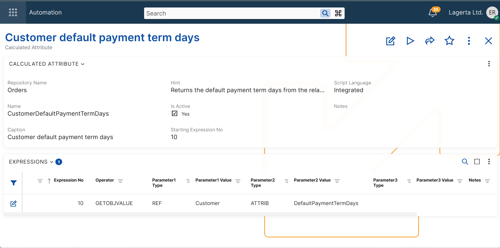
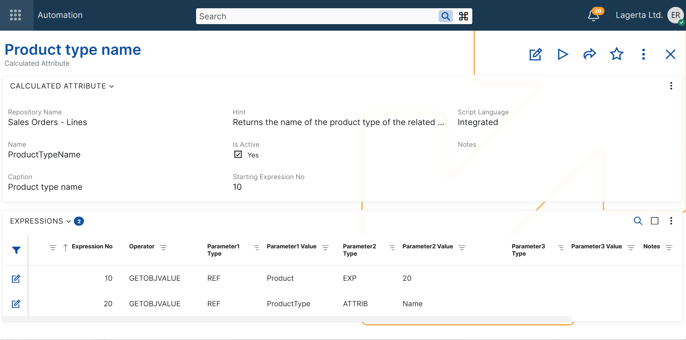
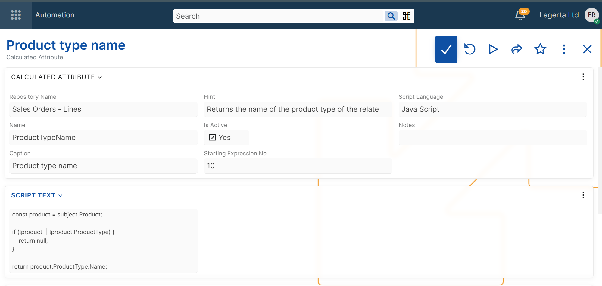

# Canonical notation

A calculated attribute definition consists of:

- a header record in **[Systems.Bpm.CalculatedAttributes](xref:Systems.Bpm.CalculatedAttributes)**.
- one or more expression rows in **[Systems.Bpm.CalculatedAttributeExpressions](xref:Systems.Bpm.CalculatedAttributeExpressions)**.

The header defines the calculated attribute itself.  
The expression rows define how its value is calculated.

## Header fields

| Field | Description |
| --- | --- |
| **Repository Name** | The entity type for which the calculated attribute is defined (evaluated per instance). *Required* |
| **Name** | The technical name of the calculated attribute. This name is used when the attribute is referenced in other formulas. *Required* |
| **Caption** | The user-facing name of the attribute. *Required* |
| **Hint** | Additional help text shown in the UI. *Optional* |
| **Is Active** | Specifies whether the calculated attribute is active. *Required* |
| **Starting Expression No** | The number of the expression row whose result becomes the value of the calculated attribute. *Required* |
| **Script Language** | Specifies how the attribute is calculated. Supported values are `Integrated` and `JavaScript`. *Required* |
| **Script Text** | JavaScript code used when Script Language is set to `JavaScript`. *Optional* |
| **Notes** | Optional internal notes. *Optional* |

## Expression rows

When **Script Language** is set to **Integrated**, the calculated attribute is defined by expression rows.

Each row defines one expression in the calculation.

### Fields

| Field | Description |
| --- | --- |
| **Expression No** | A unique number of the expression within the calculated attribute. This number can be referenced by other expressions through `EXP:<ExpressionNo>` or `INPUT:<ExpressionNo>`. |
| **Operator** | The operator that defines what the expression does. Each operator accepts a specific set of parameters. For more information, see [Operators](operators/index.md). |
| **Parameter1 Type** | Specifies how the value of the first parameter is obtained. For the supported parameter types, see [Parameter types](parameter-types/index.md). |
| **Parameter1 Value** | The value of the first parameter. Its meaning depends on the selected **Parameter1 Type**. |
| **Parameter2 Type** | Specifies how the value of the second parameter is obtained. For the supported parameter types, see [Parameter types](parameter-types/index.md). |
| **Parameter2 Value** | The value of the second parameter. Its meaning depends on the selected **Parameter2 Type**. |
| **Parameter3 Type** | Specifies how the value of the third parameter is obtained. For the supported parameter types, see [Parameter types](parameter-types/index.md). |
| **Parameter3 Value** | The value of the third parameter. Its meaning depends on the selected **Parameter3 Type**. |
| **Notes** | Optional internal notes for the expression row. |

### Canonical form

Each expression row can be written in the following canonical form:

```text
<ExpressionNo>: <Operator> <Parameter1Type>:<Parameter1Value> <Parameter2Type>:<Parameter2Value> <Parameter3Type>:<Parameter3Value>
```

If an operator uses fewer than three parameters, the unused parameters are omitted.

## Examples

### Example 1 - Get a related value

Header:

| Field | Value |
| --- | --- |
| **Repository Name** | `Crm.Sales.SalesOrders` |
| **Name** | `CustomerDefaultPaymentTermDays` |
| **Caption** | `Customer default payment term days` |
| **Hint** | `Returns the default payment term days from the related customer.` |
| **Is Active** | `True` |
| **Starting Expression No** | `10` |
| **Script Language** | `Integrated` |
| **Script Text** | |
| **Notes** |  |

Expression rows:

| Expression No | Operator | Parameter1 Type | Parameter1 Value | Parameter2 Type | Parameter2 Value | Parameter3 Type | Parameter3 Value |
| --- | --- | --- | --- | --- | --- | --- | --- |
| `10` | `GETOBJVALUE` | `REF` | `Customer` | `ATTRIB` | `DefaultPaymentTermDays` |  |  |

Canonical notation:

```text
10: GETOBJVALUE REF:Customer ATTRIB:DefaultPaymentTermDays
```

Explanation:

- **GETOBJVALUE** gets information from a related entity.
- `REF:Customer` specifies the related entity.
- `ATTRIB:DefaultPaymentTermDays` specifies the attribute to return.
- The result of expression `10` becomes the value of the calculated attribute.



### Example 2 - Chained navigation

Header:

| Field | Value |
| --- | --- |
| **Repository Name** | `Crm.Sales.SalesOrderLines` |
| **Name** | `ProductTypeName` |
| **Caption** | `Product type name` |
| **Hint** | `Returns the name of the product type of the related product.` |
| **Is Active** | `True` |
| **Starting Expression No** | `10` |
| **Script Language** | `Integrated` |
| **Script Text** |  |
| **Notes** |  |

Expression rows:

| Expression No | Operator | Parameter1 Type | Parameter1 Value | Parameter2 Type | Parameter2 Value | Parameter3 Type | Parameter3 Value |
| --- | --- | --- | --- | --- | --- | --- | --- |
| `10` | `GETOBJVALUE` | `REF` | `Product` | `EXP` | `20` |  |  |
| `20` | `GETOBJVALUE` | `REF` | `ProductType` | `ATTRIB` | `Name` |  |  |

Canonical notation:

```text
10: GETOBJVALUE REF:Product EXP:20
20: GETOBJVALUE REF:ProductType ATTRIB:Name
```

Explanation:

- Line `10` gets the related `Product` and applies expression `20` to it.
- Line `20` gets the `Name` attribute from the related `ProductType`.
- The result of line `10` is the final value when **Starting Expression No** is `10`.



## JavaScript

When **Script Language** is set to **JavaScript**, the value of the calculated attribute is determined by the contents of **Script Text** field.

The script must return the calculated value.

The following example is equivalent to **Example 2 - Chained navigation**.

Header:

| Field | Value |
| --- | --- |
| **Repository Name** | `Crm.Sales.SalesOrderLines` |
| **Name** | `ProductTypeName` |
| **Caption** | `Product type name` |
| **Hint** | `Returns the name of the product type of the related product.` |
| **Is Active** | `True` |
| **Starting Expression No** | Not used for JavaScript. |
| **Script Language** | `JavaScript` |
| **Script Text** | See the script below. |
| **Notes** |  |

Script Text:

```js
const product = subject.Product;

if (!product || !product.ProductType) {
    return null;
}

return product.ProductType.Name;
```

Explanation:

- `subject` is the current object for which the calculated attribute is evaluated.
- The script gets the related `Product`.
- Then it gets the related `ProductType`.
- Finally, it returns the value of the `Name` attribute from the related `ProductType`.
- If the script returns `null`, the value of the calculated attribute is `null`.

For more information, see [Scripting in calculated attributes](scripting/index.md).



