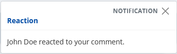
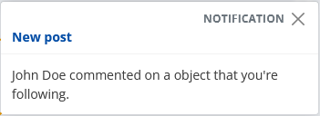
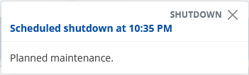
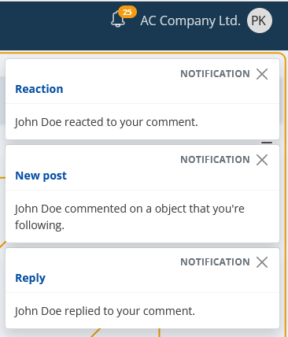

# Real-time events

The real-time events are a core part of @@erpnet. As the name suggests, these are events that are triggered in real time.

As an end-user experience, the real-time events may seem as "live notifications" (and in a matter of fact they are), but @@erpnet makes a distinction between these terms.

> [!NOTE] 
> A **notification** is a "first-class citizen"- i.e. it's an entity (aggregate root). It lives in the database. [Communities.Notifications Entity](https://docs.erp.net/model/entities/Communities.Notifications.html)
>    
> On the other hand a **real-time event** is a non-persistent data unit and it's used for on-the-fly signaling of user-relevant events.

Each real-time event consists of a header, specifying its type, as well as a payload- the event data itself.

As a comparison to the notification definition above:
> [!NOTE]
> A real-time event's payload MAY OR MAY NOT hold a notification. See below for more information on all types of real-time events.

## A real-time event in a nutshell

Some of the key aspects:
- They're produced real time and don't depend on the client application.
- They're addressed to the concerned user (i.e. the recipient), regardless of whether it uses @@erpnet @@winclient or @@webclient.
- The real-time events are "broadcasted" to the target user no matter how many instances of the @@winclient or @@webclient are opened.
- They're only created (and sent) when there's someone to receive them. I.e. the target user is online.
- The real-time events themselves aren't persistent data. They aren't stored in the database.

## Use-case(s)

Obviously, they have one purpose- to notify you of something that concerns you. 

**Now**

For example, if someone reacts to your comment:

Or someone comments on a object you're following (e.g. a specific document like an offer, sales order, etc):

What about if there's a planned maintenance?

Or several events at once:

## Variety of types

The payload (i.e. the data), provided by the real-time events can be of the following different types:

| Code | Description |
| ---- | ----------- |
| CM_REMINDER | Reminder (a.k.a alarm), related to an [activity](https://docs.erp.net/model/entities/General.Contacts.Activities.html). |
| MAIL | Incoming mail [message](https://docs.erp.net/model/entities/Applications.Mail.Messages.html). |
| VOIP | Voice over IP. Incoming call. |
| SHUTDOWN | Warning of an upcoming shutdown event. |
| SYS_MSG | System message. |
| PERF | Performance measurement. This is often a system measurement for the duration of an operation. |
| NOT | Social interaction as a notification.   For more information, check the separate [notifications documentation topic](../../modules/community/social-interactions/notifications/index.md). |
| WRN | System message. |