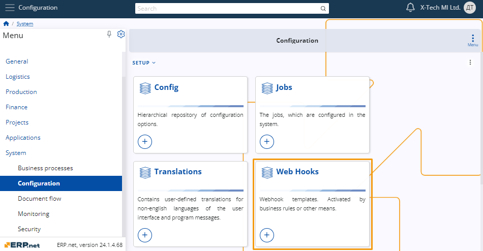
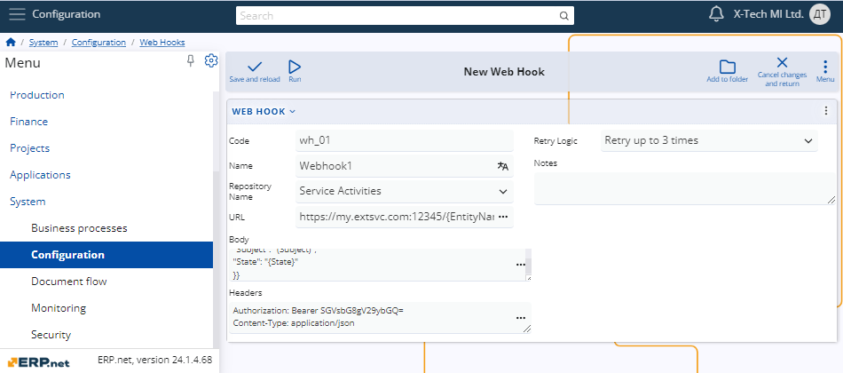
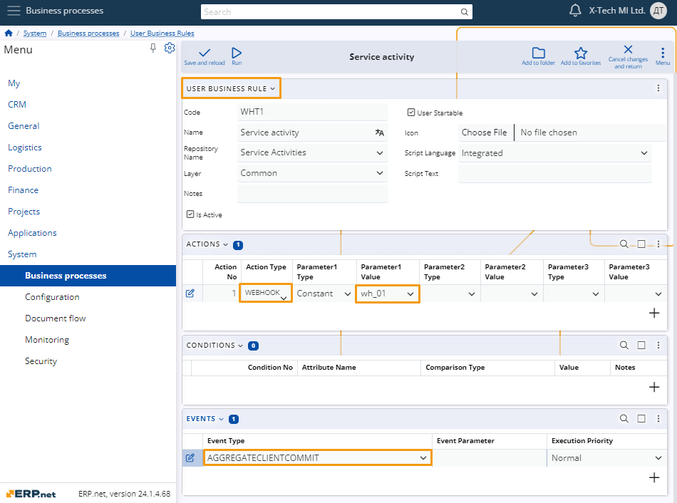

# **Webhooks**

Seemingly, a webhook is just an HTTP POST request, but behind the curtains, this simple form of messaging can be responsible for a variety of use cases. In practice, webhooks are used as custom callbacks. These callbacks are triggered when a specific event occurs.

## **Use cases**

The introduction of webhooks reveals a wide variety of use cases. Some brief examples of such:

- Real-time custom data synchronization with external systems.
- Ability to implement more complex real-time business logic from external applications.
- Integration with external BPM platform orchestrators.
- Real-time message sending to message brokers such as [Azure Service Bus](https://docs.microsoft.com/en-us/azure/service-bus-messaging/service-bus-messaging-overview/) and [RabbitMQ](https://www.rabbitmq.com/).
- External logging or chat services like [Slack](https://slack.com/), [Graylog](https://www.graylog.org/).
- Issue and project tracking systems - create issues in [Jira](https://www.atlassian.com/software/jira/) or cards in a [Trello](https://trello.com/) list.

## **Setting things up**

The process of triggering a webhook is divided into two stages.

- You need to create a webhook template that specifies the contents of the webhook, as well as the endpoint it will trigger.
- Then you need to have an event that will trigger the webhook via its template. Such an event can be raised by the [user-defined business rules](https://docs.erp.net/model/entities/Systems.Bpm.UserBusinessRules.html).

### **Webhook template**

The webhook template is just an entity, part of the Systems.Core namespace ([Systems.Core.WebHooks](https://docs.erp.net/model/entities/Systems.Core.WebHooks.html)).



The attributes are self-explanatory and must be filled in to meet the requirements of the external system (which will de facto receive the webhook).

Let's see some of the more interesting attribute values in the example below.



The **Repository Name** must match the one in the user business rule.

**URL** and **Body** attributes contain the destination address and the body content of the webhook. As you can see, they're interpolated strings.

```
https://my.extsvc.com:12345/{EntityName}/{Id}

{{
    "Id": "{Id}",
    "Number": "{DocumentNo}",
    "Date": "{DocumentDate}",
    "Subject": "{Subject}",
    "State": "{State}"
}}
```

After evaluation, they will look like this:

```
https://my.extsvc.com:12345/Srv_Service_Activities/{925bc44b-787e-4e73-b8da-a4dfd2e442b6}

{
    "Id": "925bc44b-787e-4e73-b8da-a4dfd2e442b6",
    "Number": "000015",
    "Date": "13.01.2022",
    "Subject": "Test service activity",
    "State": "New"
}
```

The Headers content is straightforward. It contains an authorization token as a constant and a format specifier for the body (application/json).

### **Event (user business rule)**

We already have a webhook template, but the final step is to reference it from a user business rule when a particular event occurs.

Let's take a look at the picture below:



This is the definition of a user business rule. The following key points need to be mentioned:

- The business rule is defined for the `Applications.Service.ServiceActivities` repository.
- It has a defined event of type `AGGREGATECLIENTCOMMIT`.
- Introduces an action of type `WEBHOOK` with a single parameter equal to `"wh_01"`.

Long story short:

*A webhook template with code `wh_01` will be triggered on each `COMMIT` in the `ServiceActivities` aggregate tree.*

## **Example**

A **[business rule](../user-business-rules/index.md)** executes a webhook when a service activity is created or updated.

| Repository                             |                 |                    |                  |
| -------------------------------------- | --------------- | ------------------ | ---------------- |
| Applications.Service.ServiceActivities |                 |                    |                  |
| **Events**                             |                 |                    |                  |
| Event type                             | Event parameter | Execution priority |                  |
| AGGREGATECLIENTCOMMIT                  |                 | Normal             |                  |
| **Actions**                            |                 |                    |                  |
| Action No                              | Action type     | Parameter1 type    | Parameter1 value |
| 1                                      | WEBHOOK         | Constant           | wh_01            |

The value of the WEBHOOK's Parameter1 is simply the code of the corresponding [WebHook](https://docs.erp.net/model/entities/Systems.Core.WebHooks.html) entity.

| Name             | Value                                                      |
| ---------------- | ---------------------------------------------------------- |
| Code             | wh_01                                                      |
| Name             | Webhook 01                                                 |
| Repository name  | Applications.Service.ServiceActivities                     |
| URL              | http://my-external-system:12345/{EntityName}               |
| Body             | <pre>{{<br/>    "Id": "{Id}",<br/>    "Number": "{DocumentNo}",<br/>    "Date": "{DocumentDate}",<br/>    "Subject": "{Subject}",<br/>    "State": "{State}"<br/>}}</pre> |
| Headers          | <pre>User-Agent: ERP.net<br/>X-Auth-Token: my_security_token</pre>                                                      |
| Retry logic      | Retry up to 3 times                                        |
| Notes            | Sends an HTTP POST request to the target URL, identifying the updated service activity. |

The table above shows the webhook template "behind" the code "wh_01". Note that the values for the URL and body properties are using string interpolation. And because a webhook is by definition just an HTTP POST request, you can see below what the HTTP message would look like, according to the examples above.

```
POST /Srv_Service_Activities HTTP/1.1
Host: my-external-system:12345
User-Agent: ERP.net
X-Auth-Token: my_security_token
Content-Length: 153

{
    "Id": "9b68c23b-e3bc-4aa3-a906-cfa83fe1cdfc",
    "Number": "00001",
    "Date": "12.01.2022",
    "Subject": "Test activity",
    "State": "New"
}
```

-------------
## **See more**

- **[Webhook wiki](https://en.wikipedia.org/wiki/Webhook)**
- **[WebHooks entity](https://docs.erp.net/model/entities/Systems.Config.WebHooks.html)**
- **[Webhook action type](../user-business-rules/action-types/webhook.md)**
- **[Send a message to Azure Service Bus](../user-business-rules/examples/azure-service-bus-send-message.md)**
- **[Create a card in Trello](../user-business-rules/examples/trello-create-card.md)**
- **[Send a message in a channel in Slack](../user-business-rules/examples/slack-send-message.md)**
- **[String interpolation](../string-interpolation/index.md)**

> [!NOTE]
> The screenshots taken for this article are from v24 of the platform.
