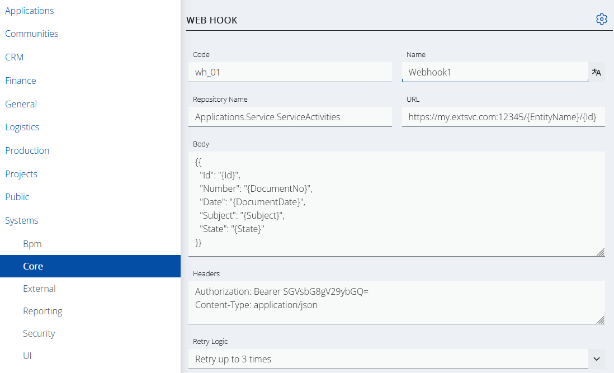
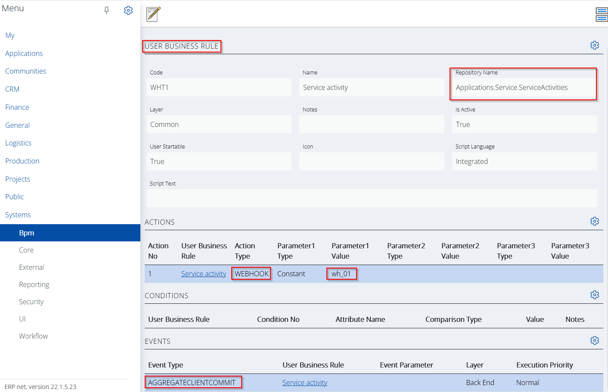

# Webhooks support

Seemingly, a webhook is just an HTTP POST request, but behind the curtains this simple form of messaging can be responsible for a variety of use cases.

## Webhooks in ERP.net

The process of triggering a webhook in ERP.net is divided into two stages.

First, you need to create a webhook template created that specifies the contents of the webhook, as well as the endpoint it will trigger.

In ERP.net the webhook template is just an entity, part of the Systems.Core namespace [(Systems.Core.WebHooks)](https://docs.erp.net/model/entities/Systems.Core.WebHooks.html).

Then you need to have an event that will trigger the webhook via its template. In ERP.net such an event can be raised by the [user-defined business rules](https://docs.erp.net/model/entities/Systems.Bpm.UserBusinessRules.html).


The attribute are self-explanatory and must be filled in to meet the requirements of the external system (which will de facto receive the webhook).

Let's see some of the more interesting attribute values in the example below.



The **Repository Name** must match the one in the user business rule.

**URL** and **Body** attributes contain the destination address and the body content of the webhook. As you see can they're interpolated strings.

```
https://my.extsvc.com:12345/{EntityName}/{Id}

{{
    "Id": "{Id}",
    "Number": "{DocumentNo}",
    "Date": "{DocumentDate}",
    "Subject": "{Subject}",
    "State": "{State}"
}}
```

After evaluation they will look like this,

```
https://my.extsvc.com:12345/Srv_Service_Activities/{925bc44b-787e-4e73-b8da-a4dfd2e442b6}

{
    "Id": "{925bc44b-787e-4e73-b8da-a4dfd2e442b6}",
    "Number": "000015",
    "Date": "13.01.2022",
    "Subject": "Test service activity",
    "State": "New"
}
```

The Headers content is pretty straightforward. It contains an authorization token as a constant and a format specifier for the body (application/json).

### Putting everything together

We already have a webhook template, but the final step is to reference it from a user business rule when a particular event occurs.

Let's take a look at the picture below,



This is the definition of a user business rule. The following key points need to be mentioned:

- The business rule is defined for the Applications.Service.ServiceActivities repository.
- It has a defined event of type AGGREGATECLIENTCOMMIT.
- Introduces an action of type WEBHOOK with a single parameter equal to "wh_01".

Long story short,

*A webhook template with code wh_01 will be triggered on each COMMIT in the ServiceActivities aggregate tree.*

-------------
## See more

- **[WebHooks entity](https://docs.erp.net/model/entities/Systems.Core.WebHooks.html)**
- **[Webhook action type](../user-business-rules/action-types/webhook.md)**
- **[Common webhook use cases](../user-business-rules/Q%26A/index.md)**
- **[Webhook wiki](https://en.wikipedia.org/wiki/Webhook)**

- **[String interpolation](../string-interpolation/index.html)**