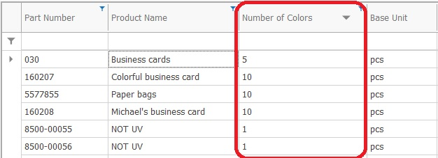

# User Data Attributes

User Data Attributes (also called "Custom Properties") allow the user to extend the data model with custom attributes. User-Defined Data Attributes allow the storage of values in the database, extending the system tables.

## Similarity With System Data Attributes

The user-defined data attributes behave mostly like the system data attributes. They can be shown in columns, grouped and filtered in navigators just like system attributes. Again similar to system attributes, they can have default values and shown in the view of data forms.

Most of the time, the end users can't distinguish between system and user-defined attributes.

It is up to the implementation team to define custom attributes, which fit best the implementation requirements. 

## Note

Many custom attributes can easily be defined and set as "required". However, this might endanger the whole ERP implementation, since requiring too much data entry for each operation can alienate the end users from the system. Carefully balance the business needs with the end user comfort.

## More Information

To learn more about user-defined attributes (also called "Custom Properties"), select a topic below:

- Create User-Defined Data Attribute
- Documents And User-Defined Data Attributes
