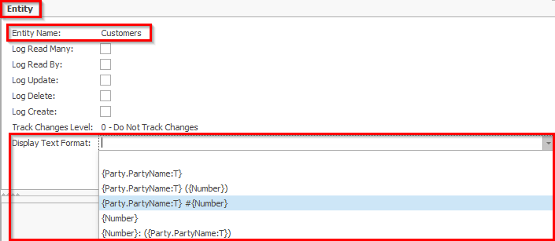
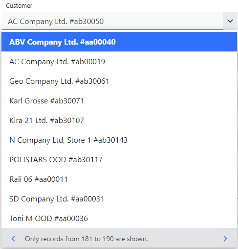

# Display format

## Overview

Each [entity object](../concepts/object-relational-mapping.md#definitions) must have a representation as text, so that it can be visualized in a user interface - e.g., in @@winclientfull or @@webclientfull. This is quite a simple task for [entity types](../concepts/object-relational-mapping.md#definitions) that have few attributes, but in reality, most do not. Let's see the following usual entity types as examples,

> Client
>
> Product

These entity types are one of the most commonly used in a typical workflow. Now we will expand these entity types to real (sample) data- i.e., entities.

> **Client**

| Number | Name | Sales person |
| --- | --- | --- |
| nmb001 | Nia Cartwright | Kristy Griffin |
| 123456 | Kamile Farrington | Natalie Dunn |
| ab1234 | Kurtis Dickinson | Anderson Fraser |

> **Product**

| Code | Name | Measurement unit | Group |
| --- | --- | --- | --- |
| 1103 | DEO GALERIA PINK F 150 ML | pcs | Goods |
| 1102-01-011 | 1U Server | pcs | Computers |
| 12345678 | Remote support | h | Services |

Usually, these entities make sense in the context of other ones. E.g., documents, reports, analysis, etc... And therefore, they must be visualized in some way. The most typical way is to display their names (i.e., the "Name" attribute):

> **Client**
>
> Nia Cartwright
>
> Kamile Farrington
>
> Kurtis Dickinson

> **Product**
>
> DEO GALERIA PINK F 150 ML
>
> 1U Server
>
> Remote support

Ok, everything seems fine, but what if we need something more? Think in general, not just about printouts or reports, this entity visualization should also apply when we choose a customer or a product (respecting the example above). How will you handle the situation when you have several products, named *"1U Server"*? Wouldn't it be better to see more information (i.e., additional attribute/s) about each entity? How about if you see what's the product availability at the time you choose it?

And this is where the display format becomes important. 

@@name allows you to specify the display format of each entity type.

So, if you need more attributes to be displayed or a specific format of your choice, you are free to customize it. 
Here is an example of how you could customize the products entity type:

| Display format | Visualization |
| --- | --- |
| `{Name:T}` | DEO GALERIA PINK F 150 ML |
| `{Name:T} ({Code})` | DEO GALERIA PINK F 150 ML (1103) |
| `{Name:T} #{Code}` | DEO GALERIA PINK F 150 ML #1103|
| `{Code}` | 1103 |
| `{Code}: ({Name:T})` | 1103: (DEO GALERIA PINK F 150 ML) |

The common thing between all display formats is the fact they use string interpolation- it gives you the opportunity to customize how each one of your entity types will be displayed.

You can find more information on the topic of [string interpolation here](../string-interpolation/index.md).

## Configuring display format

Changing the display format for a entity type is an easy task. Just open its definition and change `Display Text Format` attribute to the desired one.

As a result, each entity of this type (i.e., each customer) will be displayed according to the selected display format. In the picture below you can see how a customer dropdown is shown in the @@webclient.

Furthermore, it's possible to specify the display format yourself if the predefined formats don't suit you. It's easy- you just have to follow the rules when specifying the [interpolation string](../string-interpolation/index.md).

Also, you may be wondering how you will know the specific attributes of the entity type you need? You can refer to the [@@erpnet Domain Model documentation](https://docs.erp.net/model/entities/). Following to the example above, all the necessary information is available in the [Crm.Customers Entity](https://docs.erp.net/model/entities/Crm.Customers.html).

Internally the display format attribute for an entity is located in the [Systems.Core.EntitySettings Entity](https://docs.erp.net/model/entities/Systems.Core.EntitySettings.html#displaytextformat) table.

## Examples

In this section you can see several examples of different entity types- sample data, available predefined display formats and their corresponding visualization.

### Customers

[Customers entity documentation](https://docs.erp.net/model/entities/Crm.Customers.html).

#### Sample data

| Number | Name |
| --- | --- |
| nmb001 | Nia Cartwright |
| 123456 | Kamile Farrington |
| ab1234 | Kurtis Dickinson |

#### Display formats

| Display format | Visualization |
| --- | --- |
| `{Party.PartyName:T}` | Nia Cartwright |
| `{Party.PartyName:T} ({Number})` | Nia Cartwright (nmb001) |
| `{Party.PartyName:T} #{Number}` | Nia Cartwright #nmb001 |
| `{Number}` | nmb001 |
| `{Number}: ({Party.PartyName:T})` | nmb001: (Nia Cartwright) |
| | |
| `{Party.PartyName:T}` | Kamile Farrington |
| `{Party.PartyName:T} ({Number})` | Kamile Farrington (123456) |
| `{Party.PartyName:T} #{Number}` | Kamile Farrington #123456 |
| `{Number}` | 123456 |
| `{Number}: ({Party.PartyName:T})` | 123456: (Kamile Farrington) |
| | |
| `{Party.PartyName:T}` | Kurtis Dickinson |
| `{Party.PartyName:T} ({Number})` | Kurtis Dickinson (ab1234) |
| `{Party.PartyName:T} #{Number}` | Kurtis Dickinson #ab1234 |
| `{Number}` | ab1234 |
| `{Number}: ({Party.PartyName:T})` | ab1234: (Kurtis Dickinson) |

### Products

[Products entity documentation](https://docs.erp.net/model/entities/General.Products.Products.html).

#### Sample data

| Name | Part number |
| --- | --- |
| DEO GALERIA PINK F 150 ML | 1103 |
| 1U Server | 1102-01-011 |
| Remote support | 12345678 |

#### Display formats

| Display format | Visualization |
| --- | --- |
| `{Name:T}` | DEO GALERIA PINK F 150 ML |
| `{Name:T} ({PartNumber})` | DEO GALERIA PINK F 150 ML (1103) |
| `{Name:T} #{PartNumber}` | DEO GALERIA PINK F 150 ML #1103 |
| `{PartNumber}` | 1103 |
| `{PartNumber}: ({Name:T})` | 1103: (DEO GALERIA PINK F 150 ML) |
| | |
| `{Name:T}` | 1U Server |
| `{Name:T} ({PartNumber})` | 1U Server (1102-01-011) |
| `{Name:T} #{PartNumber}` | 1U Server #1102-01-011 |
| `{PartNumber}` | 1102-01-011 |
| `{PartNumber}: ({Name:T})` | 1102-01-011: (1U Server) |
| | |
| `{Name:T}` | Remote support |
| `{Name:T} ({PartNumber})` | Remote support (12345678) |
| `{Name:T} #{PartNumber}` | Remote support #12345678 |
| `{PartNumber}` | 12345678 |
| `{PartNumber}: ({Name:T})` | 12345678: (Remote support) |