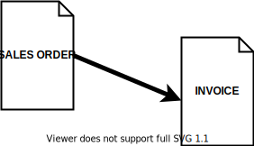

# Generation Procedures Overview

Generation Procedures are automated procedures, which generate @Documents from other documents.
They are the basis for the @document-flow.
Generation Procedures are the arrows in the document flow diagrams.

## Setup

In order to start generating documents, the Generation Procedures need to be configured.
The configuration is performed in the Document Type entity, in the Document Type Routes child entity.

Each Document Type Route is a configuration for a single Generation Procedure.

# Generation Procedures Lifetime Stages

The current topic describes the stages of the lifetime of a generation procedure:

- NEW - in development, cannot be used
- ACTIVE - the generation could be actively used by the users
- AGEING - triggers a warning, can be silenced.
- OBSOLETE – triggers a warning e or an error and has to be replaced by an active generation procedure.

- DEAD – does not work, throws an error or is permanently deleted.

## Details 

When creating a NEW generation procedure if it replaces a generation procedure that is currently in use, the old generation is **marked as obsolete** and it enters the lifetime stage AGEING. In those cases, the AGEING generation procedures, which later become OBSOLETE have to be replaced with the ACTIVE procedures that have been released, because they maintain the contemporary business logic, methods of computing and have a better and faster performance. The transition does not have to be made immediately after the release of the new version but it has to be performed before the generation procedure enters the stage DEAD i.e. before its **Date of Suspension**.

For every Generation Procedure that is marked as an Obsolete is scheduled a **Date of Suspension on** which date the Generation Procedure will be discontinued and could no longer be used.** The date is added in the obsolete procedure's name e.g. "To be deleted: 9.2021". As a result of this date, are defined three periods in which the software will inform users accordingly:

1. AGEING - From ([Date of Suspension] - 3 years) to (Date of Suspension] - 1 year) – a pop-up (balloon) message will be displayed informing the user that it is using an obsolete generation. These messages’ only purpose is to inform the users and they won’t interrupt/stop their operating with the system. The messages will be logged into the Information Messages navigator. The messages will stop popping up if for the particular line of the Document Type's Routes the filed "Allow Obsolete Generation" is check-marked.

2. OBSOLETE - From ([Date of Suspension] - 1 year) to ([Date of Suspension])

- If the filed "Allow Obsolete Generation" is NOT check-marked - an error in a modal window will pop up during the execution of the obsolete generation procedure. The error will inform the users that they are using an obsolete procedure and **the generation of the sub-document will be interrupted**. The error **will stop popping** up if for the particular line of the Document Type’s Routes the filed "Allow Obsolete Generation" is check-marked.

- If the filed "Allow Obsolete Generation" IS check-marked - a pop-up (balloon) message will be displayed informing the user that it is using an obsolete generation. These messages' only purpose is to inform the users and they won’t interrupt/stop their operating with the system. The messages will be logged into the Information Messages navigator. While using this generation, the popping up of this message could **no longer be avoided**.

3. DEAD - From [Date of Suspension] onwards - generation ceases to operate and enters the the lifetime stage DEAD.   **An error that can not be avoided will be thrown.**

With the release of the new main version after the Date of Suspension, the obsolete generation procedure is **to be deleted** and it will no longer appear in the drop-down lists.

