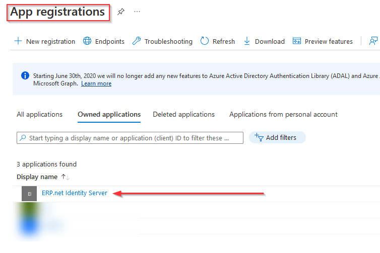

# Azure authentication

ERP.net supports Azure as an authentication provider. There are a couple of Azure and ERP.net settings that should be configured for this authentication method to work.

### Azure settings

1. Log into your Azure subscription via https://portal.azure.com.

2. Manage Azure Active Directory.

3. Register your application with your Azure Active Directory tenant by clicking **App registrations** -> **Register an application**.

4. Enter the required details. You can use anything for the name (for example: ERP.net Identity Server).   Leave “_Accounts in this organization directory only_” checked.

5. Click on Authentication.

6. In the Redirect URI field enter the callback path configured in IdentityServer4 for Azure AD auth.  
This will be **https://"<UIN>".my.erp.net/id/signin-aad**, where:

- ``<UIN>`` is the ERP.net unique instance name
- ``/id`` is the relative path of the ID site
- ``/signin-aad`` is the endpoint responsible for AZURE AD redirects (/signin-aad is constant for all databases)

7. Check the ID tokens checkbox.

8. Make a note of your Application (client) ID and Directory (tenant) ID values - they should be copied in the corresponding fields in the Sec_Domain_Providers table.

### ERP.net settings

1. In the "Setup / Security / Domains" section a "Domain providers" record should be created.  
There is a default domain in the databases and the Azure record should be added there.
 
 

2. The users are referenced by their email:
 

3. There should be a license **SEC01 - Security - Sign in with Azure AD**
 

