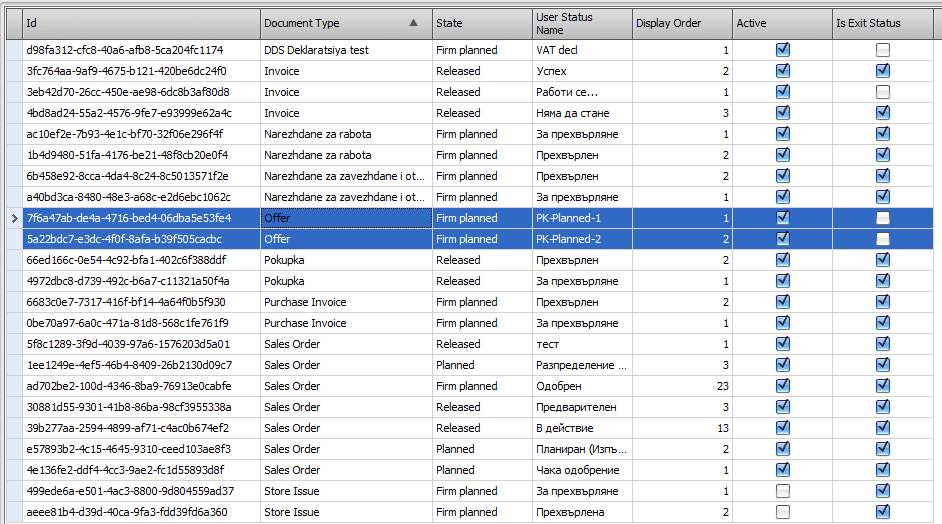
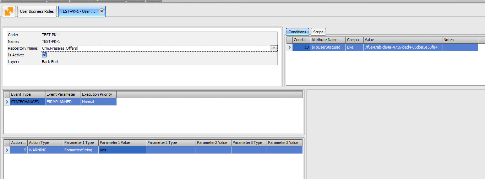

# Use system variables for managing user status in documents

You can use two system variables for the "STATECHANGED" and "STATECHANGING" events to manage the user status of a document.

They can be used across any **[business rules](https://docs.erp.net/tech/advanced/user-business-rules/index.html)**.

- **$FromUserStatusId** – relates to the initial user status.
- **$ToUserStatusId** – relates to the targeted user status.
   
You need to first select them from the list of attributes of the **Condition** of the user business rule and then specify the **ID** of the user status in the **Value** field.

### Step-by-step example

In this example, we will call the STATECHANGING event for documents of type *BGVATDeclarations*. 

1. Create at least two new user statuses.

	

2. Add a new business rule using the _$ToUserStatusId_ variable.
 
	

3. Create one offer. As part of the rule conditions, change the target **Attribute** and its **Value**.
  
   Every time a condition is met, you should get a "Yes" warning. This will result in changing the user status of the document.
