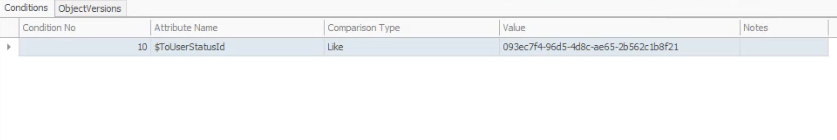
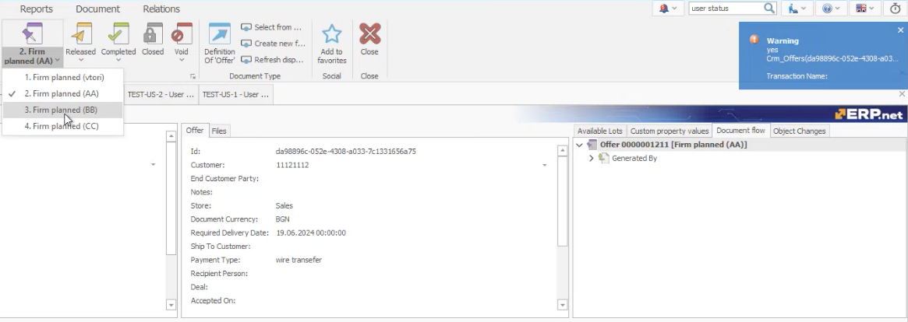

# Manage the user status of a document

You can use system variables for **[business rules](https://docs.erp.net/tech/advanced/user-business-rules/index.html)** with the "STATECHANGED" and "STATECHANGING" events to trigger specific actions when changing the user status of a document.

- **$FromUserStatusId** - ties the rule to the initial user status, ensuring that actions are triggered based on the starting status of a document
- **$ToUserStatusId** - ties the rule to the target user status, allowing actions to be triggered when the document transitions to the specified status.

## Set up a business rule

In this example, we will create a business rule for documents of type *Offer*. 

In the end, we should trigger a warning message when changing an offer's document status.

### Step-by-step example

1. If not present, create at least two user statuses for the _FIRMPLANNED_ document state of the _Offer_ document type.
2. Define a _STATECHANGING_ event with a _FIRMPLANNED_ parameter.
3. In the **Conditions** panel, select _$ToUserStatusId_ from the **Attribute name** field.

   Within the **Value** field, input the ID of the user status corresponding with the _FIRMPLANNED_ state of the Offer document type.

	

4. Define a **warning** action with a **formatted string** parameter (e.g. "yes") and save the business rule.

Now, if you change the user status of an offer in Firm planned state to the one specified in the condition of the business rule, you will trigger a warning.

