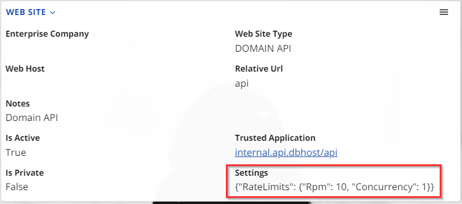

# Domain API

The web site provides Domain API to the @@erpnet domain model using the [OData (Open Data Protocol)](https://www.odata.org/) standard. Domain API allows for the creation and consumption of data, in a RESTful manner and provides an opportunity for external applications to interact with the domain model. 

It enables external applications to access the domain model by querying, filtering, and updating the data through standard HTTP requests. Domain API provides a convenient and standardized way for external applications to interact with the domain model while also ensuring the security of the data being accessed.

Domain API is secured using [OAuth 2.0](https://oauth.net/2/), which provides an industry-standard for authorization.

## Rate limits

HTTP response code `429 - Too Many Requests` is returned if limits are exceeded.

There're several limiters in the API, including:
- 600 requests per minute per session.
- No concurrent requests in a single session.
- No more than 1 open transaction at the same time in a single session.

### Configuring rate limits

The limits above are the default ones. You may specify others in the related web site definition.



Long story short:

If you need an one-liner, just to set up the rate limits:

`{"RateLimits": {"SessionRpm": 100, "SessionConcurrency": 1, "SessionTransactions": 1}}`

_*note the surrounding brackets_

---

The rate limits settings are expressed by a JSON object in the following format:
```
"RateLimits": {
  "SessionRpm": <requests-per-minute>,
  "SessionConcurrency": <concurrent-requests>,
  "SessionTransactions": <number-of-simultaneously-open-transactions>
}
```

Here's what it looks like as part of a complete web site configuration:
```
{
  "Setting1": 1,
  "Setting2": 2,
  "RateLimits": {
    "SessionRpm": <requests-per-minute>,
    "SessionConcurrency": <concurrent-requests>,
    "SessionTransactions": <number-of-simultaneously-open-transactions>
  },
  "AnotherSetting": "test"
}
```

-------------
## See more

- **[Domain API docs](https://docs.erp.net/dev/domain-api/index.html)**