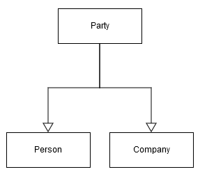
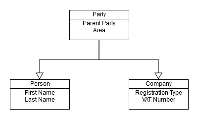
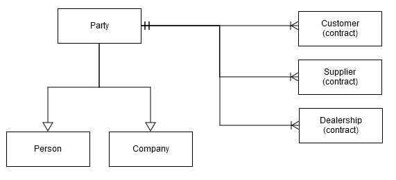

# Parties concepts

Parties are one of the most widely used definitions in @@name. They usually participate in business relations or transactions.

Examples include:

- Business customers
- Consumer customers
- Employees in our or external companies
- Contacts
- Dealers
- Company locations
- Departments

## Basic party types

Parties don't exist on their own - they're always created as separate objects, like person or company. 

In object terms, it means that 'Person' and 'Company' **inherit** 'Party'. 'Party' is considered **of type** 'Person' or 'Company'.

> [!NOTE]
> 
> Parties **can't** be created directly. They're always instantiated as some sub-type, like 'Person' or 'Company'.

This diagram shows the relationship between party, person and company:

## Party attributes inheritance

All attributes of 'Party' are also attributes of 'Person' and 'Company'. 

For example, if a party has an **Area** attribute, all 'Person' and 'Company' objects would also have it. 

The opposite **isn't** true. 'Person' and 'Company' objects have attributes which are specific only to them.

In this diagram, 'Party' has **Parent Party** and **Area** attributes, inherited by 'Company' and 'Person'. 

'First name' and 'Last name' are specific only to 'Person'. Neither companies nor parties have them.

## Relationships with other entity types

Although parties don't exist on their own, they can participate in **relationships**. 

For example, customer and supplier contracts are objects that can coexist with a party. As a result of the relationship, a both would relate to either a person or a company. This is shown on the following diagram:

> [!NOTE]
> 
> In @@name, Customer (contract), Supplier (contract) and Dealership (contract) = Customer, Supplier and Dealer.

> [!NOTE]
> 
> The diagram shows how one 'Party' object can be in relationships with **many** 'Customer contract' objects. The current implementation of @@name allows multiple customer contracts per party, but only **one** for each enterprise company. In other words, a party can only have a single customer contract with any given enterprise company.

Let's suppose you have:

- A **customer** (company), called "ABC"
- A **supplier** (person), named "John"

This will be represented by the following objects:

- Party (ABC)
- Company (ABC), which inherits Party (ABC)
- Customer (ABC), which points to Party (ABC)
- Party (John)
- Person (John), which inherits from Party (John)
- Supplier (John), which points to Party (John)

If you query the system with something like "Show me ALL parties", the result will be:

- Party (ABC)
- Party (John)

If you query with "Show me ALL customers", the result will be:

- Customer (ABC)

## Party hierachy

There are other party types in addition to the main ones. Among them are 'Department' and 'Division'. 

By using all types, data about parties can be neatly organized. A useful example is the ability to structure parties **hierarchically**. Having departments and divisions as parties allows for flexible representation of different corporate hierarchies.

For example, let's have 'Corporation A' structured in the following way:

- **Corporation A**
  - Division 1
    - Sales Department
    - Marketing Department
  - Division 2
    - Sales Department
    - Marketing Department
  - Global Marketing Department
  - Global Accounting Department

The flexible party hierarchy also allows structuring different companies within a corporation:

- **Corporation B**
  - Company A
    - Consumer Electronics Division
      - Sales Department
    - Business Consulting Division
      - Sales Department
    - Accounting Department
  - Company B
    - Sales Department
    - Accounting Department
  - Corporate Financials Department

> [!NOTE]
> 
> Because our own enterprise companies **[Multi-company](https://docs.erp.net/tech/concepts/multi-company.html)** are also parties, such hierarchy can be used for organizing our own corporate structure and the corporate structure of our business partners.

## Party relationships

Relationships between different parties can be formal or informal. 

Using them allows for the easy representation of information:

- Peter works for Company A
- Peter is a friend of George
- Steven has been married to Susan since 8/3/2011
- John worked for Company B from 1/1/2010 till 3/5/2015

This information, on the other hand, is represented by a table:

| From Party | Relationship Type | To Party  | From Date | To Date  | Notes |
| :--------- | :---------------- | :-------- | :-------- | :------- | :---- |
| Peter      | works for         | Company A |           |          |       |
| Peter      | is friend with    | George    |           |          |       |
| Steven     | is husband of     | Susan     | 8/3/2011  |          |       |
| John       | works for         | Company B | 1/1/2010  | 3/5/2015 |       |

_From Date_ and _To Date_ represent the dates when the relationship was **established** and **terminated**, respectively.

## Party Code, Customer number, Supplier number 

This section explains the codes and numbers assigned to parties (numbering, sequences) and describes a troubleshooting approach for a common issue—the violation of value uniqueness.

Upon creation, Parties are automatically assigned a Party Code, while Customers and Suppliers are automatically assigned Numbers. There is no semantic difference between a code and a number. These values are unique across the system.

Party Codes are read-only, whereas Customer and Supplier Numbers can be modified.

System validation rules work together with unique indexes to prevent the same code or number from being assigned to multiple records. In large instances, when creating a new Party, Customer, or Supplier, these rules may occasionally trigger errors such as:

1. Duplicated Party Code:

  _Violation of UQ_Gen_Parties_Table_Party_Code

   Duplicated value: (100000)_

2. Duplicated Customer/Supplier number

_The set of values for the following fields could not be saved more than once.

Fields: (Customer_Number)

Duplicated value:  (The statement has been terminated.)

Index: IX_Crm_Customers_Table_Customer_Number

Please remove the duplicate record or change the value of any of the fields listed.
 One or more errors occurred.
 
Violation of Prevention of duplicating of values in columns 'Customer number' constraint.
Duplicated key value is (100000)._

 
This prevents the creation of a new party, customer or supplier.

**Why the problem occurs?**

The Codes and Numbers are auto-generated by searching for the highest existing number and incrementing it by one (1). However, the highest number is determined by sorting the records lexicographically (as strings) rather than numerically.

As a result, when both 99999 and 100000 already exist, the algorithm still considers 99999 to be the “largest” value (because '9' is greater than '1'). Consequently, the system repeatedly proposes 100000 as the next value. Since a record with code/number 100000 already exists, the corresponding error is raised.

**What to do?** 

In such cases, it is recommended to start a new numbering sequence using a letter prefix — for example: A100000.

Within Customer/Supplier numbers this is easy - find the highest existing number of the series and upon creation of the new record input manually the next number with the prefix.

Within Party codes is a bit more complicated -  since the field is read-only, try using a custom business rule in the General.Contacts.Companies repository to set the new value (for example, A100000) in PartyCode once, at the time of saving. After that, deactivate the rule, and all subsequent Party records—companies, persons, and similar—should be saved successfully using the new numbering sequence with the prefix applied.

