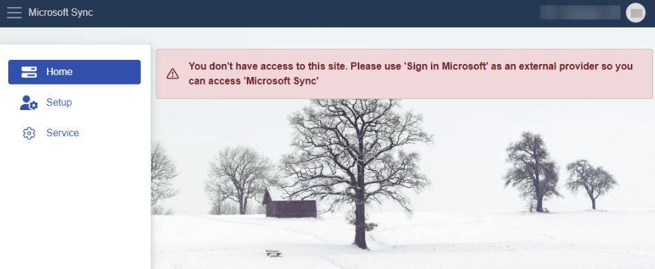

# Getting started

First, ensure that your organization uses **[Azure Athentication](/advanced/security/authentication/azuread.md)** and that the organization's **[domain](/advanced/security/authentication/azuread.md#erpnet-settings)** is configured in @@name.

Second, a **website** with the type "Microsoft Sync" must be set up in your @@name database.

Third, an @@name **admin** needs to log in to MSSync and grant access to your **Microsoft 365** resources using the **[Service](service.md)** menu.

Finally, **each user** who wants to use synchronization must sign in to MSSync to activate it, following these steps:

1. Login to the company's **MSSync** website. To access **MSSync**, it’s mandatory to sign in using the **'Sign in with Microsoft'** button with the **Microsoft account** provided by your organization. 

2. To establish the link, you will need to **read** and **accept** the permissions MSSync needs to obtain.

 
If you use local **ERP** credentials to log in, **MsSync** will still open, but will essentially deny you any kind of access to its resources. 

> [!WARNING]
> 
> You must log in via an existing **Microsoft account** in order to reference your **Outlook** calendar. Otherwise, **MSSync** would be unable to determine which calendar to link to.

3. Then select your default enterprise company, location, and time zone and activate the desired synchronizations using the **[Setup](setup.md)** menu.
 
## Main menu

The **MSSync** app consists of **three** sections: 

-	**[Home](home.md)**
-	**[Setup](setup.md)**
-	**[Service](service.md)**

In **Home**, you'll find personal profile details, general information about the current **state** of your application, as well as the latest **log data** for your activated sync jobs.

 

In **Setup**, you can see information about your **enterprise company** - the one that is currently linked to **MSSync**. 

Additionally, you can toggle synchronization for a specific sync job **on** or **off**.

 

The **Service** section is meant for users with administrator access levels. It reveals more technical and sensitive details used in the communication between **MSSync** and **Office365**.

From here, admins can securely connect their **MSSync** instance to their **Microsoft Entra ID**. This is essential for activating all synchronization-related functionalities. 

For more information about navigating, setting up, and configuring MsSync, see:

*	**[Home](home.md)**
*	**[Setup](setup.md)**
* **[Service](service.md)**

> [!NOTE]
> 
> The screenshots taken for this article are from v24 of the platform.