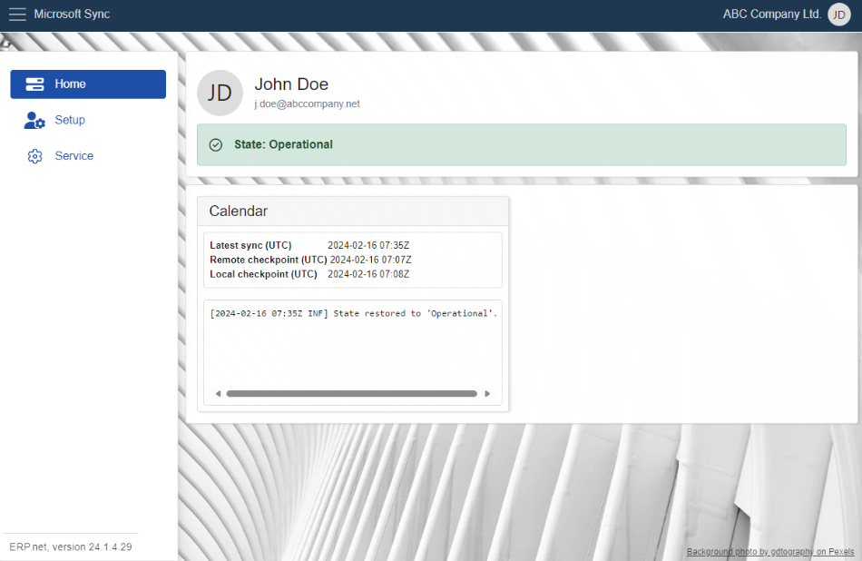
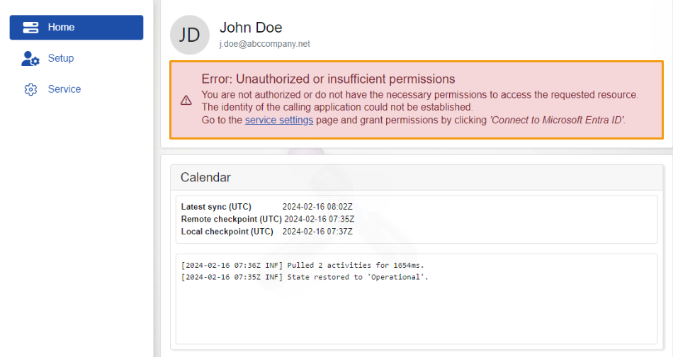
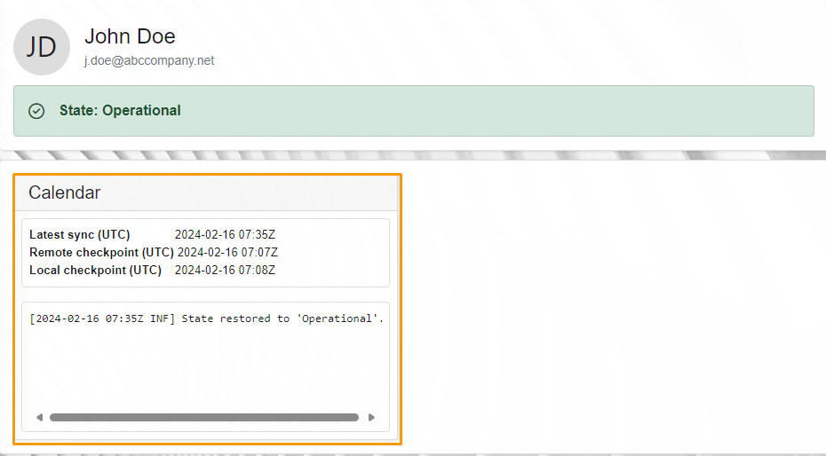
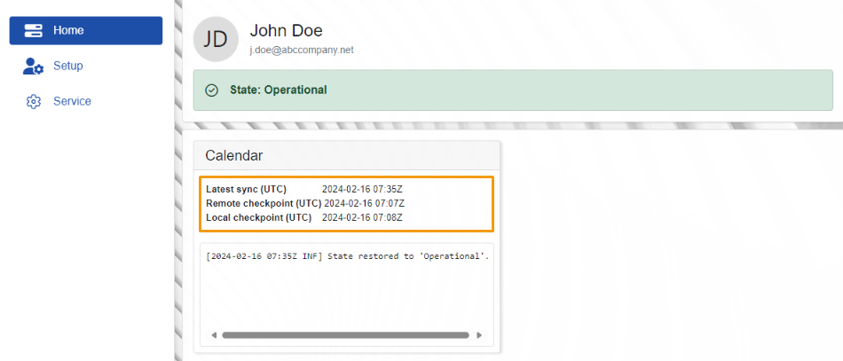

# Home

The **Home** page offers a quick overview of MSSync’s current state. 

Here, you'll see details about the app’s **sync jobs**, including all the **logs** and **timestamps** generated by each, as well as the **latest time** they synced with **Office365**.

## States 

The synchronization status indicates whether the connection between **MsSync** and **Office365** is successful or failed. 

Possible scenarios include:

### Operational 

The connection is stable and there aren’t any operational issues. 

### Error: Unauthorized or insufficient permissions

When an error occurs, it indicates a **problem** with the permissions granted for **ERP** to access and modify resources from **Office365** and the other way around.

 
To address this issue, navigate to **Service** and grant permissions by selecting **“Connect to Microsoft Entra ID”**. 

For further assistance, refer to our [Service documentation](https://docs.erp.net/tech/modules/applications/mssync/service.html). 

> [!NOTE]
> To access **Service** you need to be an administrator.

## Sync Jobs 

Within this panel, you'll discover details about the current synchronization jobs and their related information. 

 
The **UTC (Latest sync)** timestamp indicates the most recent confirmed synchronization.

Additionally, **logs** are available detailing operations, including when a resource is retrieved from a **Office365** and when a resource is sent from **ERP **.

> [!NOTE]
> The screenshots taken for this article are from v24 of the **Web Client**.
 
