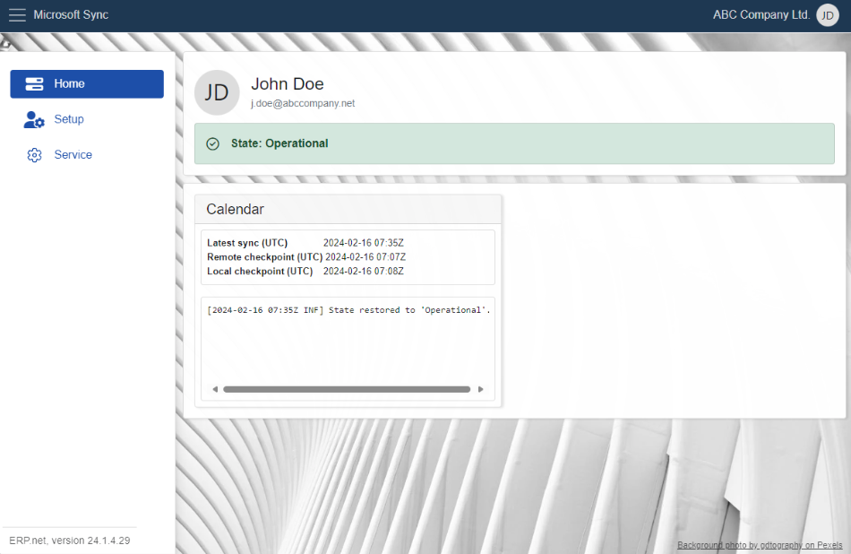
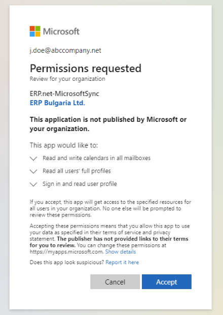
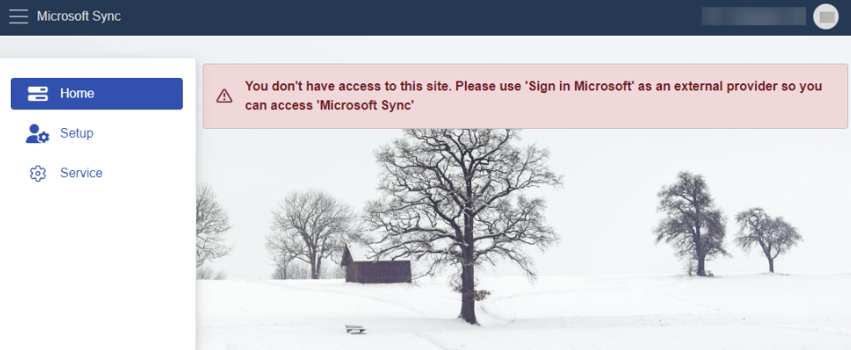
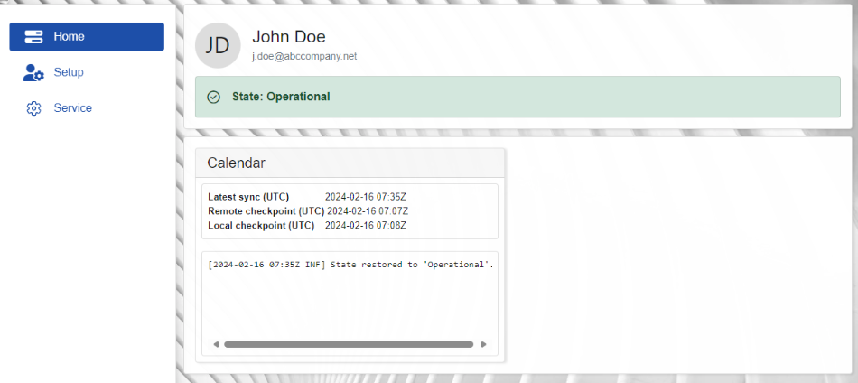
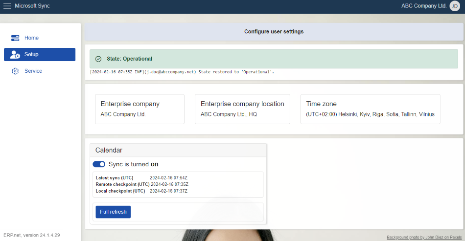

# Overview

MsSync is an application designed to synchronize resources between the **ERP.net Web Client** and **Office 365**. 

Each synchronization task is referred to as a **job**, allowing resources created in **Office 365** to be automatically reflected in the corresponding module in the **ERP**, and the other way around.

Currently, the only available sync job is for the [Calendar](https://docs.erp.net/webclient/introduction/my-apps/calendar.html), but more will be added in the near future.

 
### Access

To access **MSSync**, it’s mandatory to sign in with an existing **Microsoft account**. 

To establish the link, you will need to **read** and **accept** the permissions Microsoft needs to obtain.

 
If you use standard **ERP** credentials to log in, **MsSync** will still open, but will essentially deny you any kind of access to its resources. 

 
## Menu

The **MSSync** app consists of **three** sections: 

-	**[Home](https://docs.erp.net/tech/modules/applications/mssync/home.html)**
-	**[Setup](https://docs.erp.net/tech/modules/applications/mssync/setup.html)**
-	**[Service](https://docs.erp.net/tech/modules/applications/mssync/setup.html)**

In **Home**, you'll find personal profile details, general information about the current **state** of your application, as well as **log data** about the latest sync job.

 

In **Setup**, you can see information about your **enterprise company** - the one that is currently linked to **MSSync**. 

Additionally, a **slider** button allows you to toggle synchronization for a specific sync job on or off.

 

The **Service** section is meant for users with administrator access levels. It reveals more technical and sensitive details used in the communication between **MSSync** and **Office365**.

From here, admins can securely connect their **MSSync** instance to **Entra ID** resources that are essential for activating all synchronization-related functionalities. 

For more information about navigating, setting up and configuring MsSync, see:

*	**[Home](https://docs.erp.net/tech/modules/applications/mssync/home.html)**
*	**[Setup](https://docs.erp.net/tech/modules/applications/mssync/setup.html)**
* **[Service](https://docs.erp.net/tech/modules/applications/mssync/setup.html)**

> [!NOTE]
> 
> The screenshots taken for this article are from v24 of the platform.

