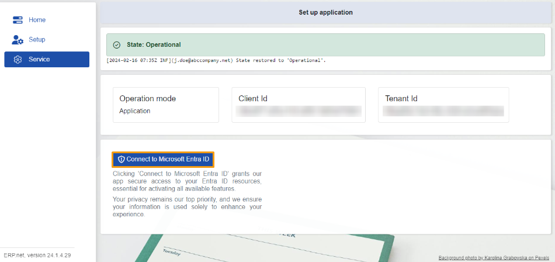
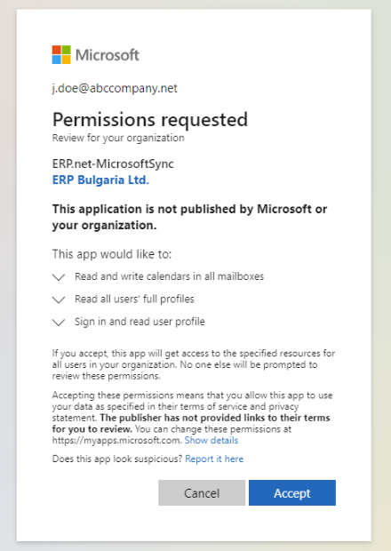

# Service 

The **Service** section is exclusively for **ERP.net** admins. 

Here, they can request permissions for accessing **Office365** resources from an admin within their **enterprise company**. 

These permissions are essential for enabling synchronization between the company's **Office365** account and the **ERP.net Web Client**. 

 

### State 

In the **Service** section, you'll find the current **state** of the MsSync app.

There are also **logs** detailing all state changes, similar to those found in the **[Setup](https://docs.erp.net/tech/modules/applications/mssync/setup.html)** section. 
 
### Information panel 

This panel stores details about the **Operation mode** of the app, and reveals the **Client Id**, and **Tenant Id**, which play a role in establishing the two-way synchronization process.

 
## Connect to Microsoft Entra ID 

This button sends a request on behalf of ERP.net to access resources already available in your **Office365** account. 

This permission not only enables modifications to existing resources but also allows the inclusion of new ones. 

Any changes made to resources in **ERP.net** are mirrored in **Office365**, and vice versa. 

 

## Give permissions

The "Give Permissions" ensures that the MsSync app has all the necessary permissions to function optimally. It's recommended that **an admin user** click the "Give Permissions" button after the very first start of the app. This action will automatically check and configure all required permissions specific to the various job types.

This process is essential for activating all available features and ensuring a seamless user experience.

--

> [!NOTE]
> The screenshots taken for this article are from v24 of the platform.
