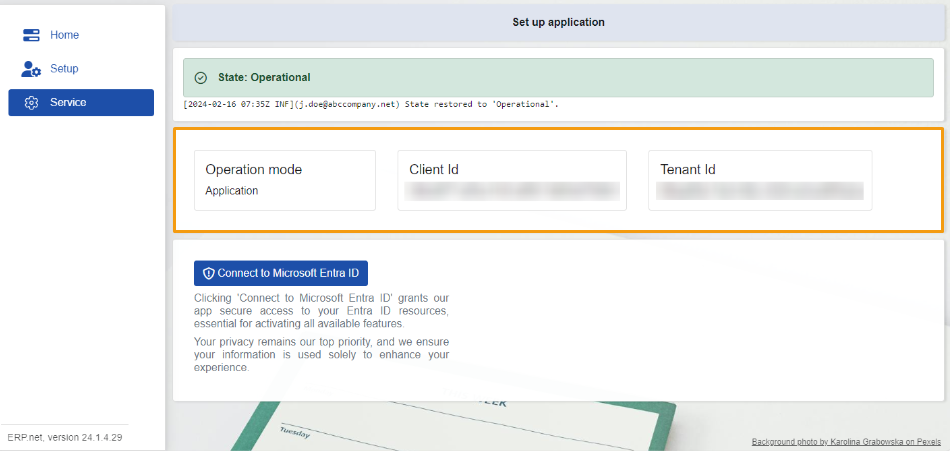

# Service 

The **Service** section is exclusively designed for **ERP.net** admins. 

Here, admins can request permission for **Office365** resources from an admin within the **Enterprise Company**. 

This permission is essential for enabling synchronization between the company's **Office365** and **ERP**. 

Once granted, seamless interaction and synchronization processes can commence.

 

## State 

In the **Service** section, you'll find the **State** of the module displayed, mirroring the layout seen on the **Home** and **Setup** section. 

Additionally, you'll discover **logs** detailing the **State** changes, similar to those found in the **Setup** section. 

For more information visits our other articles: **[Home](https://docs.erp.net/tech/modules/applications/mssync/home.html)**, **[Setup](https://docs.erp.net/tech/modules/applications/mssync/setup.html)**.

 
## Information panel 

The information panel stores details regarding the **Operation mode**, **Client id**, and the **Tenant id**, all of which are based on your profile settings.

 
## Connect to Microsoft Entra ID 

This button sends a request to your **Company's** admin, seeking access to resources already available in your **Office365**. 

 

This permission not only enables modifications to existing resources but also allows the addition of new ones. 

Any changes made to resources in the **ERP** are mirrored in the **Office365**, and the other way around. 

> [!NOTE]
> The screenshots taken for this article are from v24 of the **Web Client**.
