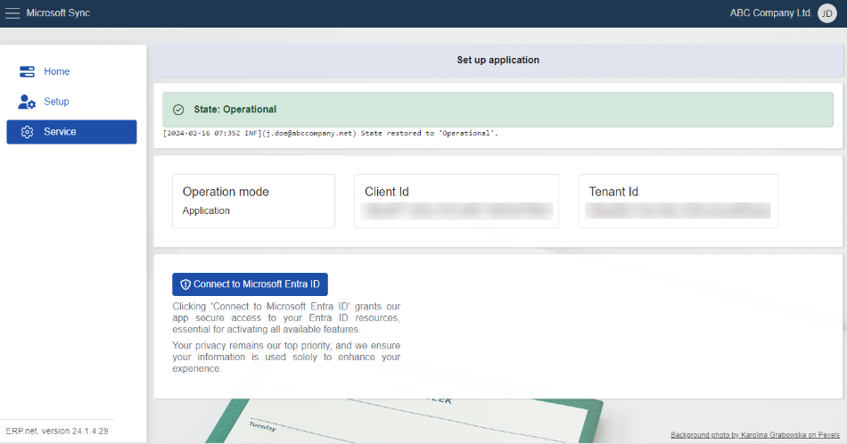

# Service 

The **Service** section is exclusively for **ERP.net** admins. 

Here, they can request permissions for accessing **Office365** resources from an admin within their **Enterprise Company**. 

These permissions are essential for enabling synchronization between the company's **Office365** account and the **ERP.net Web Client**. 

 

## State 

In the **Service** section, you'll find the current **state** of the MsSync app.

There are also **logs** detailing all state changes, similar to those found in the **[Setup](https://docs.erp.net/tech/modules/applications/mssync/setup.html)** section. 

 
## Information panel 

This panel stores details regarding the **Operation mode**, **Client id**, and **Tenant id**, all of which are based on your profile settings.

 
## Connect to Microsoft Entra ID 

This button sends a request to your **Enterprise Company** admin, seeking access to resources already available in your **Office365** account. 

 

This permission not only enables modifications to existing resources but also allows the addition of new ones. 

Any changes made to resources in **ERP** are mirrored in **Office365**, and the other way around. 

> [!NOTE]
> 
> The screenshots taken for this article are from v24 of the platform.
