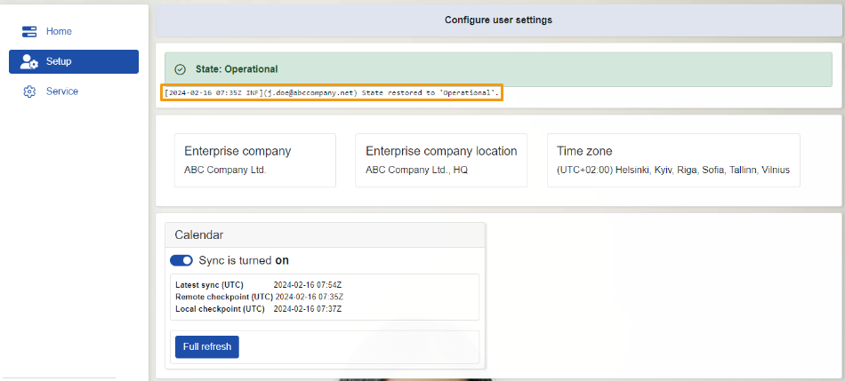

# Setup

Within the **Setup** section, you can find data about the **enterprise company** utilizing the platform, showing details like **location** and **time zone**. 

This section also showcases the **State**, mirroring the information visible in **Home**. You can also find a sliding button for toggling synchronization on and off.

 

## State 

The **State** that is shown in the **Home** you can also find in **Setup**. For more information, you can go to the article about **[Home](https://docs.erp.net/tech/modules/applications/mssync/home.html)**. 

 

Below the **State** section, you'll discover a **log** detailing user availability. This log records every change in the **State**.

 

## Company details 

This panel contains data for your **Enterprise Company**, including its name, location, and **Time Zone**. 

This information is automatically populated by the software upon your login.

  

> [!NOTE] 
> You assign the information about your company in your profile. A single profile can contain details for more than one company.

 

## Sync Jobs 

As in **[Home](https://docs.erp.net/tech/modules/applications/mssync/home.html)** section, here’s a panel presenting available **Sync Jobs**. 

Here, alongside the **UTC (Latest sync)**, you'll notice two extra actions: one for ***Sync Jobs** activation and deactivation, and another for refreshing the module.

 

### Activate and deactivate Sync button

The function of this button is to initiate the **Sync Job** assigned to it. Simply toggle the sliding button, and the process will commence. 

Upon activation, the software will sync data for the preceding two weeks and the upcoming year. Afterwards, synchronization will occur every fifteen minutes.
 
 

### Full refresh 

This button will initiate a full refresh on the **Sync Job**. When activated, synchronization will again cover the previous two weeks and the forthcoming year.
 
 

> [!NOTE]
> The screenshots taken for this article are from v24 of the **Web Client**.

