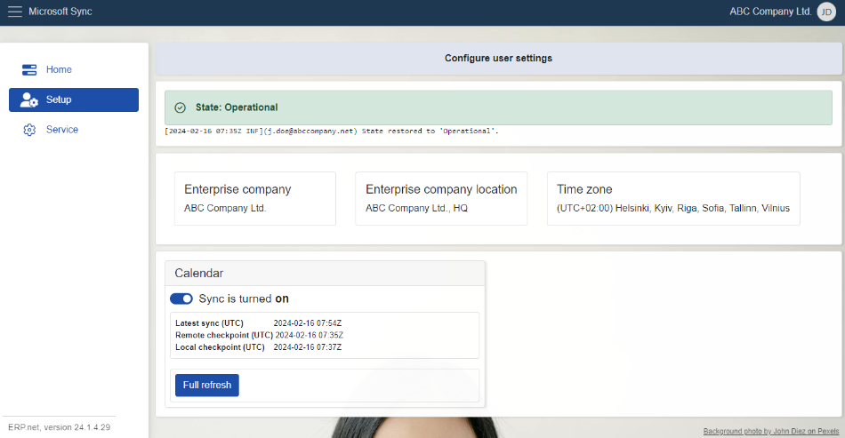

# Setup

Within this section, you can find data about your **enterprise company** - the one logged in MsSync, which includes details like **location** and **time zone**. 

This section also showcases the **state** of the app, as visible in **[Home](https://docs.erp.net/tech/modules/applications/mssync/home.html)**.

Below, there's a **slider button** for toggling synchronization for a given job on and off.

 

Just under the **state** message, you'll find an additional **log** detailing the latest change which occured for MsSync's state.

 

## Company details 

There's a panel containing data for your company, including its **name**, **location**, and **time zone**.

This information is automatically filled in by the system upon your login.

  

> [!NOTE]
> 
> You can assign data about your enterprise company in your profile settings.    A single profile can contain details for more than one company.

 

## Sync jobs 

As in **[Home](https://docs.erp.net/tech/modules/applications/mssync/home.html)**, there’s a panel presenting available **sync jobs**. 

Here, alongside the **latest sync**, you'll notice two extra buttons: one for sync jobs **activation** and **deactivation**, and another for **refreshing** the module.

 

### Activate and deactivate synchronization 

This button **enables** or **disables** the sync job assigned to it. Simply toggle the slider button in the respective direction and the process will commence. 

On first-time activation, the system will sync data for the **past two weeks and the upcoming year**. 

Afterwards, synchronization will occur **every 15 minutes**.
 
 

### Full refresh 

When you click on this button, synchronization for the respective job will refresh on-demand, reflecting the last two weeks and the upcoming year.
 
 

> [!NOTE]
> 
> The screenshots taken for this article are from v24 of the platform.

