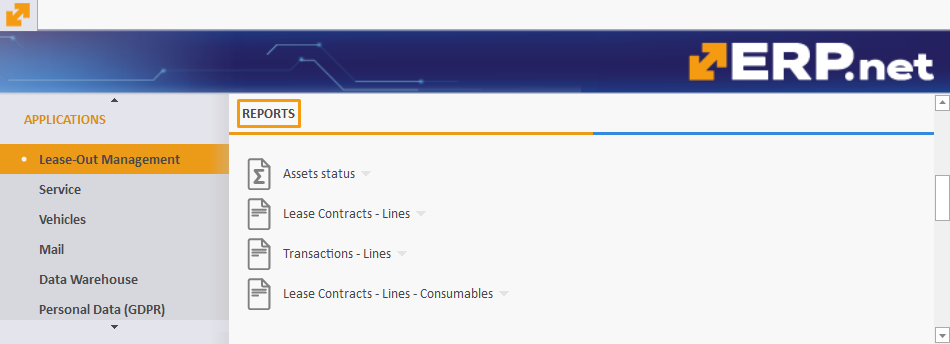

# Rental

The **Rental** section is designed to oversee and control the leasing process of all owned and re-leased assets. 

Located in the **Applications** module, it is divided into various panels, each serving a specific function to ensure effective management of assets, documents, and transactions. 

By providing a structured approach as well as the ability to generate detailed reports, **Rental** offers a comprehensive aid to all rental-related processes and operations.

> [!NOTE]
> Rental is referred to as **Lease-Out Management** in the ERP.net Desktop Client.   
> For the purposes of this overview, screenshots and references will be used from the Desktop Client.

### Types

There are two types of assets which you can create and manage through Rental:

1. **Rental assets** 
2. **Consumables** 

In the context of a rental asset, a consumable typically refers to items or materials that are used up and need to be replaced regularly as part of the asset's operation or maintenance. 

Consumables are tied to a rental asset but are treated as products distinct from it. They are **sold** and not returned, while the rental asset itself is **leased** for a specific period of time, and is therefore expected to be returned in reusable condition.

> [!NOTE]
> Each rental asset can also be categorized as a **[Managed Asset](https://docs.erp.net/tech/modules/applications/enterprise-asset-management/index.html#managed-assets)**.

## Documents

The **Documents** portion of Rental contains all essential transactions and contracts related to the leasing process.

It provides a centralized repository for managing lease agreements and transaction records, ensuring their easy access and organization.

1. **Lease contract**  - the main lease document containing the rental asset/s and its consumables, if such are applicable; it also includes the **[lease time period](time-period-types.md)** negotiated for every rental asset
2. **Transaction (Deliver)** - a protocol confirming the handover of the rental asset; it contains the start date of the negotiated lease period
3. **Transaction (Receive)** - a protocol confirming the return of the rental asset; it contains the end date of the negotiated lease period
4. **Transaction (Write Off Not Returned)** - a protocol confirming that the rental asset has not been returned by the leaser
5. **Transaction (Status Report)** - a protocol describing the rental assets handed over to a leaser (can be used for inspection).

### Document flow

A typical document flow for leasing out rental assets with consumables goes like this:

> **Lease Contract --> Transaction (Deliver), Transaction (Receive), Sales Order (Rent), Sales Order (Consumable)**

Upon release, the lease contract will lead to the simultaneous generation of a transaction (deliver) protocol, a transaction (receive) protocol, a sales order accounting for the rent, and a sales order accounting for the consumable(s).

> [!TIP]
> Like all other ERP.net modules, Rental allows you to set up a personalized document flow that meets the individual needs of your business or organization.

### Rent Lease Contracts Navigator

This navigator contains all existing **lease contract agreements** issued for rental assets, including those for consumables, and offers the ability to create new ones.

It is also equipped with a handful of **filtering capabilities** designed to speed up the process of extracting information in a convenient and systematized way. 

> [!NOTE]
> When creating a lease contract, you can include as many rental assets in it as needed, and additionally fill out necessary data for each.

### Transactions Navigator

Gives access to all **protocols** following or associated with a lease contract. 

Like the Lease Contracts Navigator, it includes useful **filtering capabilities** through which you can quickly and easily summarize protocol data in a convenient format. 

## Functions

This section includes **tools** that facilitate the day-to-day management of lease activities. 

It offers functionalities that help you stay on track with key dates and schedules.

### Calendar

The Calendar provides a quick overview of the **occupancy** of all rental assets for which there is a lease contract.

It also shows:

* the **lessees** to which the assets were leased
* **from when** the assets have been leased and **until when**
* the **status** of the current lease contract agreement they are part of

## Reports

Rental allows you to generate comprehensive **reports** summarizing your leasing activities. 

These include monitoring the status of assets, tracking lease contract details, and reviewing transaction history.

### Assets status report

Provides a detailed overview of the state of all assets, revealing their **current occupancy** as well as the **current date(s)** on which they are available to lease. These dates can **change** depending on the lease contracts a rental asset is part of, but this is always reflected by the report.

You can also see the **last date** of the final lease contract a rental asset is currently part of. After that date, the asset will be completely available to lease and the report will not feature any occupancy periods.

### Lease Contracts – Lines

Breaks down each lease contract into its lines, giving insights into contract terms and conditions.

### Transactions – Lines

Contains detailed records of all transactions, ensuring transparency and accountability in rental asset management.

### Lease Contracts - Lines – Consumables

Focuses on the consumables purchased with rental assets.

## Definitions

The **Definitions** portion of Rental provides detailed information about all rentable assets, their classifications and consumables. 

It's here, for instance, that you can add new asset **types** and **groups** necessary for the creation of the rental asset itself.

> [!NOTE]
> Certain definitions can also be created during the process of filling out the lease contract.   
> All the information you provide for a rental asset in advance of creating a lease contract will be automatically added in that contract's lines when you select the respective rental asset.

### Rental Assets

This is where rental assets are created and stored. Each has a **code** and a **name** and must first be defined a **group** with a **type**.

It is necessary to associate it with an existing **sales product** for which a **sales order** will later be issued.

You can also specify additional information for the rental asset, including tying it to a **fixed asset**.

### Asset Types

Defines the various rental asset types which need to be tied to a rental asset group.

### Asset Groups

Categorizes rental assets into hierarchies of larger groups.

### Assets – Consumables

This is where consumables are created and information for existing ones can be previewed. 

Each consumable has a **code** and a **name** and must be defined a **product** with a certain **quantity**.

One or more quantities of a particular consumable are always tied to one rental asset a time. 

### Asset Types – Consumables

Defines the different types of consumable items related to rental assets.

## Settings

The **Settings** portion of Rental allows you to define or change individual properties and attributes of various asset types. 

This includes different user characteristics and ensures a more custom approach to how you structure your rental assets.

> [!NOTE]
> 
> The screenshots taken for this article are from v24 of the platform.

