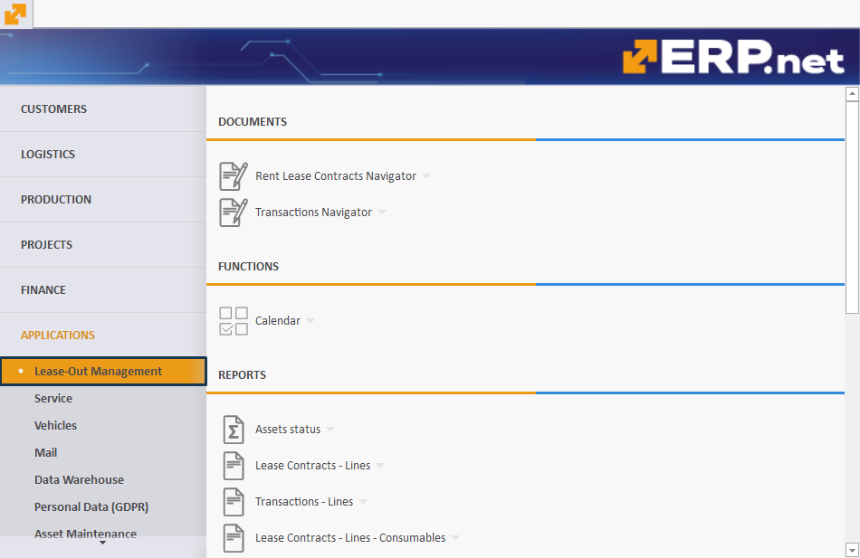

# Rental

The **Rental** section is designed to oversee and control the leasing process of all ERP.net rental assets. 

Located in the **Applications** module, it is divided into various panels, each serving a specific function to ensure effective management of documents, assets, and transactions. 

By providing a structured approach as well as the ability to generate detailed reports, **Rental** offers a comprehensive aid to all rental-related processes and operations.

> [!NOTE]
> Rental is referred to as **Lease-Out Management** in the ERP.net Desktop Client.   
> To make this overview more comprehensive, screenshots and references will be used from the Desktop Client.

## Documents

The **Documents** section contains all essential records and contracts related to the leasing process. 

It provides a centralized repository for managing lease agreements and transaction records, ensuring easy access and organization of important documents.

### Rent Lease Contracts Navigator

Contains the lease contracts for rental assets, providing a centralized location for managing and reviewing lease agreements.

### Transactions Navigator

Access all transaction records, including the records of handover and handing-over activities related to the rental assets.

## Functions

The **Functions** section includes tools that facilitate the day-to-day management of leasing activities. 

It offers functionalities that help users keep track of key dates and events, ensuring smooth operation and timely actions.

### Calendar

Manage and track important dates and events related to lease contracts and transactions, ensuring timely renewals and compliance.

## Reports

The **Reports** section generates comprehensive insights and summaries of the leasing activities. 

These reports help users monitor the status of assets, track lease contract details, and review transaction histories.

### Assets status

Provides a comprehensive overview of the current status of all assets, helping users to monitor asset availability and condition.

### Lease Contracts – Lines

Breaks down the details of each lease contract, providing line-by-line insights into contract terms and conditions.

### Transactions – Lines

Contains detailed records of all transactions, including handover and handing-over records, to ensure transparency and accountability in asset management.

### Lease Contracts - Lines – Consumables

Focuses on the consumables associated with lease contracts, helping users to track and manage expendable items.

## Definitions

The **Definitions** section provides detailed information about all rentable assets and their classifications. 

It allows users to create and manage new asset types and groups, ensuring a well-organized inventory.

### Rental Assets

Contains detailed information about all rentable assets, serving as the primary database for asset management.

### Create New Rental Assets

Allows users to add new assets to the rental inventory, ensuring the database is up-to-date.

### Asset Types

Defines the various types of assets available for rent, providing a structured classification for better management.

### Create New Asset Types

Enables users to define new asset types, ensuring flexibility in asset categorization.

### Asset Groups

Groups rentable assets into a hierarchy of logical groups, simplifying the management of large inventories.

### Assets – Consumables

Contains information about consumable items related to rental assets, aiding in the management of these expendables.

### Create New Assets – Consumables

Allows the addition of new consumable items to the inventory.

### Asset Types – Consumables

Defines different types of consumable items related to rental assets.

### Create New Asset Types – Consumables

Provides the functionality to define new types of consumable items, ensuring comprehensive categorization.

## Settings

The **Settings** section allows users to define the properties and attributes of various asset types. 

This ensures detailed and precise descriptions, enabling better management and customization of assets.

### Asset Types – Properties

Defines the properties and attributes of various asset types, ensuring detailed and precise asset descriptions.

### Create New Asset Types – Properties

Allows the creation of new properties for asset types, enhancing the customization and specificity of asset management.
