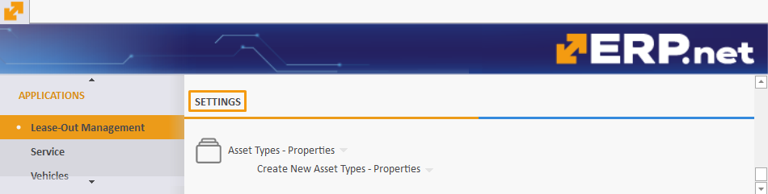

# Rental

The **Rental** section is designed to oversee and control the leasing process of all owned and re-leased assets. 

Located in the **Applications** module, it is divided into various panels, each serving a specific function to ensure effective management of assets, documents, and transactions. 

By providing a structured approach as well as the ability to generate detailed reports, **Rental** offers a comprehensive aid to all rental-related processes and operations.

> [!NOTE]
> Rental is referred to as **Lease-Out Management** in the ERP.net Desktop Client.   
> For the purposes of this overview, screenshots and references will be used from the Desktop Client.

### Types

There are two types of assets which you can create and manage through Rental:

1. **Rental assets** 
2. **Consumables** 

In the context of a rental asset, a consumable typically refers to items or materials that are used up and need to be replaced regularly as part of the asset's operation or maintenance. 

Consumables are therefore tied to a rental asset but are treated as distinct **products**. The rental asset itself is expected to be returned in reusable condition.

> [!NOTE]
> Each rental asset can also be categorized as a **[Managed Asset](https://docs.erp.net/tech/modules/applications/enterprise-asset-management/index.html#managed-assets)**.

## Documents

The **Documents** portion of Rental contains all essential transactions and contracts related to the leasing process, including:

1. Lease contract  - the main lease document containing the rental asset/s and its consumable/s
2. Issue transaction - contains the date of leasing out (deliver) the rental asset
3. Receipt transaction - contains the date of return (receive) of the rental asset 

It provides a centralized repository for managing lease agreements and transaction records, ensuring their easy access and organization.

### Document flow

A sample document flow for leasing out assets and consumables goes like this:

> Lease Contract --> Issue Transaction --> Receipt Transaction --> Sales Order (Consumable) --> Sales Order (Rent)

### Rent Lease Contracts Navigator

This navigator contains all existing lease contract agreements issued for rental assets, including those for consumables, and also offers the ability to create new ones.

You can include as many rental assets in a lease contract as needed. Required information includes defining a **time period type** for lease, **start date** and **end date**.

### Transactions Navigator

Gives access to all protocols following or associated with a lease contract. 

It includes useful filtering capabilities, thanks to which you can quickly and easily summarize protocol data in a convenient format. 

## Functions

This section includes tools that facilitate the day-to-day management of lease activities. 

It offers functionalities that help you stay on track with key dates and schedules.

### Calendar

The Calendar provides a quick overview of all of your rental assets' **availability**, showing you the customers to which they were leased, from when they have been leased and until when. It lets you know when they will be free to lease again, including the periods when they will not be leased.

## Reports

Rental allows you to generate comprehensive reports summarizing your leasing activities. 

These include monitoring the status of assets, tracking lease contract details, and reviewing transaction history.

### Assets status report

Provides a comprehensive overview of the current status of all assets, revealing their current availability/occupancy.

### Lease Contracts – Lines

Breaks down each lease contract into its lines, giving insights into contract terms and conditions.

### Transactions – Lines

Contains detailed records of all transactions, ensuring transparency and accountability in rental asset management.

### Lease Contracts - Lines – Consumables

Focuses on the consumables purchased with rental assets.

## Definitions

The **Definitions** portion of Rental provides detailed information about all rentable assets, their classifications and consumables. 

It's here, for instance, that you can add new asset **types** and **groups** necessary for the creation of the rental asset itself.

> [!NOTE]
> Certain definitions can also be created during the process of filling out the lease contract.   
> All the information you provide for a rental asset in advance of creating a lease contract will be automatically added in that contract's lines when you select the respective rental asset.

### Rental Assets

This is where rental assets are created and stored. Each has a **code** and a **name** and must first be defined a **group** with a **type**.

It is necessary to associate it with an existing **sales product** for which a **sales order** will later be issued.

You can also specify additional information for the rental asset, including tying it to a **fixed asset**.

### Asset Types

Defines the various rental asset types which need to be tied to a rental asset group.

### Asset Groups

Categorizes rental assets into hierarchies of larger groups.

### Assets – Consumables

This is where consumables are created and information for existing ones can be previewed. 

Each consumable has a **code** and a **name** and must be defined a **product** with a certain **quantity**.

One or more quantities of a particular consumable are always tied to one rental asset a time. 

### Asset Types – Consumables

Defines the different types of consumable items related to rental assets.

## Settings

The **Settings** portion of Rental allows you to define or change individual properties and attributes of various asset types. 

This includes different user characteristics and ensures a more custom approach to how you structure your rental assets.

