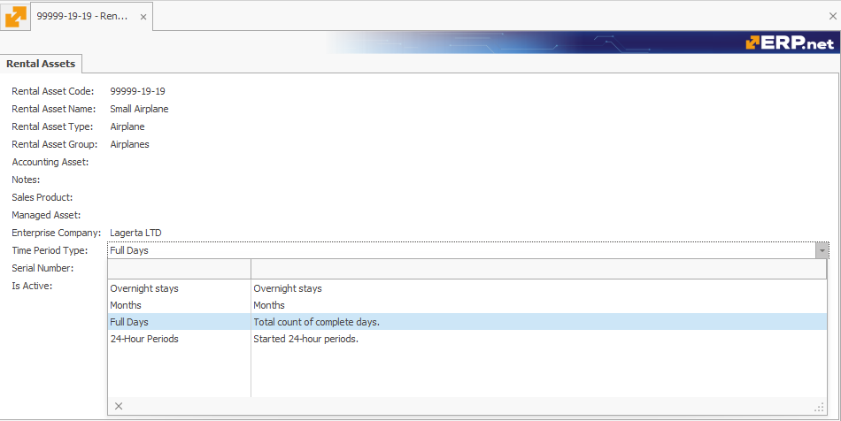
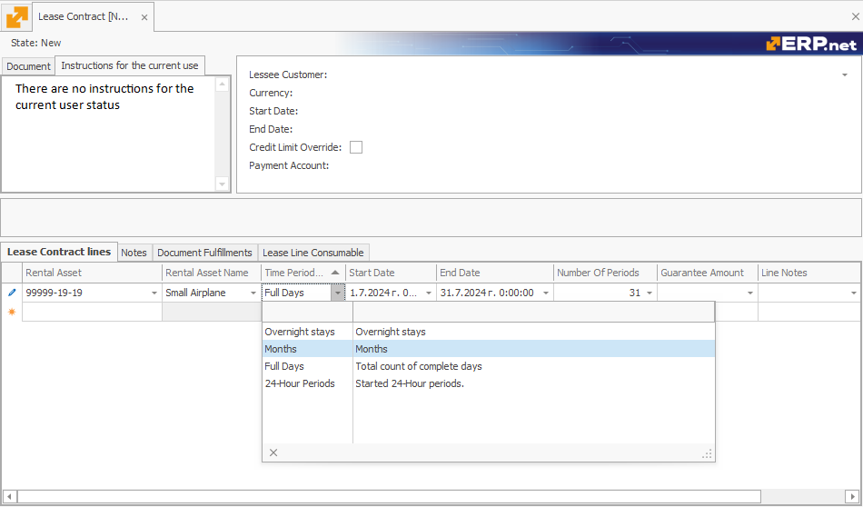
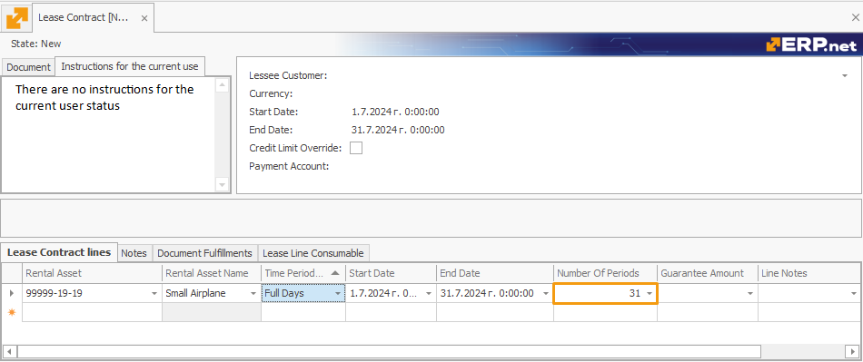
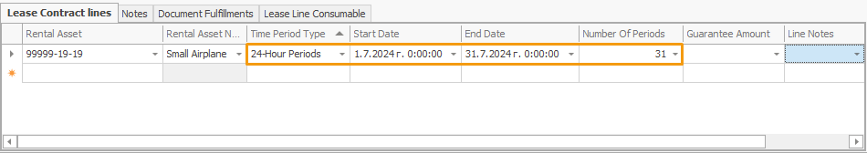
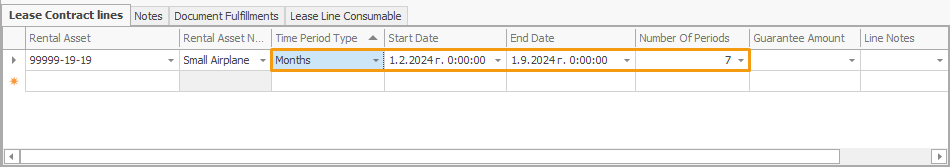

# Time period types

When defining a rental asset, you can specify one of four **time period types** for it to determine the unit by which the periods of renting this asset will be measured. Clicking on the **Time Period Type** field expands it into a dropdown menu with the following options:

## Options

### Full Days

Calculates the total number of complete days a rental asset is used.

It **does not** consider the receive and delivery hours specified in the respective Receive and Delivery transactions.

### 24-Hour Periods

Calculates all started 24-hour periods, taking into account the receive and delivery times specified in the respective transactions. 

If no protocols are generated in addition to the contract, it functions like the **Full Days** setting.

### Overnight Stays

Calculates the number of times the date in a specified period changes, assuming it does that only once when a day transitions into another.

### Months

Calculates the number of full calendar months that pass during a specified time range, taking into account shorter and longer months.

It is ideal for long-term rentals, providing an easy way to calculate monthly rental periods.

---

### Changing the Time Period Type

Each rental asset you add to a lease contract will assume its **default** time period type value assigned during its definition.

This value will be automatically reflected in the **lease contract line** the rental asset is added to.

However, you can always **change** it at any point prior to releasing the document. 

> [!Note]
> The time period type of a rental asset specified in the lease contract lines is **prioritised** over the one provided in its definition.

## Number of periods  	

Based on the Start and End date of the lease specified for the Time Period Type of a rental asset, an additional **Number of Periods** field is automatically calculated. It reveals **how many** full days, 24-hour periods, overnight stays, or months the asset will be leased for.

This automatic calculation applies for the **lease contracts lines** containing the respective rental asset(s), as well as for the lines of subsequently generated **transaction protocols** of type "Receive" and "Write Off Not Returned".

> [!NOTE]
> The **Number of Periods** for a Receive transaction will be calculated only after the respective Deliver transaction is set to **Released**.

In addition, once a lease contract is generated, the subsequently generated **sales order** accounting for the rent will base its **Quantity** field on the calculcated **Number of Periods** field. 

> [!WARNING]
> If you **modify** the Start and/or End date field for a Lease contract, Receive, or a Write Off Not Returned transaction that is already created, the respective document will be **re-generated**, and the value of the Number of Periods field will be **re-calculated**.

---

### Examples for calculating Number of Periods in Lease contract lines

#### Full Days

- **Start Date:** July 1, 2024
- **End Date:** July 31, 2024

Using this setting, the field will count each day from July 1 to July 31, inclusive.

*Number of Periods*: *31* 

#### 24-Hour Periods

- **Start Date:** July 1, 2024
- **End Date:** July 31, 2024

*Number of Periods*: *31*

#### Overnight Stays

- **Start Date:** July 1, 2024
- **End Date:** July 31, 2024

*Number of Periods:* *30* 

#### Months

- **Start Date:** February 1, 2024
- **End Date:** September 1, 2024

*Number of Periods:* *7* 

### Examples for calculating Number of Periods in Transaction lines 

#### Full Days

- **Start Date and Time**: July 1, 2024, 10:00 AM
- **End Date and Time**: July 31, 2024, 10:00 AM

*Number of Periods:* *31* 

#### 24-Hour Periods

- **Start Date and Time**: July 1, 2024, 3:00 PM
- **End Date and Time**: July 31, 2024, 2:00 PM

*Number of Periods:* *30* 

#### Overnight Stays

- **Start Date and Time**: July 1, 2024, 8:00 PM
- **End Date and Time**: July 31, 2024, 7:00 AM

*Number of Periods:* *30* 

#### Months

- **Start Date and Time**: February 1, 2024, 9:00 AM
- **End Date and Time**: September 1, 2024, 9:00 AM

*Number of Periods:* *7* 

> [!NOTE]
> In the **Deliver Transaction**, the **Number of Periods** field is not calculated and will not be referenced in any operational features.

> [!NOTE]
> 
> The screenshots taken for this article are from v24 of the platform.
