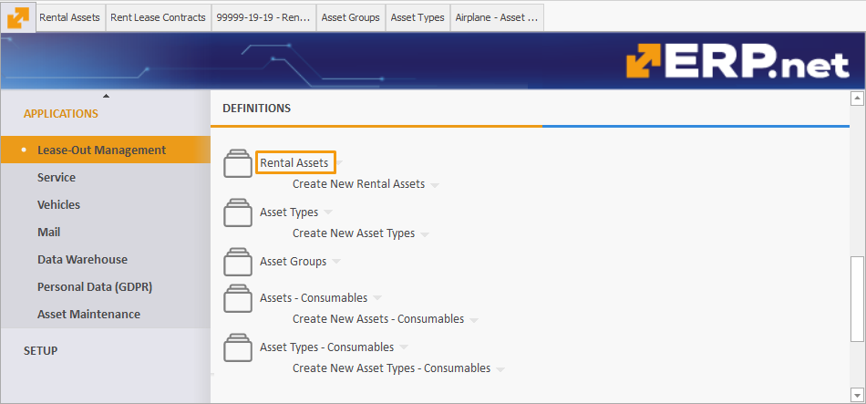
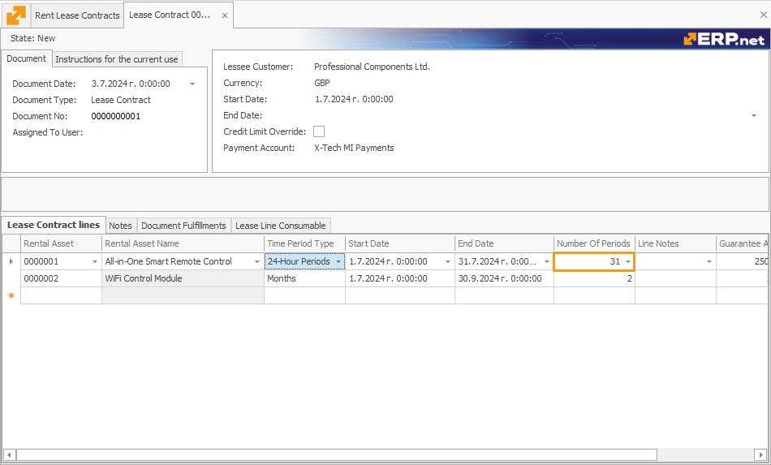

# Time Period Types

The **Time Period Type** field in the **Rental Asset** definition includes several options:

## Full Days

This method calculates the total number of complete days a rental asset is used, without considering specific reception and delivery hours. 

It offers a straightforward calculation of full calendar days.

## 24-Hour Periods

This method counts started 24-hour periods, taking into account the reception and delivery times specified in the protocols. 

If protocols are not used and only a **Rent Lease Contract** is present, it functions like the **Full Days** method, providing flexibility based on available documentation.

## Overnight Stays

This option counts the number of overnight stays or shifts, giving a clear picture of the actual rental usage for nights spent.

## Months

This value calculates the number of months from the selected start date to the same date of the following month. 

It is ideal for long-term rentals, providing an easy way to calculate monthly rental periods.

## Default Time Period Type for Rental Assets

When managing Rental Assets in **ERP.net**, you can assign a default time period type during creation or editing.

### Navigation

Navigate to Applications -> Rental -> Rental Assets. 

You can open an existing rental asset by clicking on its name or creating a new one.

### Assign a Time Period Type

After opening a **Rental Asset**, find the **Time Period Type** field and choose an option from the dropdown menu.

Assigning a time period type to a **Rental Asset** ensures:

- When **Rent Lease Contracts** are created for the **Rental Asset**, the assigned time period type is automatically applied by default.
- You can still adjust the time period type for individual **Rent Lease Contracts** as necessary.

### Number of Periods  	

In a **Rent Lease Contract**, the **Number of Periods** field indicates how many units of the selected **Time Period Type** are required for the duration of the contract. 

You can also locate this field in the **Transactions**, though it is not always automatically computed there.

If the contract period is adjusted and the handover transaction is released, the **Number of Periods** field will be recalculated accordingly.

### Examples 

#### Full Days

**Method Definition:** Calculates the total number of complete days a rental asset is used, without considering specific reception and delivery hours.

**Example:**
- **Start Date:** June 1, 2024
- **End Date:** June 10, 2024

Using the Full Days method, the calculation would simply count each day from June 1 to June 10, inclusive.

- Number of days: \( 10 \) days (June 1 to June 10)

#### 24-Hour Periods

**Method Definition:** Counts started 24-hour periods, considering specific reception and delivery times if protocols are in place. If no specific times are specified, it functions like the Full Days method.

**Example:**
- **Start Date:** July 1, 2024, 10:00 AM
- **End Date:** July 5, 2024, 9:00 AM

In this case, the rental period would be counted in 24-hour periods from the start time of July 1, 10:00 AM.

- July 1, 10:00 AM to July 2, 10:00 AM = 1 period
- July 2, 10:00 AM to July 3, 10:00 AM = 1 period
- July 3, 10:00 AM to July 4, 10:00 AM = 1 period
- July 4, 10:00 AM to July 5, 9:00 AM = 1 period

Total 24-hour periods: \( 4 \) periods

#### Overnight Stays

**Method Definition:** Counts the number of overnight stays or shifts, providing a clear picture of the actual rental usage in terms of nights spent.

**Example:**
- **Start Date:** August 1, 2024, check-in at 6:00 PM
- **End Date:** August 5, 2024, check-out at 10:00 AM

This method counts each night the asset is used for accommodation, regardless of the time of check-in and check-out.

- August 1 (night) to August 2 (morning) = 1 stay
- August 2 (night) to August 3 (morning) = 1 stay
- August 3 (night) to August 4 (morning) = 1 stay
- August 4 (night) to August 5 (morning) = 1 stay

Total overnight stays: \( 4 \) stays

#### Months

**Method Definition:** Calculates the number of months from the selected start date to the same date of the following month. Ideal for long-term rentals.

**Example:**
- **Start Date:** September 15, 2024
- **End Date:** November 15, 2024

This method counts the number of full months between the start and end dates.

- September 15 to October 15 = 1 month
- October 15 to November 15 = 1 month

Total months: \( 2 \) months

