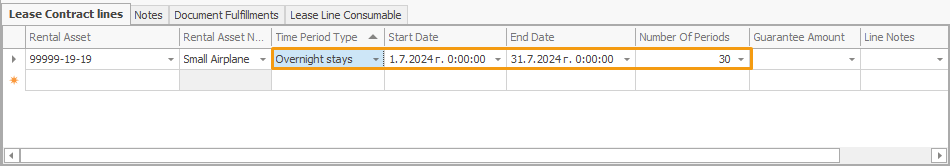

# Time period types

When defining a rental asset, you can specify one of four **time period types** for it to determine the unit by which the periods of renting this asset will be measured. Clicking on the **Time Period Type** field expands it into a dropdown menu with the following options:

## Options
---

### Full Days

Calculates the total number of complete days a rental asset is used, including the specified start and end date.

It **does not** consider the receive and delivery hours specified in the respective Receive and Delivery transactions.

### 24-Hour Periods

Calculates all started 24-hour periods, taking into account the receive and delivery times specified in the respective transactions. 

If no protocols are generated in addition to the contract, it functions like the **Full Days** setting.

### Overnight Stays

Calculates the number of nights, or how many times the date in a specified period changes.

### Months

Calculates the number of months full calendar months, taking into account months with 28, 29, 30 and 31 days.

It is ideal for long-term rentals, providing an easy way to calculate monthly rental periods.

---

### Changing the Time Period Type

Each rental asset you add to a lease contract will assume its **default** time period type value assigned during its definition.

This value will be automatically reflected in the **lease contract line** the rental asset is added to.

However, you can always **change** it at any point prior to releasing the document. 

> [!Note]
> The time period type of a rental asset specified in the lease contract lines is **prioritised** over the one provided in its definition.

## Number of periods  	

Based on the Start and End date of the lease, as well as the Time Period Type specified for the asset, an additional **Number of Periods** field is automatically calculated. It reveals **how many** full days, 24-hour periods, overnight stays, or months the asset will be leased for.

This automatic calculation applies for the **lease contracts lines** containing the respective rental asset(s), as well as for the lines of subsequently generated **transaction protocols** of type "Receive" and "Write Off Not Returned".

> [!NOTE]
> The **Number of Periods** for a Receive transaction will be calculated only after the previously generated Deliver transaction from the same **[document flow](https://docs.erp.net/tech/modules/applications/rental/index.html#document-flow)** is set to **Released**.

In addition, once a lease contract is generated, the subsequently generated **sales order** accounting for the rent will base its **Quantity** field on the calculcated **Number of Periods** field. 

> [!WARNING]
> If you **modify** the rental asset, as well as the Start and/or End date fields for a Lease contract, a Receive transaction, or a Write Off Not Returned transaction, the respective documents from the document flow will be **re-generated**, and the value of the Number of Periods field will be **re-calculated**.

---

### Examples for calculating Number of Periods in Lease contract lines

The following examples show how the Number of Periods field is calculcated in the lease contract lines.

Keep in mind that the hours for delivering and receiving the rental asset are not taken into account.

#### Full Days

- **Start Date:** July 1, 2024
- **End Date:** July 31, 2024

*Number of Periods*: *31* 

#### 24-Hour Periods

- **Start Date:** July 1, 2024
- **End Date:** July 31, 2024

*Number of Periods*: *31*

#### Overnight Stays

- **Start Date:** July 1, 2024
- **End Date:** July 31, 2024

*Number of Periods:* *30* 

#### Months

- **Start Date:** February 1, 2024
- **End Date:** September 1, 2024

*Number of Periods:* *7* 

### Examples for calculating Number of Periods in Receive transaction lines 

The following examples show how the Number of Periods field is calculcated in the receive transaction lines.

Keep in mind that the hours for handing over and receiving the rental asset are taken into account.

#### Full Days

- **Start Date**: July 1, 2024, 10:00 AM
- **End Date**: July 31, 2024, 9:15 AM

*Number of Periods:* *31* 

**OR**

- **Start Date:** July 1, 2024, 10:00 AM
- **End Date:** July 31, 2024, 6:30 PM

_Number of Periods:_ _31_

#### 24-Hour Periods

- **Start Date**: July 1, 2024, 10:00 АM
- **End Date**: July 31, 2024, 9:15 АM

*Number of Periods:* *30*

**OR**

- **Start Date:** July 1, 2024, 10:00 AM
- **End Date:** July 31, 2024, 6:30 PM

_Number of Periods:_ _31_

#### Overnight Stays

- **Start Date**: July 1, 2024, 10:00 АM
- **End Date**: July 31, 2024, 9:15 AM

*Number of Periods:* *30* 

**OR**

- **Start Date:** July 1, 2024, 10:00 AM
- **End Date:** July 31, 2024, 6:30 PM

_Number of Periods: 30_

#### Months

- **Start Date**: February 1, 2024, 10:00 AM
- **End Date**: September 1, 2024, 9:15 AM

*Number of Periods:* *7*

**OR**

- **Start Date:** February 1, 2024, 10:00 AM
- **End Date:** September 1, 2024, 6:30 PM

_Number of Periods: 7_

> [!NOTE]
> 
> The screenshots taken for this article are from v24 of the platform.
