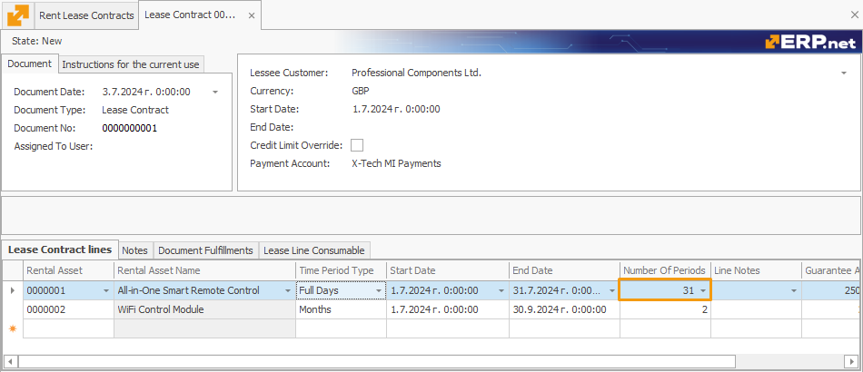

# Time Period Types

When defining a rental asset, you can specify one of four **time period types** for it to determine the unit by which the periods of renting this asset will be measured. 

The **Time Period Type** field expands into a dropdown menu with the following options:

### Full Days

Calculates the total number of complete days a rental asset is used, without considering the receive and delivery hours specified in the respective transactions.

**Example:**
- **Start Date:** June 1, 2024
- **End Date:** June 10, 2024

Using the Full Days method, the calculation would simply count each day from June 1 to June 10, inclusive.

- Number of days: \( 10 \) days (June 1 to June 10)

### 24-Hour Periods

Calculates all started 24-hour periods, taking into account the receive and delivery times specified in the respective transactions. 

If no protocols are generated in addition to the contract, it functions like the **Full Days** setting.

**Example:**
- **Start Date:** July 1, 2024, 10:00 AM
- **End Date:** July 5, 2024, 9:00 AM

In this case, the rental period would be counted in 24-hour periods from the start time of July 1, 10:00 AM.

- July 1, 10:00 AM to July 2, 10:00 AM = 1 period
- July 2, 10:00 AM to July 3, 10:00 AM = 1 period
- July 3, 10:00 AM to July 4, 10:00 AM = 1 period
- July 4, 10:00 AM to July 5, 9:00 AM = 1 period

Total 24-hour periods: \( 4 \) periods

### Overnight Stays

Calculates the number of times the date in a specified period changes, assuming that it does that only once when one day transitions into the next.

**Example:**
- **Start Date:** August 1, 2024, check-in at 6:00 PM
- **End Date:** August 5, 2024, check-out at 10:00 AM

This method counts each night the asset is used for accommodation, regardless of the time of check-in and check-out.

- August 1 (night) to August 2 (morning) = 1 stay
- August 2 (night) to August 3 (morning) = 1 stay
- August 3 (night) to August 4 (morning) = 1 stay
- August 4 (night) to August 5 (morning) = 1 stay

Total overnight stays: \( 4 \) stays

### Months

Calculates the number of full calendar months that pass during a specified time range, taking into account shorter and longer months.

It is ideal for long-term rentals, providing an easy way to calculate monthly rental periods.

**Example:**
- **Start Date:** September 15, 2024
- **End Date:** November 15, 2024

This method counts the number of full months between the start and end dates.

- September 15 to October 15 = 1 month
- October 15 to November 15 = 1 month

Total months: \( 2 \) months

## Time Period Type in the Lease contract lines 

Each rental asset you add to the lease contract can have a default time period type assigned during its definition.

This setting will be automatically applied in the **lease contract line** the rental asset is added to, and you can still change it before releasing the document. 

> [!Note]
> The time period type specified in the lease contract is prioritised over the one provided for the rental asset definition.

## Number of periods  	

Based on the Start and End date of the lease specified for a particular Time Period Type of a rental asset, an additional **Number of Periods** field is automatically calculated.

This applies for the lease contracts lines and the lines of subsequent transactions of type Receive and Write Off Not Returned.

> [!NOTE]
> In order for the **Number of Periods** to be calculated for a receive transaction, the respective deliver transaction must be set to **Released**.

In addition, once a lease contract is generated, the subsequent sales order accounting for the rent will base its **Quantity** field on the calculcated **Number of Periods** field. 

> [!WARNING]
> If you **modify** the Start and/or End date field for a lease contract that is already created, it will lead to the re-generation of its respective transactions.

### Examples

#### Full Days

- **Start Date:** June 1, 2024
- **End Date:** June 10, 2024

Using the Full Days method, the calculation would simply count each day from June 1 to June 10, inclusive.

- Number of days: \( 10 \) days (June 1 to June 10)

#### 24-Hour Periods

- **Start Date:** July 1, 2024, 10:00 AM
- **End Date:** July 5, 2024, 9:00 AM

In this case, the rental period would be counted in 24-hour periods from the start time of July 1, 10:00 AM.

- July 1, 10:00 AM to July 2, 10:00 AM = 1 period
- July 2, 10:00 AM to July 3, 10:00 AM = 1 period
- July 3, 10:00 AM to July 4, 10:00 AM = 1 period
- July 4, 10:00 AM to July 5, 9:00 AM = 1 period

Total 24-hour periods: \( 4 \) periods

#### Overnight Stays

- **Start Date:** August 1, 2024, check-in at 6:00 PM
- **End Date:** August 5, 2024, check-out at 10:00 AM

This method counts each night the asset is used for accommodation, regardless of the time of check-in and check-out.

- August 1 (night) to August 2 (morning) = 1 stay
- August 2 (night) to August 3 (morning) = 1 stay
- August 3 (night) to August 4 (morning) = 1 stay
- August 4 (night) to August 5 (morning) = 1 stay

Total overnight stays: \( 4 \) stays

#### Months

- **Start Date:** September 15, 2024
- **End Date:** November 15, 2024

This method counts the number of full months between the start and end dates.

- September 15 to October 15 = 1 month
- October 15 to November 15 = 1 month

Total months: \( 2 \) months

> [!NOTE]
> 
> The screenshots taken for this article are from v24 of the platform.
