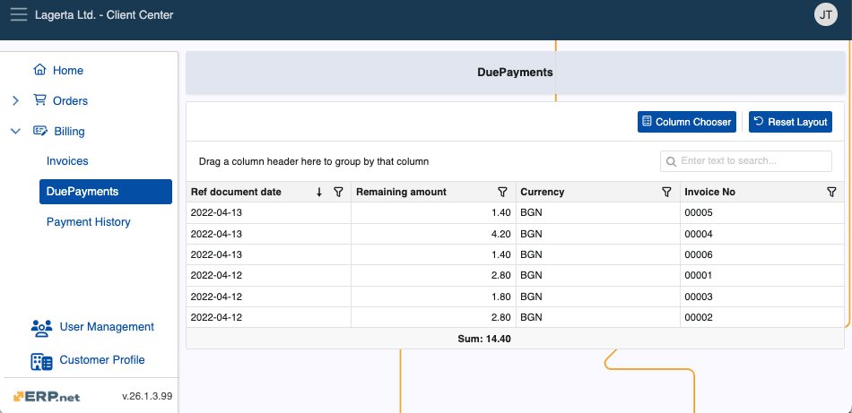
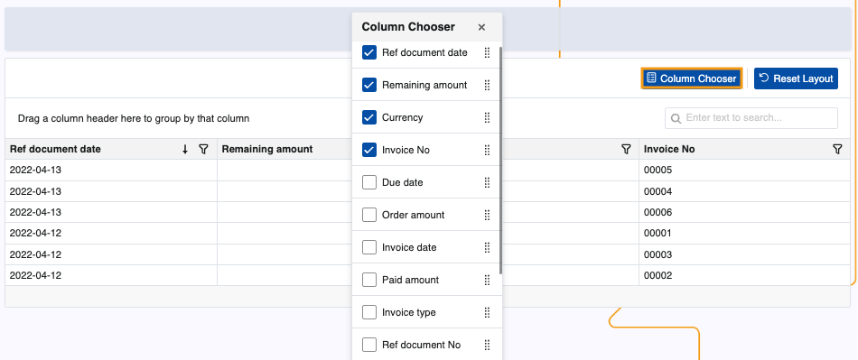
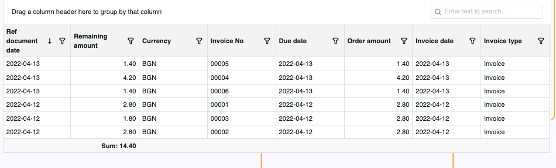

# Due Payments

The Due Payments page keeps a log of all customer due (unresolved) payments, with relevant information for each of them.

It is accessible by Client Center users with **[external role](https://docs.erp.net/tech/modules/crm/sales/customers/external-access.html#roles)** **L40 - Billing** and above.

### Details

You can find the following information about each due payment in the table:

- **Ref document date** - The date when the reference document for which there is a due payment was created.
- **Remaining amount** - The amount due to be paid.
- **Currency** - The currency of the respective amount.
- **Invoice No** - Number of the invoice document for which there is a due payment.

### Expanded view

With the Client Center's built-in **[Column Chooser](https://docs.erp.net/tech/modules/crm/clientcenter/grid-control.html#column-chooser)**, you can reveal more information about the payments in the table.

Simply click on the respective column's box to add it.

This can significantly expand the table with information like due date, paid amount, and number of overdue days.

> [!NOTE]
> The screenshots taken for this article are from v26 of the platform.
> 
