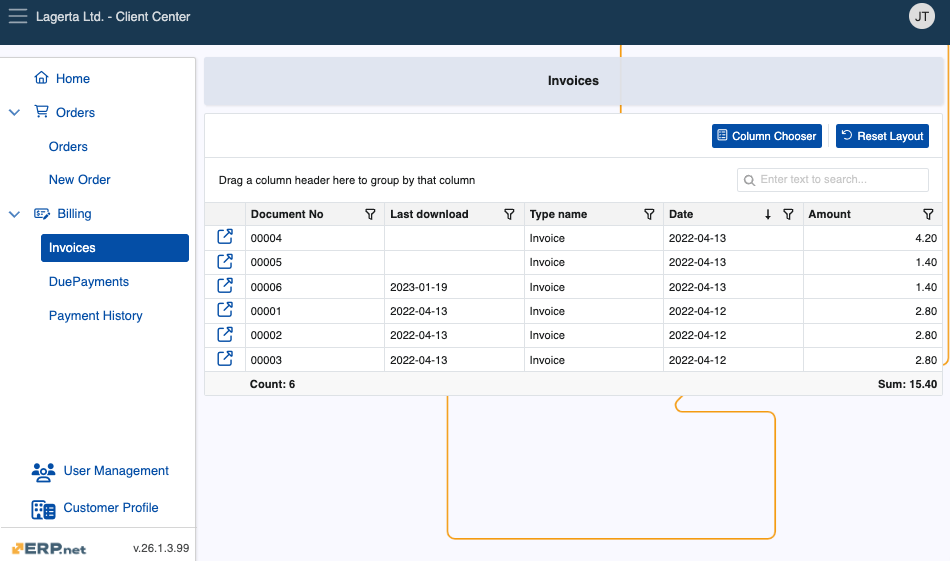
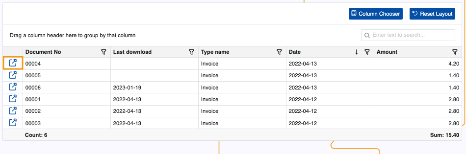
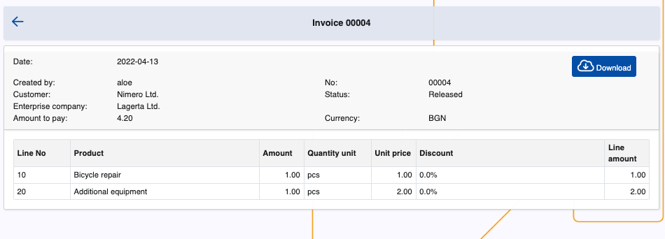
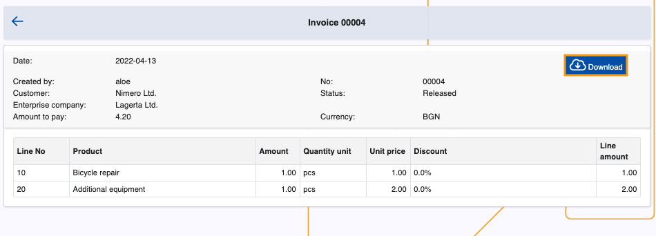

# Invoices

The Invoices page is responsible for storing all customer invoices, with relevant information for each of them. 

It is accessible by Client Center users with **[external role](modules/crm/sales/customers/external-access.md)** **L40 - Billing** and above.

### Details

You can find the following information about each invoice in the table:

- **Document No** - The document number.
- **Last download** - The last time the document was downloaded.
- **Type name** - Type of the document, Invoice by default.
- **Date** - Date of creation of the document.
- **Amount** - The amount of the invoice.

### Expanded view

If you click the **blue arrow button** on the leftmost portion of a row, you can reveal more details about an invoice.

This includes customer, status and enterprise company data, as well as individual document lines breakdown.

You can also optionally **download** an invoice for external view.

> [!NOTE]
> 
> The screenshots taken for this article are from v26 of the platform.
