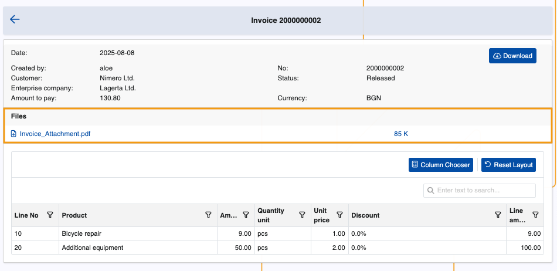

# Invoices

The Invoices page is responsible for storing all customer invoices, with relevant information for each of them. 

It is accessible by Client Center users with **[external role](https://docs.erp.net/tech/modules/crm/sales/customers/external-access.html#roles)** **L40 - Billing** and above.

### Details

You can find the following information about each invoice in the table:

- **Document No** - The document number.
- **Last download** - The last time the document was downloaded.
- **Type name** - Type of the document, Invoice by default.
- **Date** - Date of creation of the document.
- **Amount** - The amount of the invoice.

### Document types

By default, the **Invoices** page displays all invoices of all document types.

Administrators can optionally configure it to display only invoices of a certain type. 

If set, the **[InvoiceDocumentTypes JSON setting](https://docs.erp.net/tech/modules/crm/clientcenter/reference.html#invoicedocumenttypes-setting)** determines which invoice document type or types can be shown.

## Invoice document

If you click the **blue arrow button** on the leftmost portion of a row, you can reveal more details about an invoice.

This includes customer, status and enterprise company data, as well as individual document lines breakdown.

If present, files attached to an invoice will be displayed in a dedicated section, along with their name, extension and size.

**Clicking once** on a file's name will trigger its download.

File attachments whose **[Access Permission](https://docs.erp.net/webclient/introduction/how-to/access-permission-field.html)** field is not set to **"Internal users + external users"** will not appear in the **Files** section.

If none of the invoice’s attachments have this setting configured, the **Files** section will not appear at all.

You can also optionally **download** the entire invoice as a PDF file.

> [!NOTE]
> 
> The screenshots taken for this article are from v26 of the platform.
