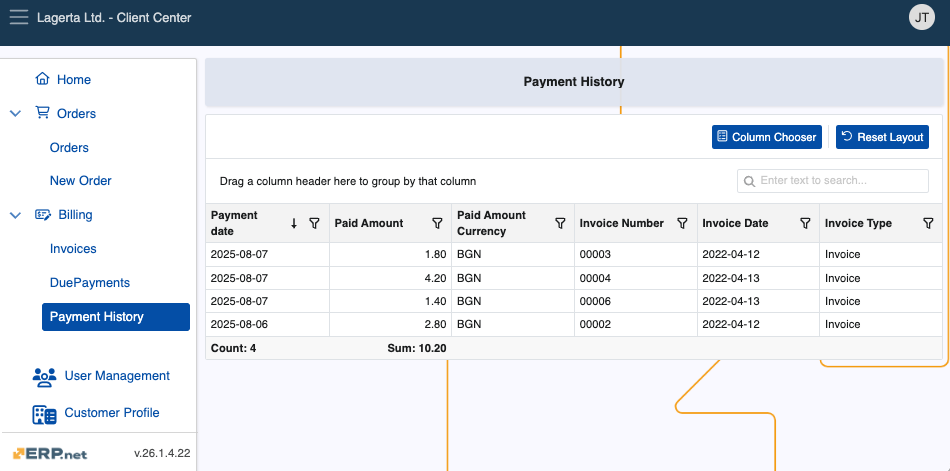
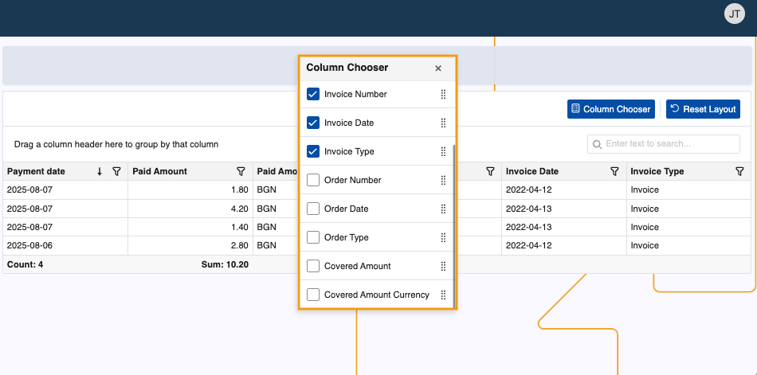
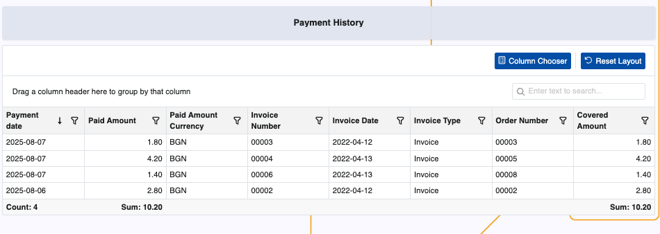

# Payment History

The Payment History page stores all customer payments made within the past 12 months.

It is accessible to users with the **[external role](/modules/crm/sales/customers/external-access.md#roles)** **L40 – Billing** and above.

### Details

You can find the following information about each payment in the table:

- **Payment date** - Date the payment was made.
- **Paid Amount** - Total amount paid.
- **Paid Amount Currency** - Currency of the paid amount.
- **Invoice Number** - Number of the invoice for which the payment was made.
- **Invoice Date** - Date the invoice was generated.
- **Invoice Type** - Type of the invoice.

> [!NOTE]
>
> The table stores up to 1,000 payment records made in the last 12 months relative to now.

### Expanded view

The table displays the most important columns by default, but with the Client Center's built-in **[Column Chooser](../grid-control.md#column-chooser)**, you can reveal more.

Simply click on the respective column's box to add it.

This can expand the table with information like order number and covered amount.

> [!NOTE]
> The screenshots taken for this article are from v26 of the platform.
> 
