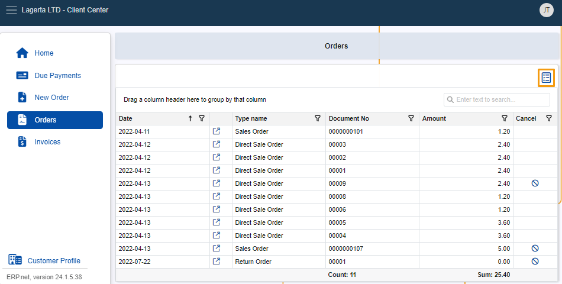

# Grid control 

The **Grid control** comprises a collection of tools built-in within Client Center navigators. 

It offers functionalities like sorting, filtering, and summarizing information, which are collectively responsible for displaying and organizing data in a more intuitive, use-case-specific way.

## Total summary

The **Total summary** option automatically calculates the **Count** (number) of documents and the total **Sum** of amounts across all pages of a given navigator.

## Filter and search

Using the built-in **Column filter** and the **Search Box**, you can easily filter large numbers of documents, as well as search for and find specific ones.

### Column filter

The Column filter is accessible through the **funnel button** at the far-right of a column's title.

Once you expand it, you can decide exactly how that particular column should filter the navigator's contents.

For instance, you can filter the **Date** column to display documents from only a specific month of a year, or the **Type name** column to show records only of a given type.

### Search Box

Using the Search Box, you can input a word, letter, or number, to see items containing your specified input in **any** of the navigator's columns.

## Grouping and summarizing

You can **group** a navigator's contents by their column headers in order to organize them in a more specific tree-like hierarchical structure.

Taking advantage of the **Group footer summary** option, you can also see summarized information for each group that includes counts and sums.

To group, simply drag and drop a column header into the **”_Drag a column header here to group by that column_”** row found above the table.

You can also group by **multiple** columns by dragging and dropping additional column headers next to the first one. 

Existing records will first be grouped by the initial column, and then by each subsequent one you include.

## Column chooser

The **Column Chooser** option allows you to decide which columns to display in a navigator, as well as determine their order.

To access it, click on the **blue icon** at the top-right of the page. 

Choose which columns will be displayed by checking the ones that you want to show.

## Layout Persistence

However you modify your Client Center navigator layout, your last preferred view will be loaded the next time you log-in, ensuring a personalized and consistent experience.

> [!NOTE]
> 
> The screenshots taken for this article are from v24 of the platform.
