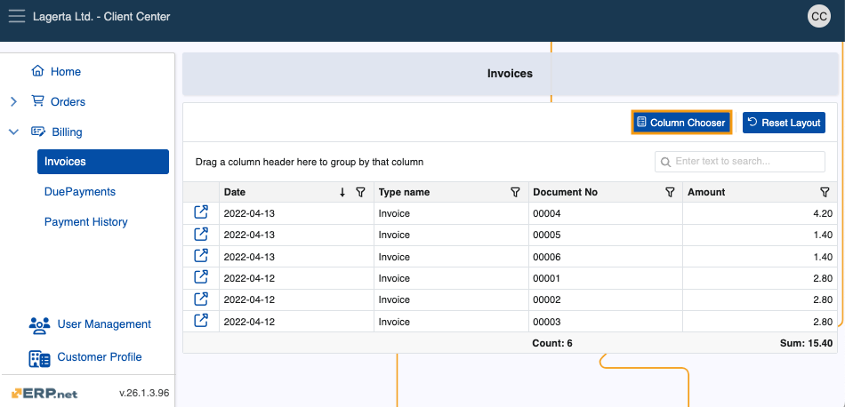
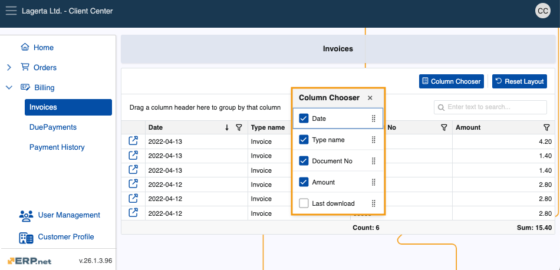
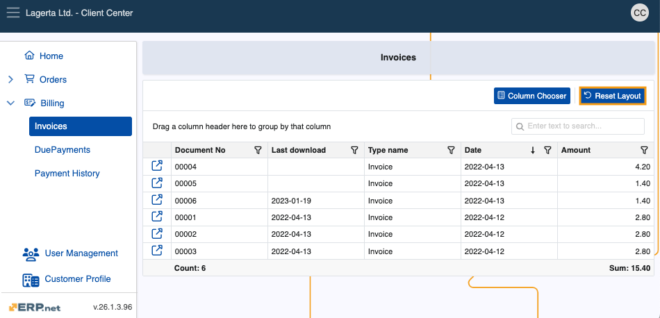

# Grid control 

The **Grid control** comprises a collection of tools built-in within Client Center navigators. 

It offers functionalities like sorting, filtering, and summarizing information, which are collectively responsible for displaying and organizing data in a more intuitive, use-case-specific way.

## Total summary

The **Total summary** option automatically calculates the **Count** (number) of documents and the total **Sum** of their amounts across all pages of a given navigator.

Information is displayed at the bottom of the table, under the **Document No** and **Amount** columns, respectively.

## Filter and search

Using the **Column filter** and the **Search Box**, you can easily filter your existing documents, as well as search for and find specific ones.

### Column filter

The Column filter is accessible through the **funnel button** at the far-right of a column's title.

Once you expand it, you can decide exactly how that particular column should filter the navigator's contents.

For instance, you may filter the **Date** column to display documents only from a specific month of a year, or the **Type name** column to show records only from a given type.

### Search bar

The Search bar allows you to input a word, letter, or number and then see items containing that input in **any** of the navigator's columns.

## Grouping and summarizing

You can **group** a navigator's contents by their column headers in order to organize them in a more specific tree-like hierarchical structure.

With the **Group footer summary** option, you can also see summarized information for each group, which includes **counts** for document numbers and **sums** for document amounts.

To group, simply drag and drop a column header into the **”_Drag a column header here to group by that column_”** row above the table.

You can also group by **multiple** columns by dragging and dropping additional column headers next to the first one. 

Existing records will first be grouped by the initial column, and then by each subsequent one you include.

## Column chooser

The **Column Chooser** option allows you to decide which columns to display in a navigator, as well as determine their order.

To access it, click on the **Column Chooser** button above the Search bar. 

Choose which columns will be displayed by checking the ones that you want to show.

## Save and restore layout

However you modify your Client Center navigator layout, your last preferred view will be **saved** and **restored** the next time you log in, ensuring a consistent experience.

You can always reset your layout to its default view by clicking **Reset Layout**.

> [!NOTE]
> 
> The screenshots taken for this article are from v24 and v26 of the platform.
