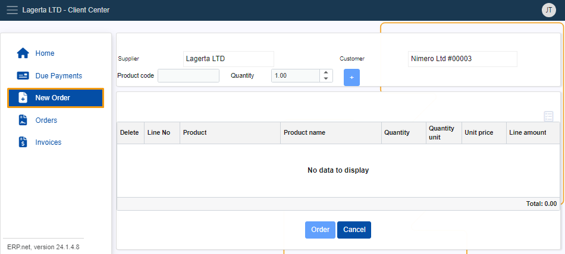
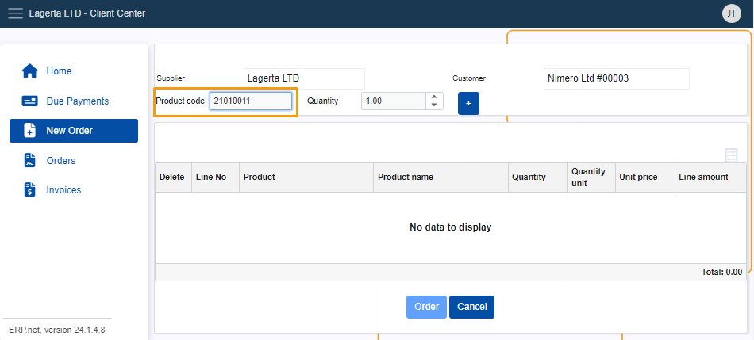

# How to create a new order

To create an order in the **Client Center**, you need to have this feature enabled manually.

See **[this guide](apply-platform-settings.md)** if you haven't already done that.

When you have access to the New Order functionality, you need to obtain all the necessary **product codes** to complete your order.

## Step-by-step process

1. Click on the **New Order** button in the **Client Center** menu. 

2. Enter the respective product code(s) into the **Product code** field.

   Apply a **quantity** value if your order contains multiple instances of the same product.

3. Click the **plus** button to add your product(s) in the order.

4. Proceed to finalize the order by clicking the **Order** button.

> [!NOTE]
> 
> The screenshots taken for this article are from v24 of the platform.
