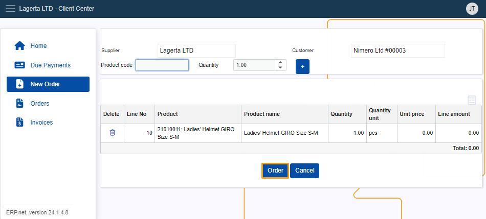

# How to create new Orders 

In order to create an order within the **Client Center**, it's mandatory to have the **Product code**. 

To complete the process you need to enter the Product code manually.

## Creating an order 

To create a new order click on the **New Order** button of the **Client Center's** menu. 

Enter the relevant product code into the **Product code** field.

Show the order details by clicking on the **Customer** button, which will display the product in the list below.

Once yo've done that, proceed to finalize the order by clicking the **Order** button.

