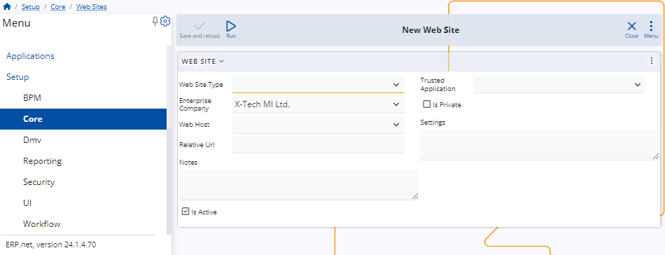
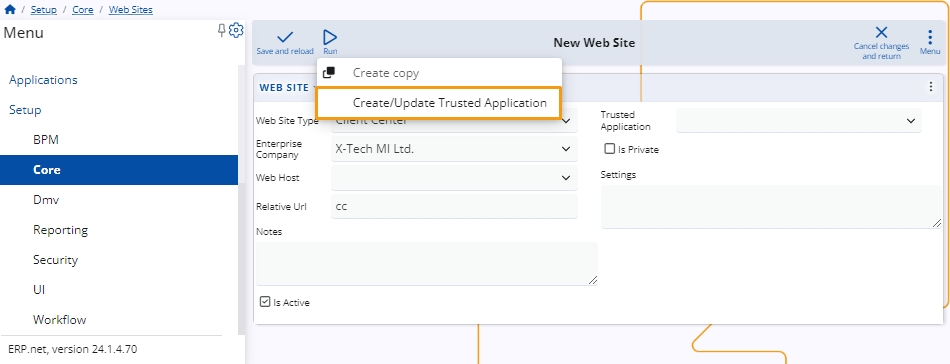
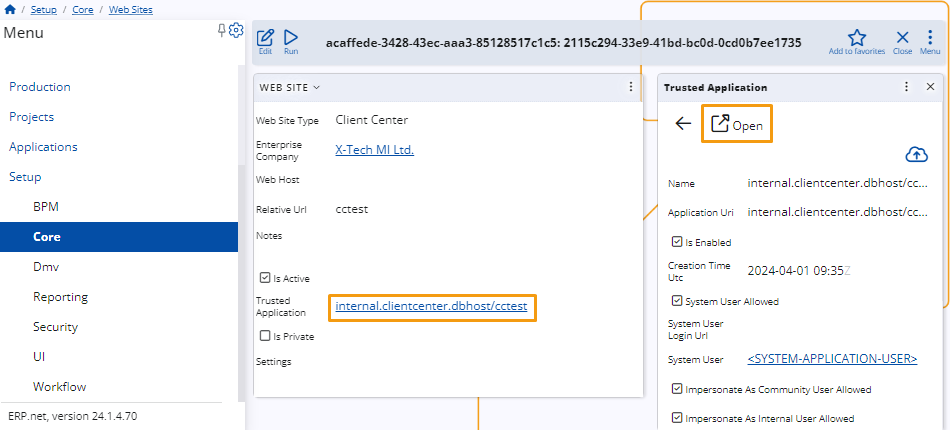

# How to define a website of type Client Center

This article provides a step-by-step guide on creating a Client Center website through ERP.net.

### Prerequisites 

To define a website of **Client Center** type, navigate to the **Web Sites** panel within the **Core** section of the **Setup** module.

### Website definition

Upon accessing the **New Web Site** form, you need to enter relevant data into the provided fields.

 
1. The only mandatory field is **Web Site Type**. In this case, it should be set to **Client Center**. 

2. Make sure you've selected the appropriate **Enterprise Company**. 

3. Additionally, you may change the **Relative Url** of the website, which is set to "cc" by default. 

4. It's necessary to create a **trusted application**.
   
   To do so, click on **Run**, select the **Create/Update Trusted Application** option, and confirm with **OK**.

5. Once you complete this step, hit **Save and reload**.
   
   The new Client Center website will be created and you can access its internal application details through the form.

If you've passed all the steps successfully, you may proceed to **[define users](setup-a-new-user-account.md)** who can access the Client Center.

> [!NOTE]
> 
> You can observe and restart all sites through the **Instance Manager**.

> [!NOTE]
> 
> The screenshots taken for this article are from v24 of the platform.
