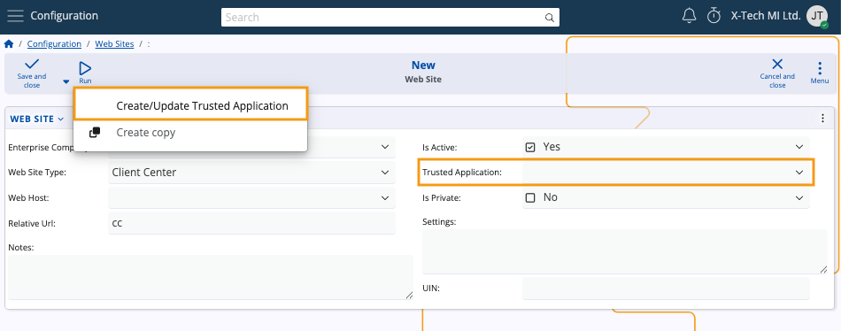

# How to set up a Client Center

This article provides a step-by-step guide on creating a Client Center website through @@name.

> [!Note]
> 
> As of **@@name version 26**, website configuration takes place under **System** -> **Configuration** -> **Web Sites**. <br>
> For version 24, you can find the Web Sites panel under **Setup** -> **Core**.

## Step by step process

To set up a website of **Client Center** type, navigate to the **Web Sites** panel within the **Configuration** section of the **System** module.


Then, click the **+ button** to begin creating a new web site.


### Website definition

Upon accessing the **New Web Site** form, you need to enter relevant data into the provided fields.


 
1. The only mandatory field is **Web Site Type**. In this case, it should be set to **Client Center**. 

2. Make sure you've selected the appropriate **Enterprise Company**. The currently logged-in one is chosen by default.

3. Additionally, you may specify the **Relative Url** of the website, which is set to "cc" by default. 

> [!Tip]
> 
> You should define a distinct site with a unique **Relative URL** or **Host** for each **Enterprise Company**.

4. It's necessary to create a **trusted application** to ensure the security and integrity of the new website.
   
   You can do that from the Run button or through the dedicated Trusted Application field. 

   

5. Specify settings that will apply to your Client Center website.

   You can do this now or later when **editing** the web site. More information can be found **below**.

6. Once you are ready, click **Save and reload**.
   
   The new Client Center website will be created and you can access its internal application details through the form.

   

## Apply platform settings

Like all @@name websites, the Client Center can have certain settings applied for it.

This includes specific visual and functional modifications. 

Below are examples of important settings you can apply to your Client Center website:

- The ability to reveal or hide the **New Order** menu, allowing or restricting users to create new orders.

    By default, this button is **hidden** so as to prevent potential information leaks.

    You need to enable the functionality **manually** only when that’s necessary.

- The ability to define the sales order document type for new orders in the Client Center. 

    You must input a **valid** **SalesOrder.DocumentType ID**. 

    This could be quite helpful for separating orders made in the Client Center from those made in other modules.

### JSON format definition

Client Center settings must be configured in a **key-value pair JSON format**. 

### Prerequisites

You need to navigate to your website's main environment, access the Client Center's details, and enter the website's settings. 

Editing mode must be active for all website-related fields. 

If the **Settings** field is not in view, use the **Show/hide field** button to toggle its visibility.

### Step-by-step process

1.	Inside the **Settings** field, input the following:

{<br>
    		"NewOrderDocumentType": "DocumentType.Id",<br>
    		"IsNewOrderEnabled": true/false, <br>"IsOrdersEnabled": true/false<br>

}

where 

- *NewOrderDocumentType* takes the valid ID value of a new (sales) order.

-  _IsNewOrderEnabled_ defines if the button for order creation will be shown or hidden to the users when they log into the system (**true** meaning visible, **false** meaning restricted).
- *IsOrdersEnabled* determines whether the "Orders" section will be present in the Client center. (**true** meaning visible, **false** meaning restricted).


2.	**Apply** the new settings.

## Troubleshooting

Depending on how you define the settings, you can encounter the following scenarios:

1.	Both settings are set:

```
    	"NewOrderDocumentType": "07c7ef2f-abc1-47d9-9d40-bc1e0acd1e7c",
   	"IsNewOrderEnabled": true
```

This results in the menu button allowing for the creation of a new order to be shown, and the document type to be set as a sales order.

If the ID doesn’t match any document of type Sales order, you’ll get an error:

**008 - Not well formatted json string**

You need to erase all inputted values, save your progress, refresh the website, and insert the correct values.

2.	Only one of the settings is set:

```
   	  "IsNewOrderEnabled": true
```

Here, the system will generate another error:

**009 – NewOrderDocumentType is set, but DocumentType is null**

3.	No settings are set:

In this scenario, both settings assume two values by default:

```
    	"NewOrderDocumentType": "CRM_SALES_ORDER.Id",
        "IsNewOrderEnabled": false
```

The button used for creating a new order will not be shown. 

If you try to use a link leading to the direct creation of an order, you’ll see the following message:

**You are not authorized to view this page.**

For more information, see the **[reference](https://docs.erp.net/tech/modules/crm/clientcenter/reference.html)**.

## Automatic tracking

Whenever you apply or change settings for the Client Center, they’re **tracked** by the system in real-time and are reflected immediately.

## User-level security

By default, the Client Center uses a system user known as **System-Application-User**. 

This user has rights to apply or change settings only in accordance with the normal functioning of the website. 

For better security, another more restricted user can be used. 

By default, the **System-Application-User** has System rights, but reflects used licenses as well. 

It’s automatically assigned whenever a new website is created and whenever a trusted application is added through the UI.

## Error visualization

When you encounter a problem in the platform, a relevant, easy-to-read and interactive **[error message](https://docs.erp.net/tech/modules/crm/clientcenter/reference.html#error-exception-codes)** will be shown explaining its nature. 


If you've passed all the steps successfully, you may proceed to **[define users](https://docs.erp.net/tech/modules/crm/clientcenter/how-to/setup-a-new-user-account-v26.html)** who can access the Client Center.

> [!Tip]
> 
> All sites can be observed, managed and restarted through the **Instance Manager**.

> [!NOTE]
> 
> The screenshots taken for this article are from v26 of the platform.
