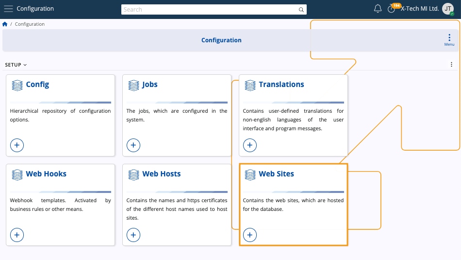
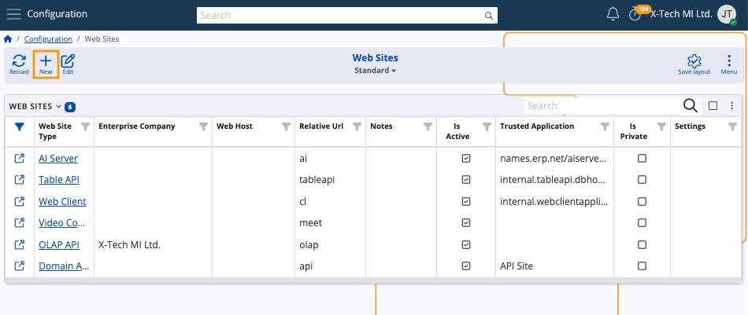
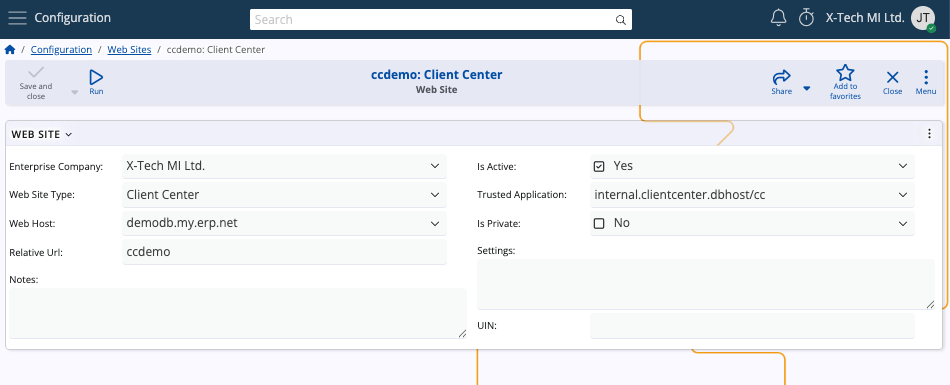
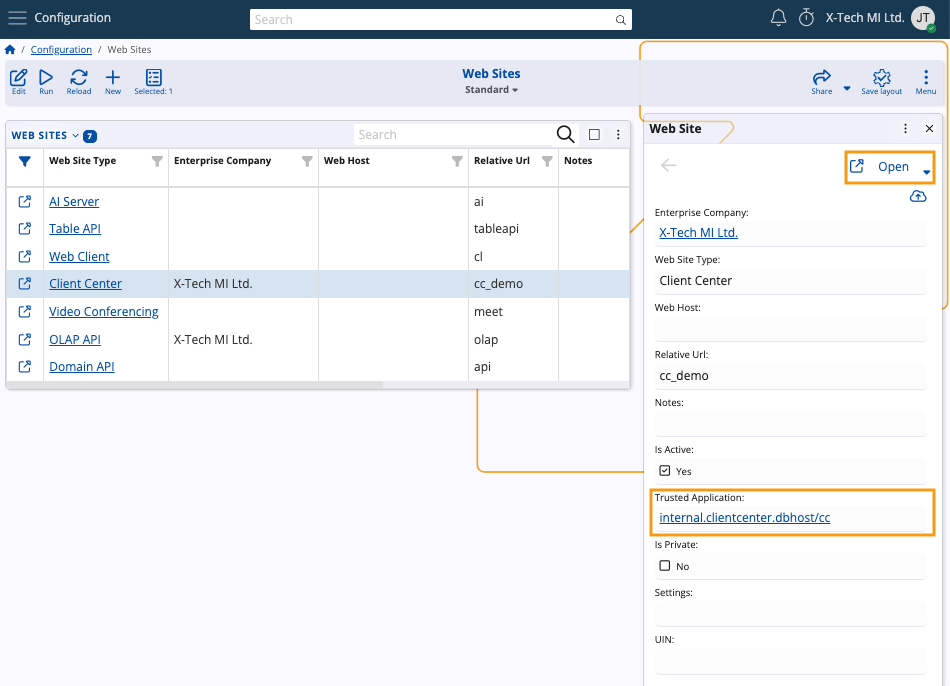

# How to set up a Client Center

This article provides a step-by-step guide on creating a Client Center website through @@name.

> [!Note]
> 
> As of **@@name version 26**, website configuration takes place under **System** -> **Configuration** -> **Web Sites**. <br>
> For version 24, you can find the Web Sites panel under **Setup** -> **Core**.

## Step by step process

To set up a website of **Client Center** type, navigate to the **Web Sites** panel within the **Configuration** section of the **System** module.



Then, click the **New button** to begin creating a new web site.



### Website definition

Upon accessing the **New Web Site** form, you need to enter relevant data into the provided fields.


 
1. Select the appropriate **Enterprise Company** for which the Client Center is created. The currently logged-in one is chosen by default.
2. The only mandatory field is **Web Site Type**. In this case, it should be set to **Client Center**.
3. Additionally, specify the **Relative Url** of the website, which is set to "cc" by default. 

> [!Tip]
> 
> You should define a distinct site with a unique **Relative URL** or **Host** for each **Enterprise Company**.

4. Specify **settings** that will apply to your Client Center website.

   You can do this now or later when **editing** the web site. More information can be found **[below](define-a-new-cc.md#apply-platform-settings)**.

5. Once you are ready, click **Save and reload**.
   
   The new Client Center website will be created and you can access its internal application details through the form.

   

## Apply platform settings

Like all ERP websites, the Client Center can have certain settings applied for it. This includes visual and functional modifications. 

Below are important settings you can apply to the Client Center: 

- The ability to reveal or hide the **[New Order module](https://docs.erp.net/tech/modules/crm/clientcenter/orders/new-order.html?q=new%20order)**.

- The ability to define which document types are shown in the **[Orders](https://docs.erp.net/tech/modules/crm/clientcenter/orders/orders.html)** and the **[Invoices](https://docs.erp.net/tech/modules/crm/clientcenter/billing/invoices.html)** modules.

An extensive list of all settings can be found in the **[Settings and errors reference](https://docs.erp.net/tech/modules/crm/clientcenter/reference.html)**

### JSON format definition

Client Center settings are defined in the **Settings** field of the Web Site creation form.

They must be configured in a **key-value pair JSON format**. 

**Example:**

```
{"NewOrderDocumentType": "DocumentType.Id","IsNewOrderEnabled": false
"IsOrdersEnabled": true}
```
**where** 

- *NewOrderDocumentType* takes the valid ID value of a new (sales) order.
-  _IsNewOrderEnabled_ defines if the module for order creation will be shown or hidden to the users when they log into the system (**true** meaning visible, **false** meaning restricted).
- *IsOrdersEnabled* determines whether the "Orders" section will be present in the Client center (**true** meaning visible, **false** meaning restricted).


> [!NOTE]
> 
> Whenever you apply or change settings for the Client Center, you need to **restart** the website through the **Instance Manager**.

### User-level security

By default, the Client Center uses a system user known as *System-Application-User*. This user has rights to apply or change settings only in accordance with the normal functioning of the website. For better security, another more restricted user can be used. 

The **System-Application-User** has System rights, but reflects used licenses as well. It’s automatically assigned whenever a new website is created and whenever a trusted application is added through the UI.

---
### See next:

- **[Settings and errors](https://docs.erp.net/tech/modules/crm/clientcenter/reference.html)**
- **[Set up a new user account](https://docs.erp.net/tech/modules/crm/clientcenter/how-to/setup-a-new-user-account-v26.html)** 

> [!NOTE]
> 
> The screenshots taken for this article are from v26 of the platform.
