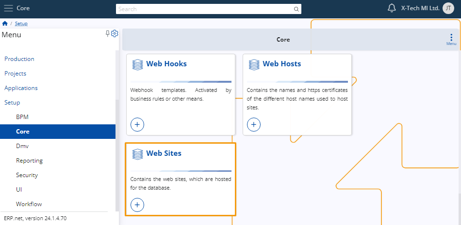
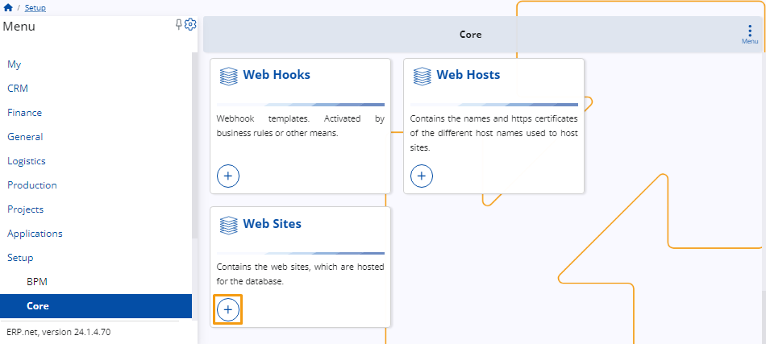
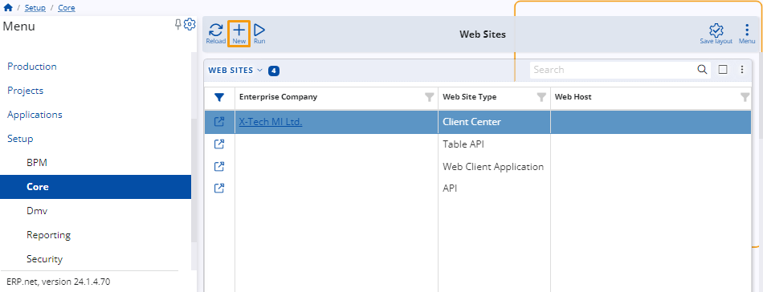
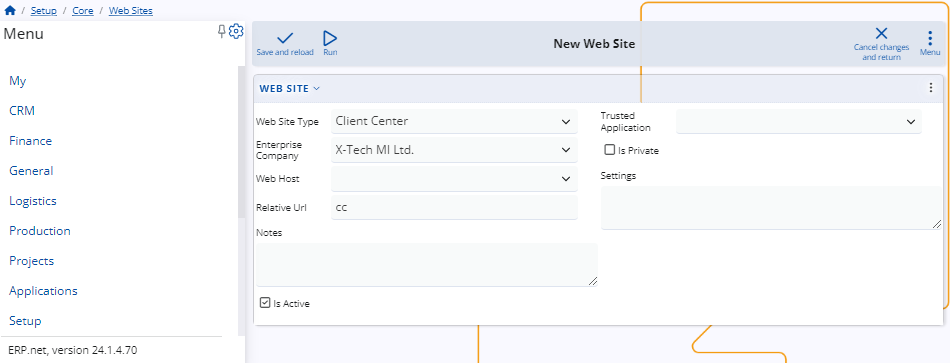
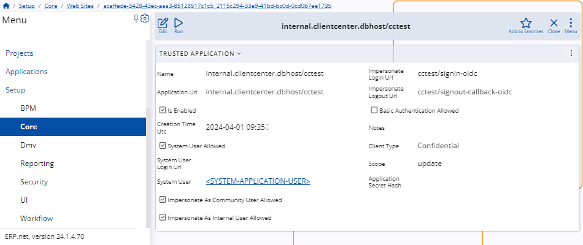

# Definition of a client center website

This article provides a detailed, step-by-step guide on creating a website within the ERP platform.

## Navigation 

To define a website categorized as **client center** type, navigate to the **Web Sites** panel within the **Core** section of the **Setup** module.

## Define a website 

There are two pathways available for defining a website. Regardless of which path you choose, the creation page will remain identical, ensuring consistency in the final result.

In the first method, simply click on the circular button featuring a **"+"** sign located on the **Web Sites** panel. 

Upon clicking, a new window will open, allowing you to proceed with the definition process.

 
The second approach involves utilizing the **New** button situated on the **Web Sites** table. To access the **Web Sites** table, simply click on the **Web Sites** panel. 

This action will open the same window as in the first approach, enabling you to proceed with your definition.

Upon accessing the definition window, you can enter the relevant information into the provided fields and checkboxes.

 
The only mandatory field is **Web Site Type**. Once you select one from the list, you can create the new customer without filling out any other information.

You can change the **Relative Url**, which is "cc" by default. 

### Create a trusted application 

To create a trusted application, click on **Run**, then select the **Create/Update Trusted Application** option.

> [!NOTE]
>
> You will be asked to confirm your intension. 

Once you complete this step, the application will be created, and you can access it through the form.

Upon opening it, you'll be able to view the details about the application.

> [!NOTE]
> 
> The screenshots taken for this article are from v24 of the platform.
