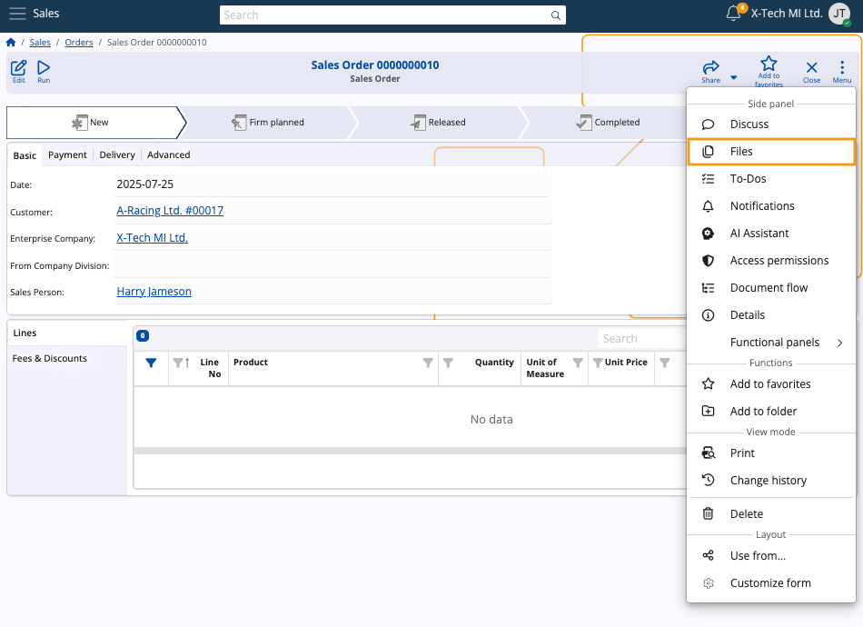
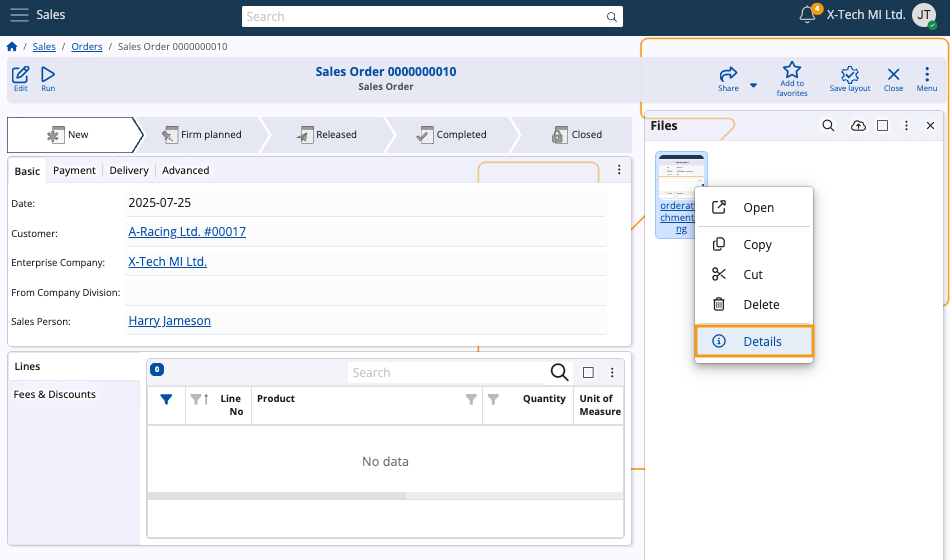
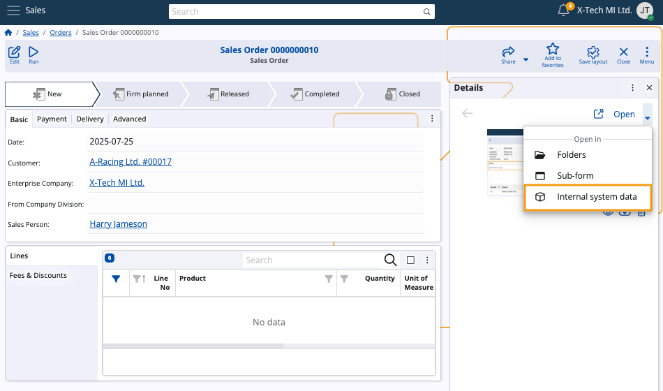
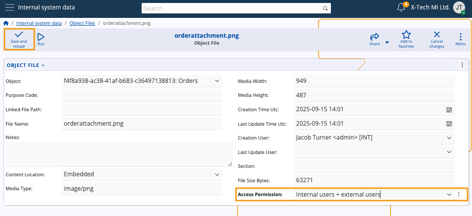
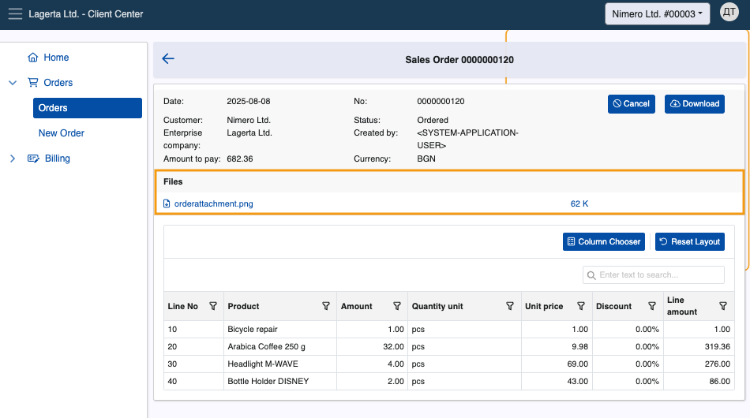

# How to download attached files

This article provides a step-by-step guide on downloading attached files from orders and invoices through the Client Center.

### Prerequisites

To be able to view and download file attachments in the Client Center, you must configure the **[Access Permissions field](https://docs.erp.net/webclient/introduction/how-to/access-permission-field.html)** of the respective attachment through the **Files** panel of your ERP.net platform instance.

1. Simply navigate to the respective order or invoice and expand the **Files** panel.

   
   
2. Then, right-click the attachment and select **Details**.

   
   
3. Click the **downward arrow** next to Open and select **Internal system data**.

   
   
4. Edit the details of the attachment by setting the value of the **Access Permissions** field to **Internal users + external users**.

   Click **Save and reload** to apply.

   

The steps above must be applied for **every** attachment you wish to see and download from within your Client Center website.

## Step-by-step process in the Client Center
	
1.	Open an invoice or an order with attachments.
   
  	The attachment will appear in a dedicated **Files** section. You can see its name, file extension, and size.

	

2. **Click** on a desired attachment name once to immediately download and save it on your device.

> [!WARNING]
> File attachments whose **Access Permission** field is not set to **Internal users + external users** will not appear in the Files section.    If none of the invoice’s attachments have this setting configured, the Files section will not appear at all.

> [!NOTE]
> The screenshots taken for this article are from v26 of the platform.
