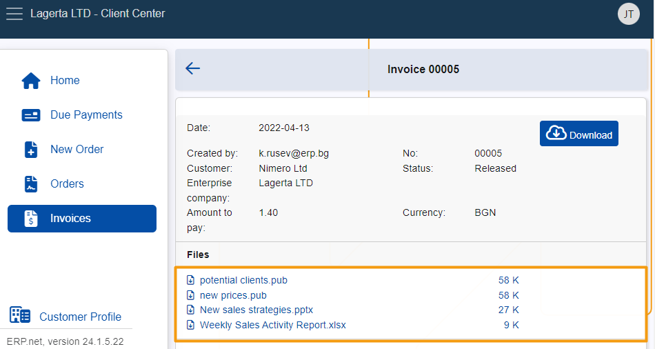

# How to download attached files from an invoice

This article provides a step-by-step guide on downloading attached files from an invoice through the Client Center.

### Prerequisites

To be able to view and download file attachments from an invoice in the Client Center, you must configure its **Access Permissions** field through your ERP.net platform instance.

Simply navigate to the respective invoice, expand the **Files** panel, open its **Details** and set the value of the **Access Permissions** field to **Internal users + external users**.

This must be applied for **every** invoice attachment you wish to see and download from within your Client Center website.

## Step-by-step process

1.	Navigate to the **Invoices** portion of the **Client Center** menu.

  	
	
2.	Open an invoice with attachments by clicking on its respective **button**.

  	

  	The invoice’s attachments will appear in a dedicated **Files** section. You can see their names, file extensions, and size.

	

3. **Click** on a desired file once to immediately download and save it on your device.

 

> [!WARNING]
> File attachments whose **Access Permission** field is not set to **Internal users + external users** will not appear in the Files section.    If none of the invoice’s attachments have this setting configured, the Files section will not appear at all.

> [!NOTE]
> The screenshots taken for this article are from v24 of the platform.
