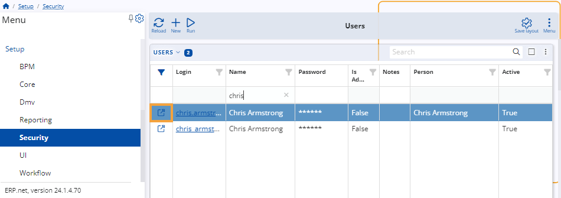

# How to define a user of a Client Center (v.24)

This is a step-by-step guide on defining a new user of Client Center (CC) **in @@name version 24**.

For details on how to define a user of a Client Center in **@@name version 26** and above, please see **[this guide](https://docs.erp.net/tech/modules/crm/clientcenter/how-to/setup-a-new-user-account-v26.html)**.

> [!NOTE]
> 
> If you haven't created a CC website already, please read **[Define a new Client Center](define-a-new-cc.md)**.

## Local account request

Before a user can be granted access to a Client Center by an administrator, they must first issue a request for a **local account**. 

Accessing the CC log-in page allows them to open **local account creation form**. Required fields are **Е-mail**, **Full Name**, and **Password**.

## Set up a user account

Once a user has sent a request for an account, they will appear as an **External Community User**.

An Administrator can configure them in the **@@name Web Client** by executing the following steps:

1. Navigate to the **Users** panel within the **[Security](https://docs.erp.net/tech/modules/system/security/index.html)** section of the **Setup** module.

2. Upon accessing the navigator, locate the user account and click on the **Edit** button located to the left of its **Login** details.

   

3. Assign a **Person** to the user. If such hasn't already been registered on the platform, you can create a new one on the spot.
   
   Either right-click on the **Person** field or click the **three-dot button**.

   In both cases, this will expand a dropdown menu where you need to select **Create new**.
   
   

   You will be redirected to a separate form for the creation of a new person.

   There are three critical fields: **First Name**, **Last Name** and **Parent Party**.

   

4. Click on **Save and reload** to finish creating the new person.
   
   You will be brought back to the user definition form. Click on **Save and reload** again to apply all settings.

5. Make sure that the **Parent Party** of the **Person** (the one in which they are employed) is a customer of the current **Enterprise Company**.
   
   To do so, open it from the **Person** form and locate its **Customers** panel. If it's not visible, add it through the **Customize form** option.

   In the **Customers** panel, verify that two fields are filled:

   * **Enterprise Company** - the Parent Party is a customer of this company, for which the Client Center is created.

   * **Serviced By Enterprise Company Location** - the respective Enterprise Company must be serviced by a particular location.

   

6. Click on **Save and reload** to apply your changes.

> [!Warning]
> 
> If any of the user configuration settings are not properly applied, a respective **[error message](https://docs.erp.net/tech/modules/crm/clientcenter/reference.html#error-exception-codes)** will be shown. 

> [!TIP]
> 
> If you've passed all the steps successfully, you may proceed to **[apply platform settings](apply-platform-settings.md)**. 

> [!NOTE]
> 
> The screenshots taken for this article are from v24 of the platform.
