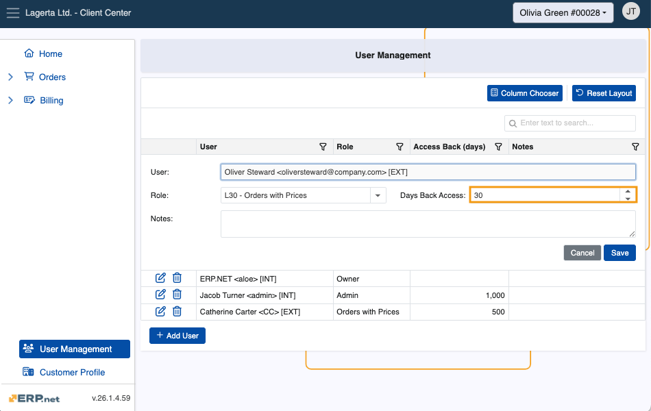
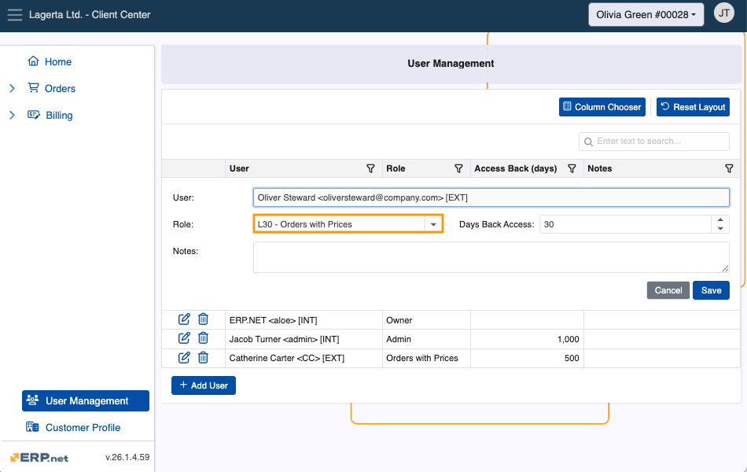
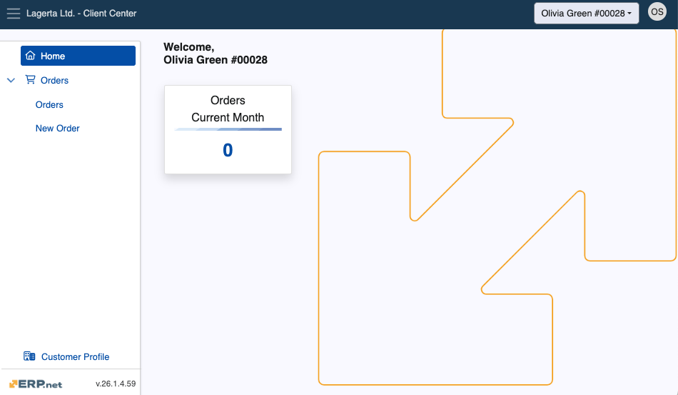

# How to define a user of a Client Center (v.26)

This article provides a step-by-step guide on defining a new user and configuring their access to a Client Center website **in @@name version 25**.

For details on how to define a user of a Client Center in @@name version 24, please see **[this guide]()**.

> [!NOTE]
> If you haven't created a Client Center website already, please read **[Define a new Client Center](define-a-new-cc.md)**.

### Prerequisites

Before a user can be granted access to a Client Center by an administrator, they must first create a **local account**. 

Required fields are **Е-mail**, **Full Name**, and **Password**.

## Set up a user account 

Once a user has created their account, an Administrator of a Client Center can add them in the respective desired environment through the **[User Management](https://docs.erp.net/tech/modules/crm/clientcenter/user-management/index.html#add-user)** page.

Administrators are assigned the **[external access role](https://docs.erp.net/tech/modules/crm/clientcenter/index.html?q=client%20center#role-based-access)** **Admin**, which guarantees them full reach of all customer data, including the ability to manage users.

1. To begin, make sure you are logged into the customer whose data you wish to share with the user.

   
   
2. Navigate to the **User Management** page and click **Add User**. This will trigger a window where you need to provide the user's **email address**.

   
   
3. Proceed to fill out the **Days Back Access** field. This is the maximum number of past days the user is allowed to view data to which their role grants them access.

   
   
4. Finally, choose the **external access role** the user will be assigned.

   
  
5. The user can log in with their credentials and immediately start using the Client Center.

   

To expand a user's reach to more of your customers, you can **switch** to another customer profile and **repeat** the same step-by-step procedure.

Users granted an external access role **Admin** or **Owner** are capable of adding other users to the same customer environment they are a part of.

> [!Warning]
> If any of the configuration settings are not properly applied, an **[error message](https://docs.erp.net/tech/modules/crm/clientcenter/reference.html#error-exception-codes)** will be shown. 

> [!TIP]
> If you've passed all the steps successfully, you may proceed to **[apply global platform settings](apply-platform-settings.md)**.   

> [!NOTE]
> 
> The screenshots taken for this article are from v26 of the platform.
