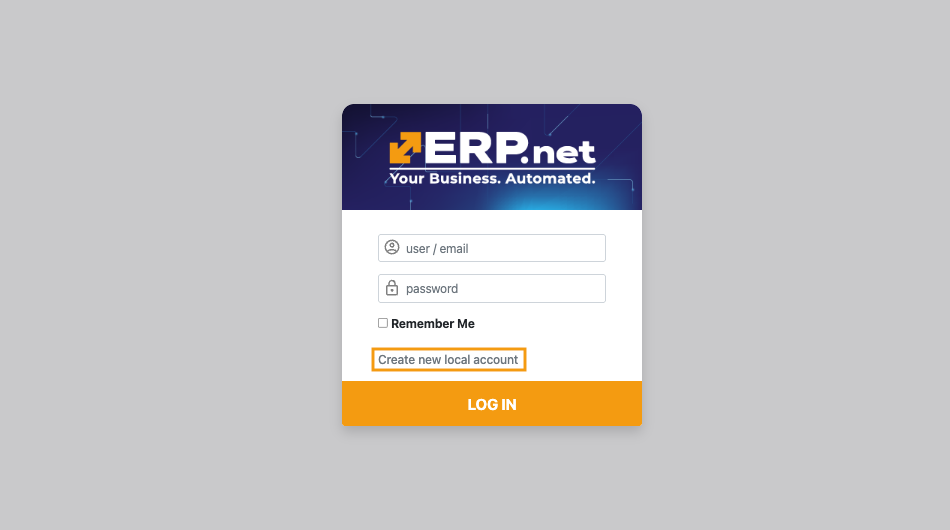
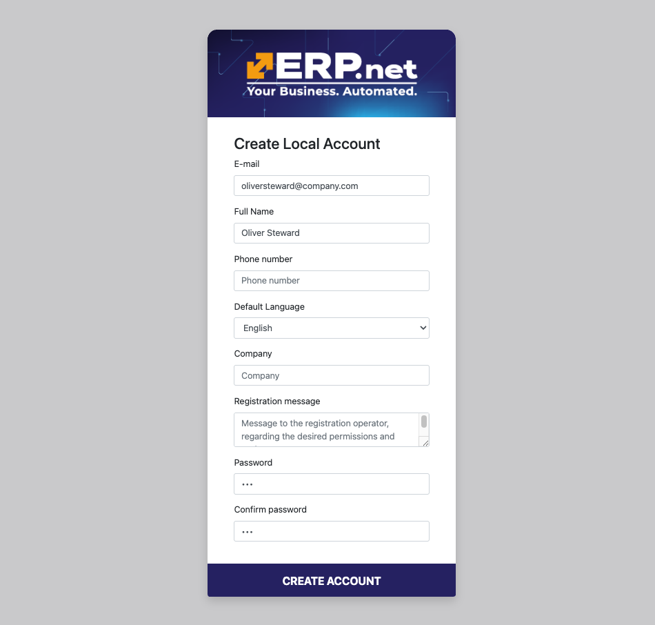
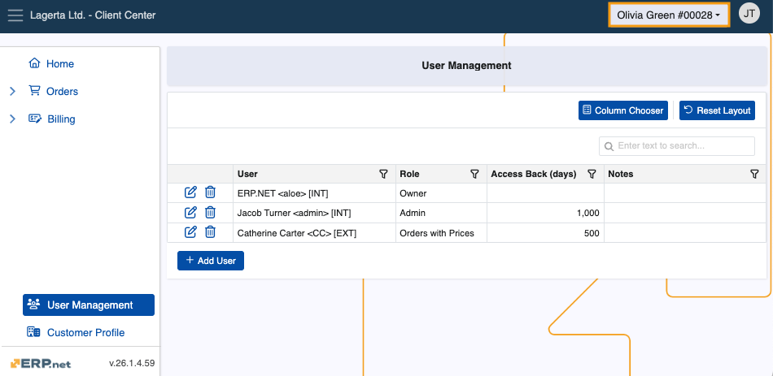
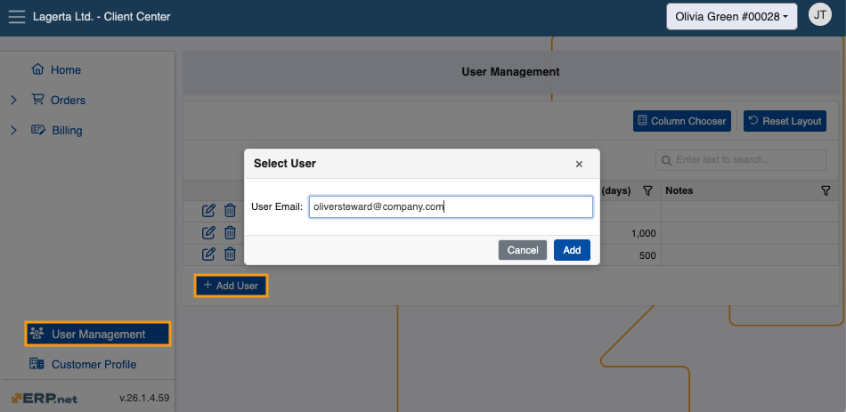
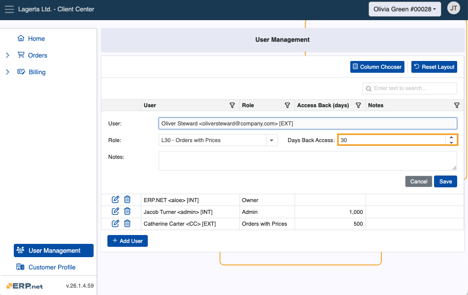
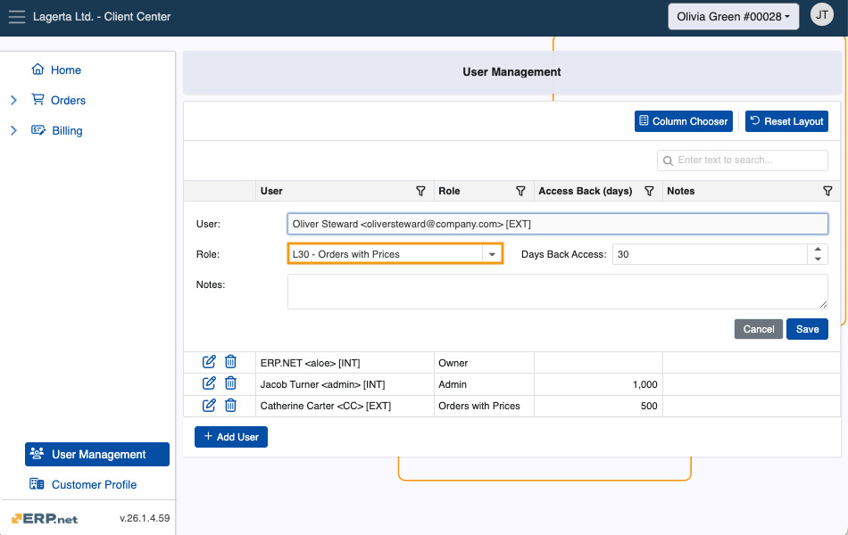
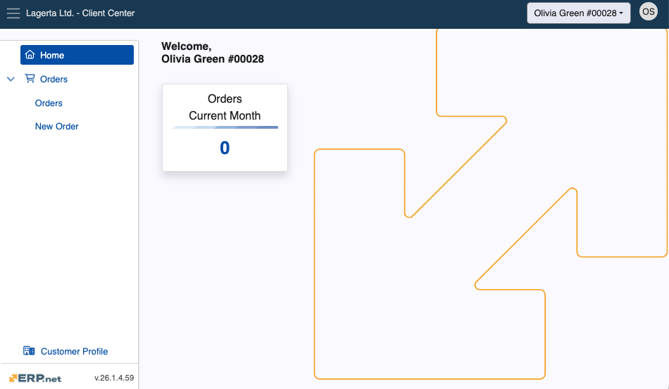

# How to add new users and manage permissions (v.26)

This is a step-by-step guide on defining a new user and configuring their access to a Client Center (CC) **in @@name version 26**.

For details on how to define a user of a Client Center in **@@name version 24**, please see **[this guide](https://docs.erp.net/tech/modules/crm/clientcenter/how-to/setup-a-new-user-account-v24.html)**.

> [!NOTE]
> If you haven't created a CC website already, please read **[Set up a Client Center](define-a-new-cc.md)**.  
> To learn how to apply global platform settings, please read **[Apply platform settings](apply-platform-settings.md)**.

## Local account creation

Before a user can get access to a Client Center through **[external access role assignment](https://docs.erp.net/tech/modules/crm/clientcenter/index.html?q=client%20center#role-based-access)**, they must first create a **local account**. 

Accessing the CC log-in page allows them to access the **local account creation form**. 

Required fields are **Е-mail**, **Full Name**, and **Password**.

## Adding local user account in CC

Once a user has created their local account, another user with an **[external access role](https://docs.erp.net/tech/modules/crm/clientcenter/index.html?q=client%20center#role-based-access)** **Admin** or **Owner** in the Client Center can add them there through the **[User Management](https://docs.erp.net/tech/modules/crm/clientcenter/user-management/index.html#add-user)** page. The Admin and Owner roles provide full reach of all customer data, including the ability to add, remove, and manage users for that customer.  

Omission of this step will result in a **critical lack-of-access** **error message** for the new user when attempting to log in.

> [!NOTE]
> 
> By default, the @@name Administrator has the **Owner** role in their Client Center, which allows them to assign any role to any external or internal user. 

### Step-by-step process

1. If using **[multiple customers](https://docs.erp.net/tech/modules/crm/clientcenter/index.html?q=client%20center#multi-customer-login)**, make sure you are logged into the **[customer](https://docs.erp.net/tech/modules/crm/sales/customers/index.html)** whose data you wish to share with the user.

   
   
2. Navigate to the **[User Management](https://docs.erp.net/tech/modules/crm/clientcenter/user-management/index.html)** page and click **Add User**.

   This will trigger a window where you need to provide the user's exact **email address**.

   
   
3. Proceed to fill out the **Days Back Access** field. This is the maximum number of days the user is allowed to view data in the past.

   
   
4. Finally, choose the **[external access role](https://docs.erp.net/tech/modules/crm/clientcenter/index.html?q=client%20center#role-based-access)** the user will be assigned.

   Users granted an external access role **Admin** or **Owner** are capable of adding other users to the CC environment(s) they are a part of.

   
  
5. The new user can now log in with their credentials and immediately start using the Client Center.

   

> [!TIP]
>
> To expand a user's access to more of your customers, **switch** to another customer and **repeat** all steps described above.

> [!Warning]
> If any of the configuration settings are not properly applied, a respective **[error message](https://docs.erp.net/tech/modules/crm/clientcenter/reference.html#error-exception-codes)** will be shown. 

> [!NOTE]
> 
> The screenshots taken for this article are from v26 of the platform.
