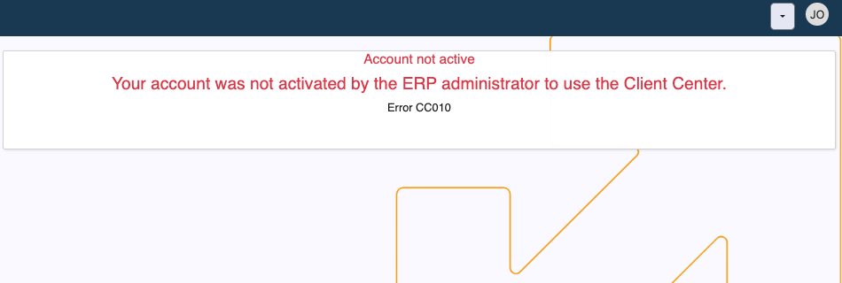

# How to define a user of a Client Center (v.26)

This is a step-by-step guide on defining a new user and configuring their access to a Client Center (CC) **in @@name version 26**.

For details on how to define a user of a Client Center in **@@name version 24**, please see **[this guide](https://docs.erp.net/tech/modules/crm/clientcenter/how-to/setup-a-new-user-account.html)**.

> [!NOTE]
> If you haven't created a CC website already, please read **[Define a new Client Center](define-a-new-cc.md)**.

## Local account creation

Before a user can be granted access to a Client Center by an Administrator, they must first create a **local account**. 

Accessing the CC log-in page allows them to open **local account creation form**. Required fields are **Е-mail**, **Full Name**, and **Password**.

## Adding local user account in CC

Once a user has created their account, an Administrator of a Client Center must add them in the respective desired environment through the **[User Management](https://docs.erp.net/tech/modules/crm/clientcenter/user-management/index.html#add-user)** page.

Administrators are assigned the **[external access role](https://docs.erp.net/tech/modules/crm/clientcenter/index.html?q=client%20center#role-based-access)** **Admin**, which guarantees them full reach of all customer data, including the ability to manage users.

Omission of this step will result in a critical lack-of-access **error message** for the new user when attempting to log in.

### Step-by-step process

1. If using **multi-customer log-in**, make sure you are logged into the **[customer](https://docs.erp.net/tech/modules/crm/sales/customers/index.html)** whose data you wish to share with the user.

   To expand a user's access to more of your customers within the same Client Center, **switch** to another customer profile and **repeat** all steps as described below.

   
   
2. Navigate to the **[User Management](https://docs.erp.net/tech/modules/crm/clientcenter/user-management/index.html)** page and click **Add User**.

   This will trigger a window where you need to provide the user's exact **email address**.

   
   
3. Proceed to fill out the **Days Back Access** field. This is the maximum number of days the user is allowed to view data in the past.

   
   
4. Finally, choose the **[external access role](https://docs.erp.net/tech/modules/crm/clientcenter/index.html?q=client%20center#role-based-access)** the user will be assigned.

   Users granted an external access role **Admin** or **Owner** are capable of adding other users to the CC environment(s) they are a part of.

   
  
5. The new user can now log in with their credentials and immediately start using the Client Center.

   

> [!Warning]
> If any of the configuration settings are not properly applied, a respective **[error message](https://docs.erp.net/tech/modules/crm/clientcenter/reference.html#error-exception-codes)** will be shown. 

> [!TIP]
> If you've passed all the steps successfully, you may proceed to **[apply global platform settings](apply-platform-settings.md)**.   

> [!NOTE]
> 
> The screenshots taken for this article are from v26 of the platform.
