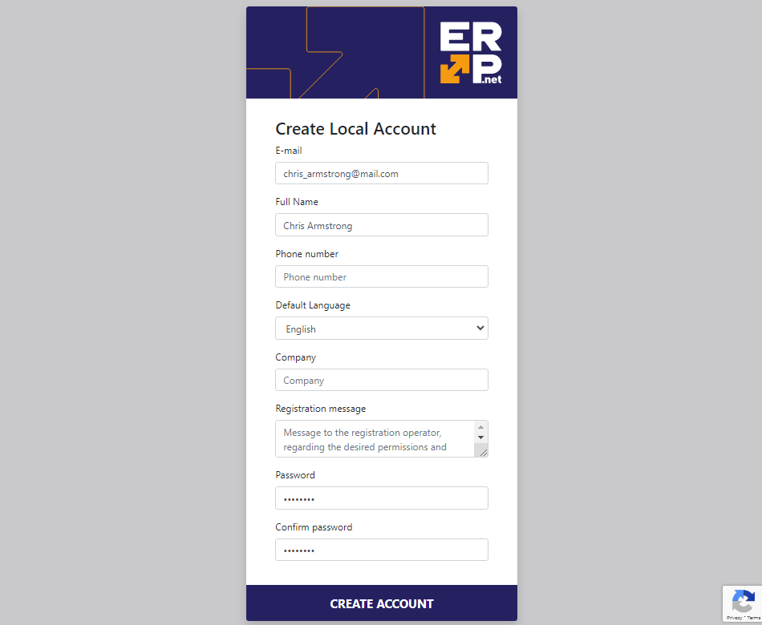

# How to define a user

This article provides a step-by-step guide on defining a new user and configuring their access to a Client Center website.

If you haven't created such a website already, please refer to **[this guide](define-a-new-cc.md)**.

### Prerequisites

Before a user can be granted access to a Client Center by an administrator, they must first have issued a request for a **local account**. 

Required fields are **Е-mail**, **Full Name**, and **Password**.

## Set up user account 

Once a customer has sent a request for an account, you can begin to configure it.

1. Navigate to the **Users** panel within the **Security** section of the **Setup** module.

2. Upon accessing the navigator, locate the new account and click on the **Edit** button located to the left of the **Login** details.

3. Assign a **person** to the user. If such hasn't already been registered on the platform, you can create a new one on the spot.
   
   Either right-click on the **Person** field or click the **three-dot button**. In both cases, this will expand a dropdown menu where you need to select **Create new**.
   
   

   You will be redirected to a separate form for the creation of a new person.

   There are three critical fields: **First Name**, **Last Name** and **Parent Party**.

   

4. Check if the **Parent Party** is a customer.
   
   To open the parent party, click on it within the form. Afterward, locate the **Customers** panel. 

   If it's not visible, you can add it through the **Customize form** option.

   In the **Customers** panel, you should verify that two fields are filled: **Enterprise Company** and **Serviced By Enterprise Company Location**.

   

   If they are empty, you'll need to create a new customer where you can fill in these fields.

5. Click on **Save and reload** to apply your changes.

> [!NOTE]
> 
> If any of these settings are missing, an error exception code from CC002 to CC007 will be displayed depending on what's missing.

> [!NOTE]
> 
> The screenshots taken for this article are from v24 of the platform.
