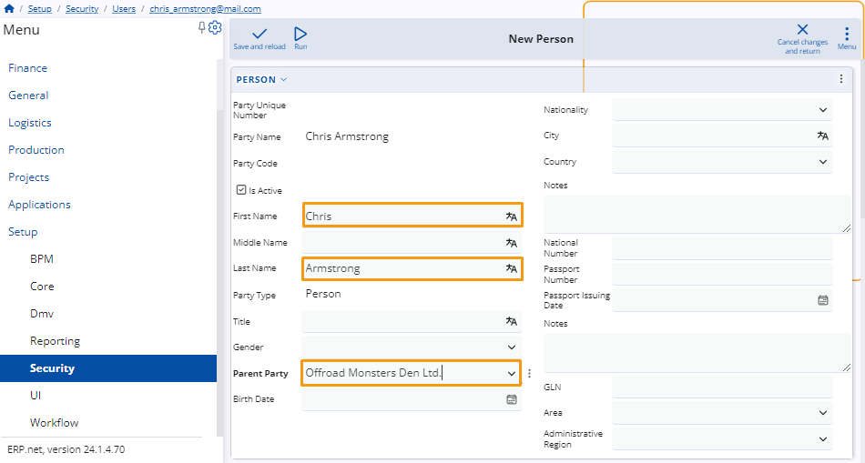
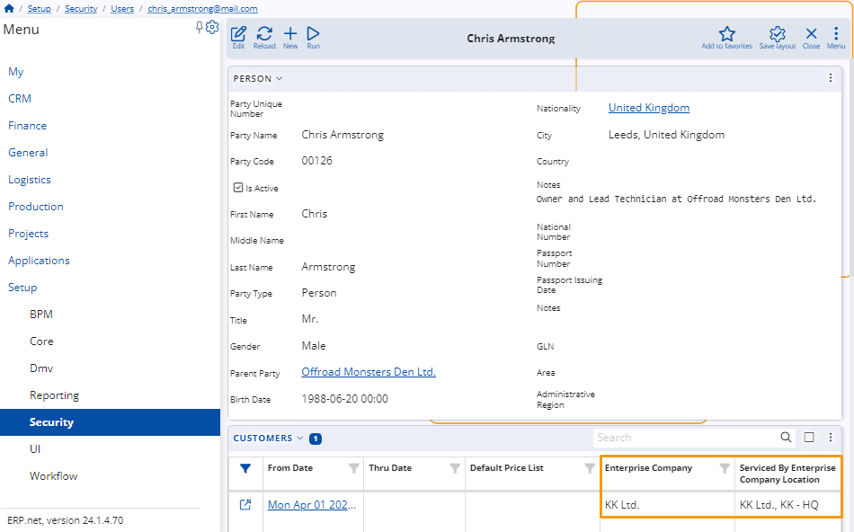

# Setup a new user account  

To initiate the setup of a new user account, the individual must first create the account, after which an administrator can configure it accordingly.

## Create a new account as a user 

To create an account, the user should click on **Create new local account** in the login menu of the **ERP.net** client center. 

Next, they should fill out a form with their information and proceed to create the account.

## Setup users account 

After a customer of your client has created an account, as an administrator, you need to configure several settings for the new account.

To proceed, navigate to **Users** within the **Security** section of the **Setup** module.

Upon opening the **Users** navigator, utilize the filter row to locate the new account by its name.

Access the account and click on the **Edit** button located at the top left corner of the table.

To add a **person** for the user, you can either click on the **Person** field and open the menu from the three-dotted button, or simply right-click on the field.

Select the **Create new** option, which will redirect you to a new window where you can create a new person.

### Create a new person 

Within this form, there are three critical fields that necessitate completion. You must enter the user's first and last name and select the **parent party** from the dropdown menu.

After completing these steps, click on **Save and reload** to finalize the creation.

### Check if the parent party is a customer 

To open the parent party, click on it within the form. Afterward, locate the **Customers** panel. 

If it's not visible, you can add it by accessing the **Related data** menu within the **customize form** option.

In the **Customers** panel, you should verify if two columns are filled. The **Enterprise Company**, which should be your company, and the **Serviced By Enterprise Company Location**.

If they are empty, you'll need to create a new project where you can fill in these fields.

> [!NOTE]
> 
> If any of these settings are missing, an error exception code from CC002 to CC007 will be displayed depending on what's missing.

> [!NOTE]
> 
> The screenshots taken for this article are from v24 of the platform.
