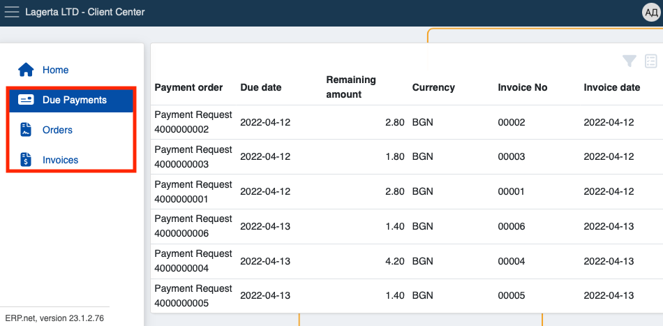
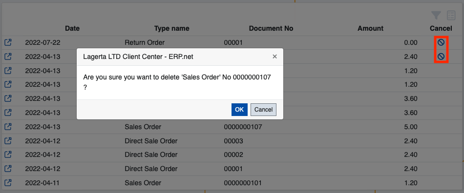

# Client Center - a single platform to engage with customers

The Client Center is a space which allows ERP.NET clients to assist their own enterprise clients by allowing them to chat with Customer Support, review due payments, access and download invoices, and create sales orders. It’s best used to increase the collaboration and exchange of valuable information between employees, suppliers and customers.

Within the Client Center, users with appropriate permissions can see and interact with four different panels. One of them offers a direct communication hotline, while the rest act as shortcuts to pages containing personal documents.

Each page works with accurate and simplified data to implement a pleasant and up-to-date platform experience. Clients are able to look at all of their due payments, sales orders and downloadable invoices on-demand.

## Features

- Depending on its size and reach, one company can have and manage multiple Client Centers. 

This could be useful for departments dealing with unique sets of tasks and issues, as their customized version of the Client Center will remain completely tailored to the users that they’re serving.  

- Already made orders can be cancelled before they've been completed.

