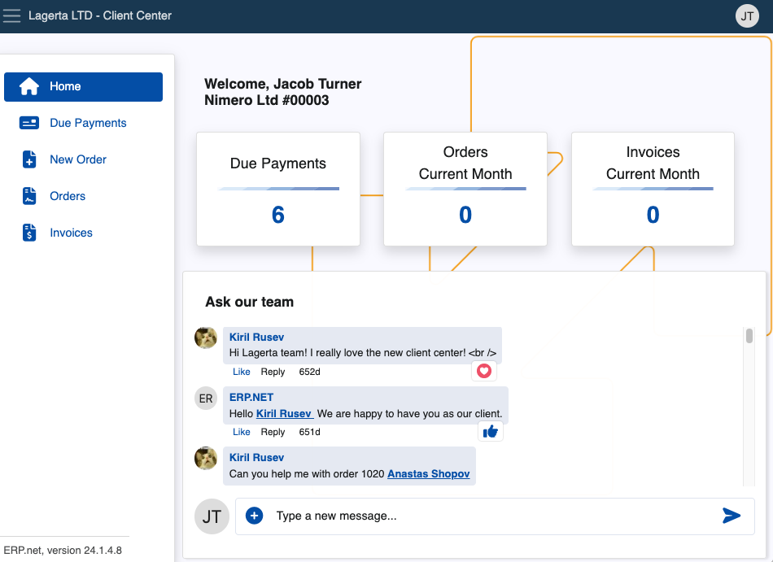
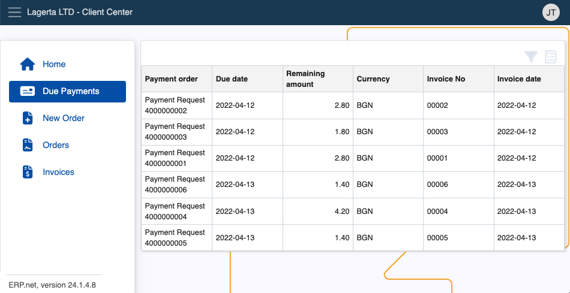
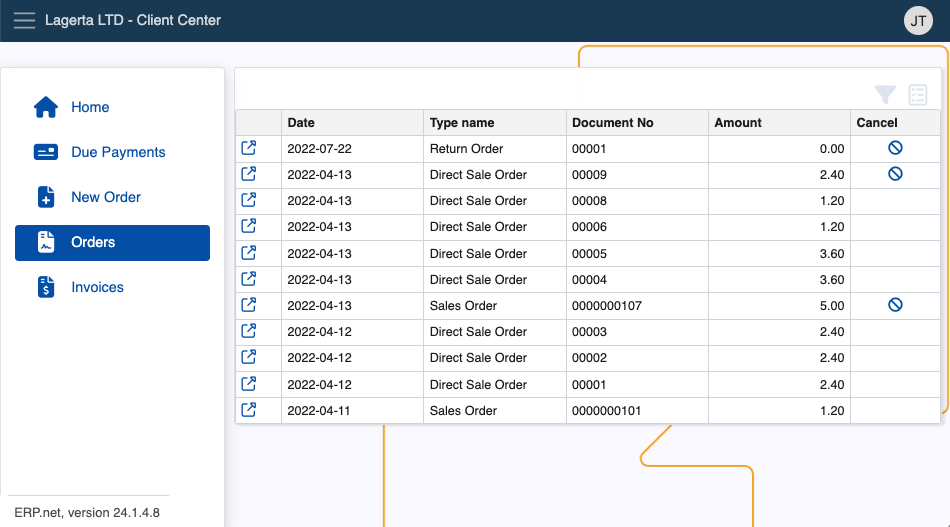

# Client Center

The Client Center allows Erp.Net clients to assist their own customers by allowing them to see and create sales orders, review due payments, as well as access and download invoices. It’s best used to provide faster support and increased speed of new orders. 

You can **[build and host](how-to/define-a-new-cc.md)** a CC instance from your global website environment, and access it using a custom relative url.

> [!NOTE]
> 
> As of v.26, the Chat is no longer available.

## Features and structure

Depending on **assigned roles**, users can see and interact with up to **five panels**. 

Each Client Center panel works with accurate and simplified data to implement a pleasant and up-to-date platform experience. 

Whether they use shortcuts or the expandable menu on the left side of the screen, clients are able to look at all of their due payments, sales orders and invoices **on-demand**.

### Panels

**Home** offers a direct communication channel and access to other pages.

Using the chat panel, clients can reach out to a representative regarding any issue or question they're having.

**Due Payments** contains a list of your due payments, available to be sorted.

**Orders** contains a list of your current orders, with the ability to preview and sort them.

**Invoices** keeps all of your invoices for completed orders.

> [!NOTE]
>
> Depending on your business' size and reach, you can create and manage **multiple** Client Centers.     This could be useful for departments dealing with unique sets of tasks and issues, as their customized version of the Client Center will remain completely tailored to the users they’re serving.

### Creating sales orders

The Client Center gives users the ability to **[create new sales orders](how-to/create-new-order.md)** with just the click of a button.

This feature is **disabled** by default for security reasons. Access should be granted only when it's necessary.

For more information on how to define and set up Client Center, please refer to our **[step-by-step guides](how-to/index.md)** and the **[reference](reference.md)**

### Actions

Users are able to perform a couple of **actions** from within the Client Center to enhance their experience.

- **Additional columns** can be added to provide more information for **due payments**, **past orders** and **invoices**.

- In the **Orders** page, already issued sales orders from the Client Center can be **cancelled** before they're finalized.

- Generated invoices for any orders can be **downloaded** and **previewed** outside of the platform.

> [!NOTE]
> 
> The screenshots taken for this article are from v24 of the platform.
