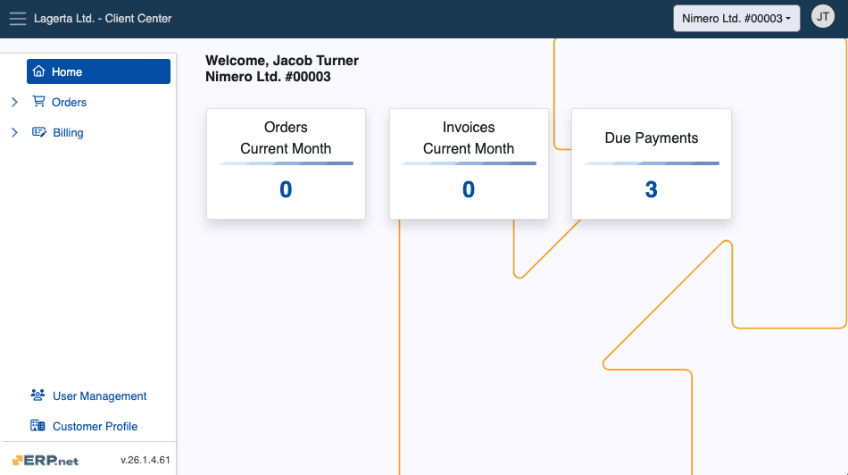
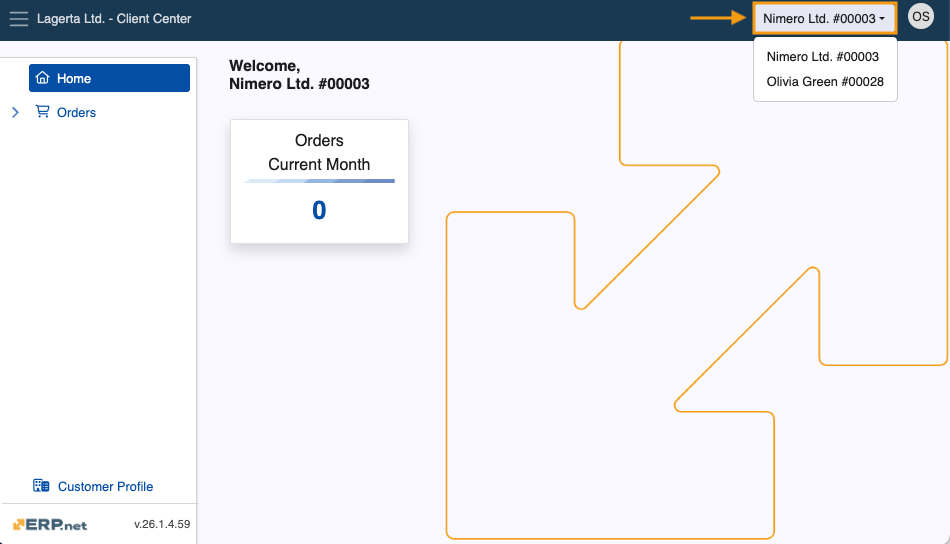
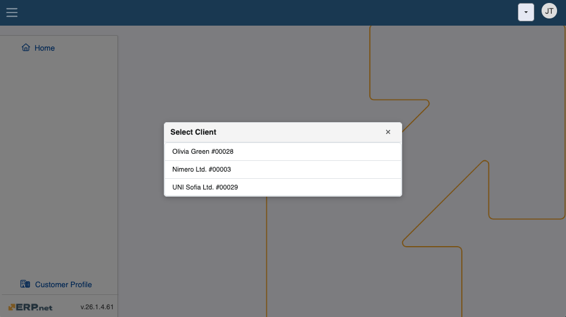

# Client Center

The Client Center (CC) allows @@name clients to assist their **[customers](https://docs.erp.net/tech/modules/crm/sales/customers/index.html)** by allowing them to see and create sales orders, review due payments, as well as access and download invoices. It’s best used to provide faster support and increased speed of new orders. 

You can **[create your own Client Center](how-to/define-a-new-cc.md)** by defining a new **Web Site** with the appropriate **[settings](https://docs.erp.net/tech/modules/crm/clientcenter/reference.html)** and **[user access levels](https://docs.erp.net/tech/modules/crm/clientcenter/index.html#role-based-access)**.

## Structure

The Client Center has a hierarchical menu structure consisting of several **sections** and **pages**. Each works with accurate and simplified data to implement a seamless platform experience, allowing customers to look at documents important to them **on-demand**.

> [!Important]
>
> User access to the Client Center is determined through **external access roles**. You can learn more about them **[below](index.md#role-based-access)**.

### Home

This is the default landing page of the Client Center, offering quick access to all **orders**, **invoices**, and **due payments** based on predefined role access. It also keeps a real-time metric of how many orders and invoices were produced for the current month.

> [!Warning]
> 
> As of v.26, the Chat integration is **no longer available**.

### Orders

This section is responsible for storing existing orders and facilitating the creation of new ones. 

It is comprised of two pages:

* **[Orders](orders/orders.md)**
* **[New Order](orders/new-order.md)**

> [!NOTE]
> 
> The New Order page offers a built-in interactive module for creating new orders. It is **disabled** by default for security reasons.  
> For more information on how to enable it, please refer to the **[Settings and error reference](https://docs.erp.net/tech/modules/crm/clientcenter/reference.html#isneworderenabled-setting)** manual.

### Billing

This section keeps a log of billing-related documents and allows for their close inspection.

It is comprised of three pages:

* **[Invoices](billing/invoices.md)**
* **[DuePayments](billing/due-payments.md)**
* **[Payment History](billing/payment-history.md)**

### User Management

The **[User Management](user-management/index.md)** page manages a customer's existing users by adding them or removing them from the Client Center.

It also determines the level of access they have.

### Customer Profile

This page is where customers can see more information about their registered company, including UIN and VAT number.

> [!Tip]
>
> Depending on your business' size and reach, you can create and manage **multiple** Client Centers.     This could be useful for departments dealing with unique sets of tasks and issues, as their customized version of the Client Center will remain completely tailored to the users they’re serving.

## Role-based access 

Individual access to the Client Center is determined based on the **[external access role](../sales/customers/external-access.md#roles)** a user is assigned.

Each subsequent role in the table below also includes the rights granted by the previous:

| Role                   | Home | Orders              | Billing              | User Management | Customer Information | Notes                                                                                   |
|-------------------------|------|----------------------|----------------------|------------------|------------------------|-----------------------------------------------------------------------------------------|
| **L10 - Basic**         | ✅   | ❌                   | ❌                   | ❌               | ✅                     | Basic access to the **Home** and **Customer Profile** pages.                           |
| **L20 - Orders**        | ✅   | ✅        | ❌                   | ❌               | ✅                     | Access to **[Orders](orders/index.md)** and **[New Order](orders/new-order.md)**, excluding Price, Discount and Amount.                                                   |
| **L30 - Orders + Prices** | ✅ | ✅      | ❌                   | ❌               | ✅                     | Like **L20 Orders**, but including Price, Discount and Amount.                                    |
| **L40 - Billing**       | ✅   | ✅      | ✅                   | ❌               | ✅                     | Adds access to **[Invoices](billing/invoices.md)**, **[Due Payments](billing/due-payments.md)**, and **Payment History**.                  |
| **L80 - Admin**         | ✅   | ✅      | ✅                   | ✅               | ✅                     | Full access, including to **[User Management](user-management/index.md)**.                                                 |
| **L90 - Owner**         | ✅   | ✅      | ✅                   | ✅               | ✅                     | Same as Admin, but Owner access **cannot** be revoked by anyone, including Admins.      |

> [!NOTE]
> 
> Any registered user can be added to a Client Center by another user with external access role **Admin** and above.  
> To see how users are defined for a Client Center, please read the following **[step-by-step guide](https://docs.erp.net/tech/modules/crm/clientcenter/how-to/setup-a-new-user-account-v26.html)**.

## Multi-customer login

The Client Center offers **multi-customer support**, which allows users to have easy access to specific data for more than one customer.

The relationship between users and customers is derived from the @@name **[External Access table](https://docs.erp.net/tech/modules/crm/sales/customers/external-access.html)**, which is used as a point of reference for establishing the type of access a user has to a particular customer.

Users can also be granted access for customer data through the **[User Management page](https://docs.erp.net/tech/modules/crm/clientcenter/user-management/index.html)**, provided there is already one Admin or Owner who can directly **[add them](https://docs.erp.net/tech/modules/crm/clientcenter/user-management/index.html#add-user)**.

**Example:**

| User   | Customer   | Role                  | Notes                                                                                           |
|--------|------------|----------------------|-------------------------------------------------------------------------------------------------|
| John | Nimero Ltd | **L40 - Billing**             | Access to billing-related data.                                              |
| John | Olivia-Green | **L30 - Orders + Prices**      | Full access to Orders.                        |

The **quick-switch** mechanism of the Client Center allows for an easy back-and-forth navigation between customers. 

Located at the upper-right corner of the platform, it dynamically fetches the latest information from the **External Access** table.

If multiple customers are detected for the same user, upon first-time login, the user will be **asked** to select a customer they wish to log into. 

This choice will be **stored** as a cookie in the browser, allowing for future sign-ins to be **automated** and not requiring the selection again. 

If the user has access only to a single customer, this pop-up will not appear and the login will complete at once.

> [!IMPORTANT]
>
> Users can perform a couple of handy actions in the Client Center:  
> - **Customize** a page's layout with **[Grid Control](grid-control.md)** capabilities  
> - **Cancel** already issued sales orders before they're finalized.  
> - **Download** orders and invoices as PDF files. 

## Explore the Client Center

* **[Orders](https://docs.erp.net/tech/modules/crm/clientcenter/orders/index.html)**
* **[Billing](https://docs.erp.net/tech/modules/crm/clientcenter/billing/index.html)**
* **[User Management](https://docs.erp.net/tech/modules/crm/clientcenter/user-management/index.html)**
* **[Settings and errors](https://docs.erp.net/tech/modules/crm/clientcenter/reference.html)**
* **[Grid control](https://docs.erp.net/tech/modules/crm/clientcenter/grid-control.html)**
* **[Step-by-step guides](https://docs.erp.net/tech/modules/crm/clientcenter/how-to/index.html)**

> [!NOTE]
> 
> The screenshots taken for this article are from v.26 of the platform.
